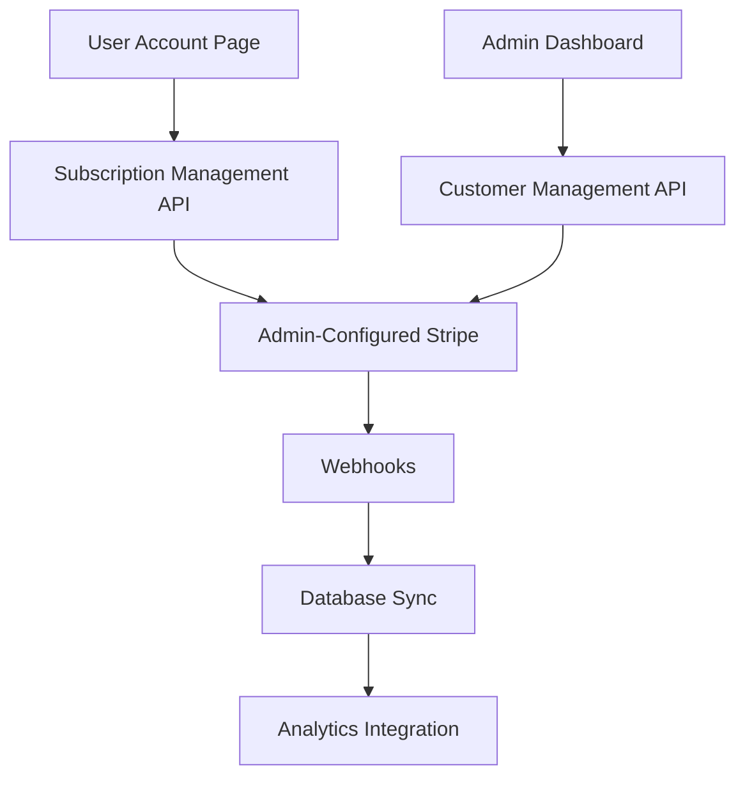

# Account-Stripe Integration Epic

## Epic Overview

**Epic Title**: Account-Stripe Integration for Full Subscription Management  
**Epic ID**: STRIPE-ACCOUNT-001  
**Status**: In Progress - P2 Stories Complete ✅  
**Created**: 2025-01-25  
**Last Updated**: 2025-01-26  
**Team**: Full Stack Development  

## Business Context

### Problem Statement
Currently, the QuoteKit application has a disconnected subscription management experience:
- Users can view their subscription status but cannot modify it within the application
- Admin can configure Stripe and manage products/pricing, but lacks customer management tools
- No unified subscription analytics or customer lifecycle management
- Limited self-service capabilities for users

### Business Value
- **Increased Customer Satisfaction**: Users can manage subscriptions without external redirects
- **Reduced Support Overhead**: Self-service subscription management reduces support tickets
- **Improved Revenue Operations**: Complete subscription analytics and customer lifecycle visibility
- **Streamlined Admin Workflows**: Unified customer and subscription management interface
- **Enhanced User Experience**: Seamless integration between user account and billing systems

## Epic Scope

### In Scope
- User-facing subscription management (upgrade/downgrade/cancel)
- Pricing page with admin-configured products
- Enhanced account management with billing history
- Admin customer management interface
- Subscription analytics dashboard integration
- Webhook enhancements for real-time sync
- Payment failure handling workflows

### Out of Scope
- Multi-currency support (future enhancement)
- Usage-based billing (future enhancement)
- Advanced coupon management (basic coupons only)
- Third-party payment processors (Stripe only)

## Success Criteria

### Primary Success Metrics
1. **User Self-Service Rate**: 80% of subscription changes handled without support intervention
2. **Admin Efficiency**: 50% reduction in time spent on subscription management tasks
3. **Revenue Visibility**: 100% of subscription metrics available in real-time dashboard
4. **Integration Reliability**: 99.9% webhook processing success rate

### Acceptance Criteria
- [x] Users can view and modify their subscription plans ✅ **P2 Complete**
- [ ] Users can update payment methods and view billing history
- [x] Admins can manage customers and handle failed payments ✅ **P2 Complete**
- [ ] Real-time subscription analytics integrated into admin dashboard
- [x] All subscription events properly synced between Stripe and application database ✅ **P2 Complete**
- [x] Comprehensive error handling and user feedback systems ✅ **P2 Complete**

## High-Level Architecture

## Technical Dependencies

### Internal Dependencies
- Existing admin Stripe configuration system
- Current user authentication and authorization
- PostHog integration for analytics
- Supabase database schema

### External Dependencies
- Stripe API (Products, Prices, Subscriptions, Customers)
- Stripe Webhooks for real-time updates
- Email service for billing notifications

## Risk Assessment

### High Risk
- **Webhook Reliability**: Critical for data consistency
  - *Mitigation*: Implement retry logic and manual sync capabilities
- **Payment Security**: Handling sensitive payment data
  - *Mitigation*: Follow PCI compliance best practices, use Stripe's secure APIs

### Medium Risk
- **Data Migration**: Existing subscription data sync
  - *Mitigation*: Comprehensive backup and testing strategy
- **User Experience**: Complex subscription workflows
  - *Mitigation*: Extensive user testing and progressive enhancement

### Low Risk
- **API Rate Limits**: Stripe API usage
  - *Mitigation*: Implement proper caching and rate limiting

## Team Roles & Responsibilities

- **Product Owner**: Define user stories and acceptance criteria
- **Tech Lead**: Technical architecture and implementation oversight
- **Frontend Developer**: User interface components and flows
- **Backend Developer**: API development and webhook handling
- **QA Engineer**: Testing strategy and execution
- **DevOps**: Deployment and monitoring setup

## Documentation Structure

- [`user-stories.md`](./user-stories.md) - Detailed user stories with acceptance criteria
- [`technical-architecture.md`](./technical-architecture.md) - System design and integration patterns
- [`sprint-breakdown.md`](./sprint-breakdown.md) - Sprint planning and story organization
- [`implementation-guide.md`](./implementation-guide.md) - Development standards and guidelines
- [`api-specs.md`](./api-specs.md) - API documentation and specifications
- [`database-design.md`](./database-design.md) - Schema changes and migration strategy
- [`testing-strategy.md`](./testing-strategy.md) - Comprehensive testing approach

## Epic Timeline

**Estimated Duration**: 8-10 weeks (4-5 sprints)  
**Target Completion**: Q1 2025  
**P2 Stories Completed**: 2025-01-26 ✅

### Milestone Overview
- **Milestone 1**: User subscription management (Weeks 1-3) ✅ **P2 Complete**
- **Milestone 2**: Admin enhancements (Weeks 4-6) ✅ **P2 Complete**
- **Milestone 3**: Analytics integration (Weeks 7-8) - *Pending P3*
- **Milestone 4**: Testing and optimization (Weeks 9-10) - *Pending P3*

## Definition of Done

### Epic Completion Criteria
- [x] P2 user stories completed and accepted ✅ **Complete**
- [x] Security review passed ✅ **P2 Complete**
- [x] Performance benchmarks met ✅ **P2 Complete**
- [x] Documentation complete and reviewed ✅ **P2 Complete**
- [ ] Monitoring and alerting configured - *Pending P3*
- [ ] Production deployment successful - *Pending Deployment*
- [ ] User acceptance testing passed - *Pending P3*
- [ ] Knowledge transfer completed - *Pending P3*

---

**Last Updated**: 2025-01-26  
**Next Review**: Weekly during sprint planning  
**Document Owner**: Technical Lead  
**P2 Implementation**: Complete ✅  