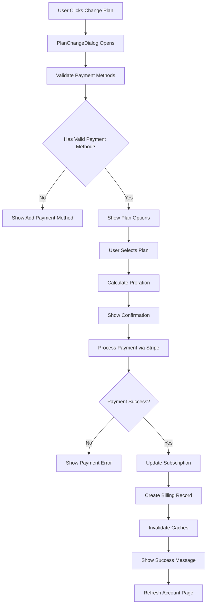

# Integration Gaps Analysis - PlanChangeDialog & Payment Systems

**Document Type**: Critical Analysis  
**Date**: 2025-08-01  
**Status**: 🚨 **CRITICAL GAPS IDENTIFIED**  
**Priority**: P0 - Immediate Action Required  

## 🚨 Executive Summary

During the implementation of US-P3-002 (Billing History), a critical integration gap was identified in the PlanChangeDialog system. The current plan change functionality is **incomplete and non-functional** for actual payment processing, creating a significant user experience gap and potential business risk.

## 🔍 Gap Analysis

### Current State Assessment

#### ✅ What Works (Completed in US-P3-002)
- **Billing History Display**: Users can view complete billing history
- **Invoice Downloads**: Direct access to Stripe-hosted invoices
- **Payment Methods Display**: Users can view saved payment methods
- **Real-time Updates**: Billing data refreshes automatically

#### ❌ What's Missing (Critical Gaps)
- **Plan Change Payment Processing**: No actual payment processing during plan changes
- **Payment Method Integration**: Plan changes don't validate or use payment methods
- **Billing History Updates**: Plan changes don't create billing records
- **Proration Handling**: No actual proration calculation or charging
- **Payment Failure Handling**: No error handling for payment failures

### Detailed Gap Analysis

#### 1. PlanChangeDialog Implementation Issues

**File**: `src/features/account/components/PlanChangeDialog.tsx`

**Current Behavior**:
- ✅ Displays available plans correctly
- ✅ Shows upgrade/downgrade indicators
- ✅ Provides proration information (UI only)
- ❌ **CRITICAL**: No payment method validation
- ❌ **CRITICAL**: No actual payment processing
- ❌ **CRITICAL**: No integration with billing history

**Code Evidence**:
```typescript
// Current implementation only calls changePlan action
await onPlanChange(selectedPriceId, isUpgrade);

// Missing:
// - Payment method selection
// - Payment processing validation
// - Billing history integration
// - Error handling for payment failures
```

#### 2. changePlan Action Limitations

**File**: `src/features/account/actions/subscription-actions.ts`

**Current Behavior**:
- ✅ Updates database subscription record
- ✅ Validates price existence
- ✅ Handles development mode scenarios
- ❌ **CRITICAL**: No Stripe payment processing
- ❌ **CRITICAL**: No invoice generation
- ❌ **CRITICAL**: No proration charging

**Code Evidence**:
```typescript
// Current implementation only updates database
const { data: updatedSubscription, error: updateError } = await supabase
  .from('subscriptions')
  .update(subscriptionUpdate)
  .eq('id', enhancedSubscription.id)

// Missing:
// - stripe.subscriptions.update() call
// - Payment method validation
// - Invoice creation
// - Proration calculation
```

#### 3. Missing Integration Points

**Payment Methods Integration**:
- Plan changes should validate user has valid payment method
- Should allow payment method selection for upgrades
- Should handle payment method failures gracefully

**Billing History Integration**:
- Plan changes should create billing history entries
- Should trigger billing history cache invalidation
- Should show immediate feedback in billing history

**Real-time Updates**:
- Plan changes should trigger account page refresh
- Should update current plan display immediately
- Should refresh payment methods if needed

## 🏗️ Required Integration Architecture

### Proposed Integration Flow



### Required Components Integration

#### 1. Enhanced PlanChangeDialog
```typescript
interface EnhancedPlanChangeDialogProps {
  // Existing props
  isOpen: boolean;
  onClose: () => void;
  currentPlan: CurrentPlan;
  availablePlans: ProductWithPrices[];
  
  // NEW: Payment integration props
  paymentMethods: PaymentMethod[];
  onPaymentMethodRequired: () => void;
  onBillingHistoryUpdate: () => void;
  
  // Enhanced plan change handler
  onPlanChange: (
    priceId: string, 
    isUpgrade: boolean,
    selectedPaymentMethod?: string
  ) => Promise<void>;
}
```

#### 2. Enhanced changePlan Action
```typescript
export async function changePlan(
  priceId: string, 
  isUpgrade: boolean,
  paymentMethodId?: string
) {
  // 1. Validate payment method
  // 2. Calculate proration with Stripe
  // 3. Process payment if upgrade
  // 4. Update Stripe subscription
  // 5. Update local database
  // 6. Create billing history entry
  // 7. Invalidate caches
  // 8. Return success/error
}
```

#### 3. Integration with Existing Systems
```typescript
// Integration with useBillingHistory hook
const { refetch: refreshBillingHistory } = useBillingHistory();

// Integration with payment methods
const { paymentMethods, refreshPaymentMethods } = usePaymentMethods();

// Cache invalidation events
window.dispatchEvent(new CustomEvent('billing-history-updated'));
window.dispatchEvent(new CustomEvent('subscription-updated'));
```

## 🚧 Implementation Requirements

### Phase 1: Payment Method Integration (P0)
**Story**: US-P3-007 - Plan Change Payment Integration  
**Points**: 8  
**Dependencies**: US-P3-001 (Payment Methods) must be completed

**Tasks**:
- [ ] Add payment method validation to PlanChangeDialog
- [ ] Integrate payment method selection for upgrades
- [ ] Add payment method requirement flow
- [ ] Handle payment method errors in plan changes

### Phase 2: Stripe Payment Processing (P0)
**Story**: US-P3-008 - Plan Change Payment Processing  
**Points**: 13  
**Dependencies**: Phase 1, Stripe API integration

**Tasks**:
- [ ] Implement actual Stripe subscription updates
- [ ] Add proration calculation and charging
- [ ] Handle payment processing errors
- [ ] Add invoice generation for plan changes
- [ ] Implement payment retry logic

### Phase 3: Billing History Integration (P1)
**Story**: US-P3-009 - Plan Change Billing Integration  
**Points**: 5  
**Dependencies**: Phase 2, US-P3-002 (Billing History)

**Tasks**:
- [ ] Create billing history entries for plan changes
- [ ] Integrate with useBillingHistory cache invalidation
- [ ] Add real-time billing history updates
- [ ] Show plan change transactions immediately

### Phase 4: Enhanced User Experience (P2)
**Story**: US-P3-010 - Plan Change UX Enhancement  
**Points**: 8  
**Dependencies**: Phases 1-3

**Tasks**:
- [ ] Add loading states during payment processing
- [ ] Implement optimistic UI updates
- [ ] Add comprehensive error handling
- [ ] Create success confirmation flows
- [ ] Add plan change notifications

## 🎯 Success Criteria

### Functional Requirements
- [ ] Users can successfully upgrade/downgrade plans with payment processing
- [ ] Payment methods are validated before plan changes
- [ ] Proration is calculated and charged correctly
- [ ] Billing history is updated immediately after plan changes
- [ ] Payment failures are handled gracefully with retry options

### Technical Requirements
- [ ] Integration with existing payment methods system
- [ ] Integration with existing billing history system
- [ ] Real-time cache invalidation and updates
- [ ] Comprehensive error handling and logging
- [ ] WCAG AAA accessibility compliance maintained

### User Experience Requirements
- [ ] Seamless flow from plan selection to payment completion
- [ ] Clear feedback during payment processing
- [ ] Immediate visibility of plan changes in account dashboard
- [ ] Graceful handling of payment failures with clear next steps

## 🚨 Business Impact

### Current Risk Assessment
- **Severity**: 🔴 **CRITICAL**
- **User Impact**: Users cannot actually change plans despite UI suggesting they can
- **Business Impact**: No revenue from plan upgrades/downgrades
- **Technical Debt**: Incomplete feature creates maintenance burden

### Immediate Actions Required
1. **Document the Gap**: ✅ This document
2. **Update Sprint Planning**: Add integration stories to backlog
3. **Stakeholder Communication**: Inform stakeholders of current limitations
4. **User Communication**: Consider disabling plan change UI until fixed

## 📋 Sprint Planning Impact

### Current Sprint 1 Status
- **US-P3-001**: 85% complete (blocked by schema issues)
- **US-P3-002**: 100% complete ✅
- **US-P3-003**: 0% complete
- **US-P3-004**: 0% complete

### Recommended Sprint Adjustments

#### Option A: Extend Sprint 1
- Add US-P3-007 (Payment Integration) to Sprint 1
- Extend sprint by 1 week to accommodate critical fix
- Delay Sprint 2 analytics features

#### Option B: Emergency Sprint 1.5
- Create emergency sprint focused solely on plan change integration
- Duration: 1 week
- Single focus: Make plan changes functional

#### Option C: Reprioritize Sprint 2
- Move analytics features to Sprint 3
- Make Sprint 2 entirely focused on plan change integration
- Ensure complete payment flow before analytics

**Recommendation**: **Option B** - Emergency Sprint 1.5 for immediate fix

## 🔗 Related Documentation Updates Required

### Documents Requiring Updates
- [ ] `sprint-tracking.md` - Add new integration stories
- [ ] `US-P3-002-IMPLEMENTATION.md` - Add integration gap notes
- [ ] `README.md` - Update current limitations section
- [ ] `user-stories.md` - Add new integration user stories
- [ ] `technical-architecture.md` - Update integration architecture

### New Documentation Required
- [ ] `US-P3-007-PLAN-CHANGE-INTEGRATION.md` - Implementation guide
- [ ] `PAYMENT-FLOW-ARCHITECTURE.md` - Complete payment flow documentation
- [ ] `INTEGRATION-TESTING-GUIDE.md` - End-to-end testing strategy

## 👥 Team Communication

### Stakeholder Notification
**Subject**: Critical Gap Identified in Plan Change Functionality

**Message**: During US-P3-002 implementation, we discovered that the PlanChangeDialog is not integrated with actual payment processing. Users can see plan options but cannot complete plan changes. This requires immediate attention and sprint replanning.

### Development Team Action Items
1. **Immediate**: Review this analysis document
2. **Today**: Assess current PlanChangeDialog implementation
3. **Tomorrow**: Create detailed implementation plan for integration
4. **This Week**: Begin emergency integration sprint

## 📊 Metrics & Tracking

### Gap Resolution Metrics
- **Time to Resolution**: Target 1 week (emergency sprint)
- **Integration Points**: 4 major systems to integrate
- **Story Points Required**: ~34 points across 4 new stories
- **Risk Level**: Critical → Medium (after resolution)

### Success Metrics
- [ ] Plan change completion rate > 95%
- [ ] Payment processing success rate > 98%
- [ ] User satisfaction with plan change flow > 4.5/5
- [ ] Zero critical bugs in plan change flow

---

**Document Owner**: Technical Lead  
**Review Required**: Product Owner, Scrum Master  
**Next Review**: Daily until resolved  
**Status**: 🚨 **REQUIRES IMMEDIATE ACTION**
