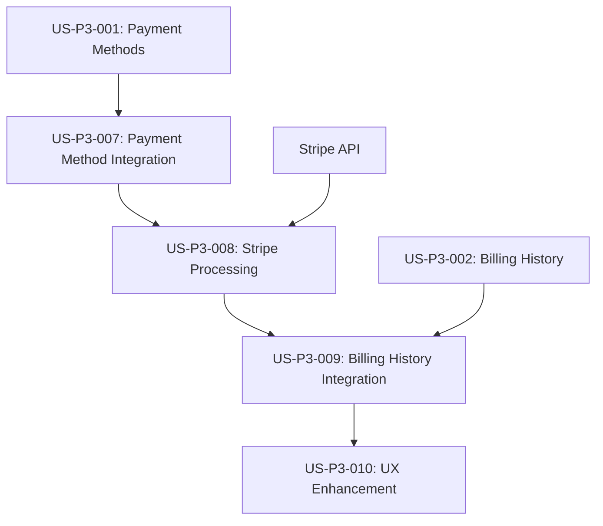

# Integration User Stories - PlanChangeDialog Payment Processing

**Epic**: STRIPE-INTEGRATION-GAPS  
**Priority**: P0 - Critical  
**Created**: 2025-08-01  
**Status**: Emergency Sprint Required  

## 📋 Overview

These user stories address the critical integration gaps discovered in the PlanChangeDialog system during US-P3-002 implementation. The current plan change functionality lacks actual payment processing, creating a significant user experience and business impact.

**Background**: See [INTEGRATION-GAPS-ANALYSIS.md](./INTEGRATION-GAPS-ANALYSIS.md) for detailed gap analysis.

---

## 🎯 User Stories

### US-P3-007: Plan Change Payment Method Integration
**Priority**: P0 - Critical  
**Story Points**: 8  
**Sprint**: Emergency Sprint 1.5  
**Dependencies**: US-P3-001 (Payment Methods Management)

#### User Story
> **As a** QuoteKit user  
> **I want** to have my payment methods validated before changing plans  
> **So that** I can successfully complete plan upgrades without payment failures

#### Acceptance Criteria
- [ ] **AC-1**: When upgrading to a paid plan, system validates user has at least one valid payment method
- [ ] **AC-2**: If no payment method exists, user is prompted to add one before proceeding
- [ ] **AC-3**: User can select which payment method to use for the plan change
- [ ] **AC-4**: System validates payment method is not expired or invalid before processing
- [ ] **AC-5**: Clear error messages are shown for payment method validation failures
- [ ] **AC-6**: User can add a new payment method directly from the plan change dialog

#### Technical Requirements
- Integrate PlanChangeDialog with existing PaymentMethodsManager
- Add payment method validation to changePlan action
- Create payment method selection UI within plan change flow
- Handle payment method errors gracefully

#### Definition of Done
- [ ] Payment method validation implemented
- [ ] Payment method selection UI created
- [ ] Error handling for invalid/expired cards
- [ ] Integration tests passing
- [ ] Accessibility compliance maintained

---

### US-P3-008: Plan Change Stripe Payment Processing
**Priority**: P0 - Critical  
**Story Points**: 13  
**Sprint**: Emergency Sprint 1.5  
**Dependencies**: US-P3-007, Stripe API integration

#### User Story
> **As a** QuoteKit user  
> **I want** my plan changes to be processed through Stripe with proper payment handling  
> **So that** I can successfully upgrade/downgrade my subscription with accurate billing

#### Acceptance Criteria
- [ ] **AC-1**: Plan upgrades process payment immediately with proration calculation
- [ ] **AC-2**: Plan downgrades are scheduled for end of billing period
- [ ] **AC-3**: Proration amounts are calculated accurately using Stripe's API
- [ ] **AC-4**: Payment failures are handled gracefully with retry options
- [ ] **AC-5**: Successful plan changes update both Stripe and local database
- [ ] **AC-6**: Invoices are generated automatically for plan changes
- [ ] **AC-7**: User receives confirmation of successful plan change

#### Technical Requirements
- Implement actual Stripe subscription update API calls
- Add proration calculation using Stripe's preview API
- Handle payment processing errors and retries
- Create invoice generation for plan changes
- Update local subscription data after Stripe confirmation

#### Definition of Done
- [ ] Stripe subscription.update() integration implemented
- [ ] Proration calculation working correctly
- [ ] Payment error handling with retry logic
- [ ] Invoice generation for plan changes
- [ ] Database synchronization with Stripe
- [ ] Comprehensive error logging

---

### US-P3-009: Plan Change Billing History Integration
**Priority**: P1 - High  
**Story Points**: 5  
**Sprint**: Emergency Sprint 1.5  
**Dependencies**: US-P3-008, US-P3-002 (Billing History)

#### User Story
> **As a** QuoteKit user  
> **I want** to see my plan changes reflected immediately in my billing history  
> **So that** I have complete visibility into my subscription changes and charges

#### Acceptance Criteria
- [ ] **AC-1**: Plan changes create entries in billing history immediately
- [ ] **AC-2**: Billing history shows proration charges separately from regular billing
- [ ] **AC-3**: Plan change transactions include clear descriptions (e.g., "Plan upgrade: Basic to Pro")
- [ ] **AC-4**: Billing history refreshes automatically after plan changes
- [ ] **AC-5**: Plan change invoices are downloadable from billing history
- [ ] **AC-6**: Failed plan changes are also recorded with failure reason

#### Technical Requirements
- Integrate plan changes with useBillingHistory hook
- Create billing history entries for plan changes
- Implement cache invalidation after plan changes
- Add plan change transaction types to billing history
- Ensure real-time updates in billing history table

#### Definition of Done
- [ ] Plan changes create billing history entries
- [ ] Cache invalidation working correctly
- [ ] Real-time billing history updates
- [ ] Plan change transaction types implemented
- [ ] Invoice downloads working for plan changes

---

### US-P3-010: Plan Change User Experience Enhancement
**Priority**: P2 - Medium  
**Story Points**: 8  
**Sprint**: Sprint 2 (after emergency fixes)  
**Dependencies**: US-P3-007, US-P3-008, US-P3-009

#### User Story
> **As a** QuoteKit user  
> **I want** a smooth and informative plan change experience  
> **So that** I feel confident and informed throughout the subscription change process

#### Acceptance Criteria
- [ ] **AC-1**: Loading states are shown during payment processing
- [ ] **AC-2**: Progress indicators show each step of the plan change process
- [ ] **AC-3**: Success confirmation includes details of the change and next billing date
- [ ] **AC-4**: Error messages are clear and provide actionable next steps
- [ ] **AC-5**: Plan change confirmation shows exact charges and proration details
- [ ] **AC-6**: User can cancel plan change before payment processing begins
- [ ] **AC-7**: Account dashboard updates immediately after successful plan change

#### Technical Requirements
- Add comprehensive loading states to PlanChangeDialog
- Implement optimistic UI updates
- Create detailed success/error messaging
- Add plan change confirmation step
- Implement real-time account dashboard updates

#### Definition of Done
- [ ] Loading states implemented
- [ ] Success/error messaging enhanced
- [ ] Confirmation step added
- [ ] Optimistic UI updates working
- [ ] Account dashboard real-time updates
- [ ] User testing completed

---

## 📊 Story Estimation & Planning

### Story Point Breakdown
- **US-P3-007**: 8 points (Payment Method Integration)
- **US-P3-008**: 13 points (Stripe Payment Processing)
- **US-P3-009**: 5 points (Billing History Integration)
- **US-P3-010**: 8 points (UX Enhancement)
- **Total**: 34 story points

### Sprint Planning Recommendation

#### Emergency Sprint 1.5 (1 week)
**Goal**: Make plan changes functional with payment processing
**Stories**: US-P3-007, US-P3-008, US-P3-009 (26 points)
**Duration**: 5 days
**Focus**: Critical functionality only

#### Sprint 2 (2 weeks)
**Goal**: Enhanced user experience and polish
**Stories**: US-P3-010 + remaining Sprint 1 stories (8 points)
**Duration**: 10 days
**Focus**: UX improvements and completion

### Risk Assessment
- **High Risk**: Stripe API integration complexity
- **Medium Risk**: Payment method validation edge cases
- **Low Risk**: Billing history integration (existing system)

## 🔄 Dependencies & Integration Points

### System Dependencies

### Technical Integration Points
1. **PaymentMethodsManager** ↔ **PlanChangeDialog**
2. **changePlan Action** ↔ **Stripe API**
3. **useBillingHistory Hook** ↔ **Plan Change Events**
4. **Account Dashboard** ↔ **Real-time Updates**

## 🧪 Testing Strategy

### Integration Testing Requirements
- [ ] End-to-end plan change flow testing
- [ ] Payment method validation testing
- [ ] Stripe API integration testing
- [ ] Billing history update testing
- [ ] Error scenario testing (payment failures, network issues)

### Test Scenarios
1. **Happy Path**: Successful plan upgrade with payment
2. **Payment Failure**: Handle declined card gracefully
3. **No Payment Method**: Prompt user to add payment method
4. **Network Issues**: Handle API failures and retries
5. **Concurrent Changes**: Handle multiple users changing plans

## 📈 Success Metrics

### Functional Metrics
- [ ] Plan change completion rate > 95%
- [ ] Payment processing success rate > 98%
- [ ] Billing history accuracy > 99%
- [ ] Error recovery rate > 90%

### User Experience Metrics
- [ ] User satisfaction with plan change flow > 4.5/5
- [ ] Time to complete plan change < 2 minutes
- [ ] Support tickets related to plan changes < 1% of changes
- [ ] User retention after plan changes > 95%

### Technical Metrics
- [ ] API response time < 500ms
- [ ] Error rate < 1%
- [ ] Cache invalidation success rate > 99%
- [ ] Database synchronization accuracy > 99%

## 🚨 Rollback Plan

### Emergency Rollback Scenarios
1. **Payment Processing Failures**: Disable plan change UI, show maintenance message
2. **Database Corruption**: Rollback to previous subscription state
3. **Stripe API Issues**: Queue plan changes for later processing
4. **Critical Bugs**: Revert to previous version with plan changes disabled

### Rollback Procedures
- [ ] Feature flag to disable plan changes
- [ ] Database backup before deployment
- [ ] Stripe webhook handling for rollback scenarios
- [ ] User communication plan for service disruptions

---

**Document Owner**: Product Owner, Technical Lead  
**Review Required**: Stakeholders, Development Team  
**Next Review**: Daily during emergency sprint  
**Status**: 🚨 **REQUIRES IMMEDIATE SPRINT PLANNING**
