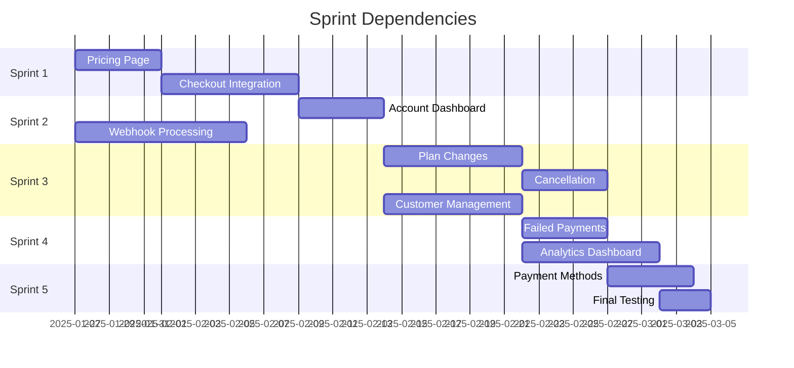

# Sprint Breakdown - Account-Stripe Integration

## Epic Sprint Planning

**Epic Duration**: 8-10 weeks (5 sprints)  
**Team Velocity**: ~12-14 story points per sprint  
**Total Story Points**: 62 points  

---

## Sprint 1: Foundation & User Checkout (Weeks 1-2)
**Sprint Goal**: Establish pricing infrastructure and user checkout capability  
**Duration**: 2 weeks  
**Story Points**: 13  

### Stories Included:
| Story | Title | Points | Priority | Dependencies |
|-------|-------|---------|----------|--------------|
| US-001 | Public Pricing Page | 5 | Must Have | Admin Stripe config |
| US-002 | Stripe Checkout Integration | 8 | Must Have | US-001 completed |

### Sprint 1 Deliverables:
- [ ] Public pricing page with admin-configured products
- [ ] Secure checkout flow with Stripe integration
- [ ] Success/cancel page handling
- [ ] Email confirmation system
- [ ] Mobile-responsive pricing display

### Sprint 1 Acceptance Criteria:
- Users can view all available subscription plans
- Users can complete checkout process end-to-end
- Payment confirmation emails are sent
- Pricing page loads in < 2 seconds
- All components pass accessibility audit

### Technical Tasks:
- [ ] Create pricing service and API endpoints
- [ ] Implement checkout session creation
- [ ] Build responsive pricing page components
- [ ] Set up email notification system
- [ ] Configure Stripe webhook processing for checkout

---

## Sprint 2: Account Management & Parallel Webhook Enhancement (Weeks 3-4)
**Sprint Goal**: Enhanced account dashboard and reliable webhook processing  
**Duration**: 2 weeks  
**Story Points**: 10 (Parallel Development)  

### Stories Included:
| Story | Title | Points | Priority | Dependencies |
|-------|-------|---------|----------|--------------|
| US-003 | Enhanced Account Dashboard | 5 | Must Have | US-002 completed |
| US-009 | Enhanced Webhook Processing | 5 | Must Have | Parallel with Sprint 1-2 |

### Sprint 2 Deliverables:
- [ ] Enhanced account dashboard with subscription details
- [ ] Billing history with downloadable invoices
- [ ] Payment method display capabilities
- [ ] Idempotent webhook processing system
- [ ] Webhook retry logic and dead letter queue

### Sprint 2 Acceptance Criteria:
- Users can view complete subscription information
- Billing history is accurate and downloadable
- Webhook processing achieves 99.9% success rate
- Account dashboard loads in < 3 seconds
- All subscription data stays synchronized

### Technical Tasks:
- [ ] Build enhanced account dashboard components
- [ ] Implement billing history API
- [ ] Create webhook processor with retry logic
- [ ] Set up webhook event logging and monitoring
- [ ] Implement invoice generation and download

---

## Sprint 3: Subscription Management & Customer Support (Weeks 5-6)
**Sprint Goal**: Complete user subscription management and admin customer tools  
**Duration**: 2 weeks  
**Story Points**: 18  

### Stories Included:
| Story | Title | Points | Priority | Dependencies |
|-------|-------|---------|----------|--------------|
| US-004 | Subscription Plan Changes | 8 | Should Have | US-003 completed |
| US-005 | Subscription Cancellation | 5 | Should Have | US-004 completed |
| US-006 | Customer Management Interface | 8 | Should Have | US-003 completed |

### Sprint 3 Deliverables:
- [ ] Plan upgrade/downgrade functionality
- [ ] Subscription cancellation flow
- [ ] Admin customer management interface
- [ ] Proration calculations and display
- [ ] Customer search and filtering capabilities

### Sprint 3 Acceptance Criteria:
- Users can change subscription plans with proper proration
- Cancellation flow includes retention strategies
- Admins can manage customer accounts effectively
- All plan changes are properly audited
- Customer communication is automated

### Technical Tasks:
- [ ] Implement subscription modification APIs
- [ ] Build plan comparison and upgrade UI
- [ ] Create cancellation flow with confirmation
- [ ] Develop admin customer list and detail pages
- [ ] Set up customer communication templates

---

## Sprint 4: Payment Recovery & Analytics Foundation (Weeks 7-8)
**Sprint Goal**: Failed payment management and analytics infrastructure  
**Duration**: 2 weeks  
**Story Points**: 13  

### Stories Included:
| Story | Title | Points | Priority | Dependencies |
|-------|-------|---------|----------|--------------|
| US-007 | Failed Payment Management | 5 | Should Have | US-006 completed |
| US-008 | Subscription Analytics Dashboard | 8 | Could Have | PostHog integration |

### Sprint 4 Deliverables:
- [ ] Failed payment dashboard for admins
- [ ] Automated payment retry mechanisms
- [ ] Customer dunning management workflow
- [ ] Real-time subscription analytics
- [ ] Revenue and churn metrics tracking

### Sprint 4 Acceptance Criteria:
- Failed payments are automatically retried with configurable schedules
- Revenue recovery rate is tracked and reportable
- Analytics dashboard shows key subscription metrics
- Admin can manually retry failed payments
- Customer notifications are sent for payment issues

### Technical Tasks:
- [ ] Build failed payment detection and retry system
- [ ] Create dunning management workflow
- [ ] Implement subscription analytics calculations
- [ ] Build analytics dashboard components
- [ ] Set up revenue and churn tracking

---

## Sprint 5: Enhancement & Payment Methods (Weeks 9-10)
**Sprint Goal**: Final enhancements and payment method management  
**Duration**: 2 weeks  
**Story Points**: 8  

### Stories Included:
| Story | Title | Points | Priority | Dependencies |
|-------|-------|---------|----------|--------------|
| US-010 | Payment Method Management | 5 | Could Have | Enhanced security measures |
| Epic Cleanup | Testing & Documentation | 3 | Must Have | All features completed |

### Sprint 5 Deliverables:
- [ ] Payment method addition and updates
- [ ] Security enhancements and PCI compliance verification
- [ ] Comprehensive testing suite completion
- [ ] Performance optimization and monitoring setup
- [ ] Documentation finalization

### Sprint 5 Acceptance Criteria:
- Users can securely manage payment methods
- All security audits pass including PCI compliance
- Test coverage exceeds 80% for critical paths
- Performance benchmarks are met
- Complete documentation is available

### Technical Tasks:
- [ ] Implement Stripe Setup Intents for payment methods
- [ ] Complete security audit and remediation
- [ ] Finalize test suite and coverage reports
- [ ] Performance testing and optimization
- [ ] Documentation review and completion

---

## Cross-Sprint Dependencies

### Parallel Development Opportunities:
1. **Webhook Enhancement (US-009)** can be developed parallel to Sprint 1-2
2. **Analytics Infrastructure** can be prepared during Sprint 2-3
3. **Security Enhancements** should be ongoing throughout all sprints

### Critical Path Dependencies:

---

## Risk Management by Sprint

### Sprint 1 Risks:
- **High**: Stripe API integration complexity
- **Medium**: Admin configuration dependency
- **Mitigation**: Early Stripe sandbox testing, parallel admin config work

### Sprint 2 Risks:
- **High**: Webhook reliability requirements
- **Medium**: Database migration challenges
- **Mitigation**: Comprehensive webhook testing, staged database migrations

### Sprint 3 Risks:
- **High**: Complex proration calculations
- **Medium**: User experience complexity
- **Mitigation**: Stripe proration API usage, extensive user testing

### Sprint 4 Risks:
- **Medium**: Analytics data accuracy
- **Medium**: Performance with large datasets
- **Mitigation**: Data validation scripts, performance testing

### Sprint 5 Risks:
- **Medium**: PCI compliance verification
- **Low**: Performance optimization timeline
- **Mitigation**: Early security review, continuous performance monitoring

---

## Success Metrics by Sprint

### Sprint 1 Success Criteria:
- [ ] Pricing page conversion rate > 5%
- [ ] Checkout completion rate > 85%
- [ ] Page load time < 2 seconds
- [ ] Zero payment processing errors

### Sprint 2 Success Criteria:
- [ ] Account dashboard satisfaction > 4.5/5
- [ ] Webhook processing success rate > 99.5%
- [ ] Data synchronization lag < 30 seconds
- [ ] User task completion rate > 90%

### Sprint 3 Success Criteria:
- [ ] Plan change completion rate > 80%
- [ ] Customer support ticket reduction by 30%
- [ ] Admin efficiency improvement > 40%
- [ ] User satisfaction with cancellation process > 4/5

### Sprint 4 Success Criteria:
- [ ] Payment recovery rate improvement > 25%
- [ ] Analytics dashboard usage > 80% by admins
- [ ] Failed payment resolution time < 24 hours
- [ ] Revenue visibility accuracy > 99%

### Sprint 5 Success Criteria:
- [ ] Payment method update success rate > 95%
- [ ] Security audit score > 95%
- [ ] Test coverage > 80%
- [ ] Performance benchmarks met 100%

---

## Resource Allocation

### Development Team:
- **Frontend Developer**: 70% user interfaces, 30% admin interfaces
- **Backend Developer**: 60% API development, 40% webhook/integration work
- **Full-Stack Developer**: 50% feature completion, 50% testing/polish
- **QA Engineer**: 40% manual testing, 60% automated test development

### External Dependencies:
- **Product Owner**: Story refinement and acceptance criteria validation
- **UX Designer**: User flow optimization and interface design
- **DevOps Engineer**: Deployment automation and monitoring setup
- **Security Engineer**: PCI compliance review and security audit

---

## Sprint Retrospective Planning

### Key Questions for Each Sprint:
1. **What went well?** - Celebrate successes and effective practices
2. **What could be improved?** - Identify process and technical improvements
3. **What blocked us?** - Address impediments and dependencies
4. **What should we continue?** - Maintain effective practices
5. **What should we start?** - New practices to improve delivery

### Continuous Improvement Areas:
- **Code Quality**: Maintain high standards throughout rapid development
- **Testing Strategy**: Balance speed with comprehensive coverage
- **User Feedback**: Incorporate user testing results into development
- **Performance**: Monitor and optimize throughout development cycle

---

**Document Version**: 1.0  
**Last Updated**: 2025-01-25  
**Next Review**: Weekly sprint planning sessions  
**Document Owner**: Scrum Master / Tech Lead

---

## Related Documents
- [Epic Overview](./README.md)
- [User Stories](./user-stories.md)
- [Technical Architecture](./technical-architecture.md)
- [Implementation Guide](./implementation-guide.md) *(Next)*