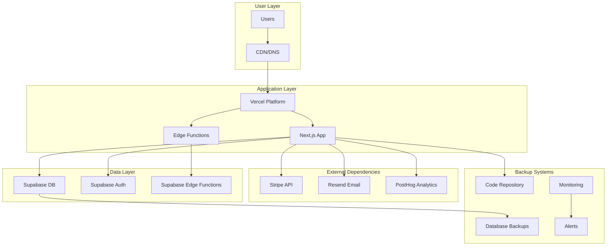

# QuoteKit Disaster Recovery Plan
## Business Continuity & System Recovery for lawnquote.online

**Classification:** CONFIDENTIAL  
**Version:** 1.0  
**Effective Date:** 2025-08-10  
**Review Date:** 2025-11-10

---

## Table of Contents
1. [Executive Summary](#executive-summary)
2. [Disaster Categories & Response](#disaster-categories--response)
3. [Recovery Objectives](#recovery-objectives)
4. [System Architecture & Dependencies](#system-architecture--dependencies)
5. [Backup & Restoration Procedures](#backup--restoration-procedures)
6. [Incident Response Procedures](#incident-response-procedures)
7. [Communication Plan](#communication-plan)
8. [Testing & Validation](#testing--validation)

---

## Executive Summary

This Disaster Recovery Plan (DRP) outlines the procedures for maintaining and restoring QuoteKit services in the event of system failures, security incidents, or other disasters. The plan ensures minimal service disruption and data loss while maintaining business continuity.

### Key Recovery Metrics
- **Recovery Time Objective (RTO):** 15 minutes for critical services
- **Recovery Point Objective (RPO):** 1 hour maximum data loss
- **Maximum Tolerable Downtime (MTD):** 4 hours
- **Business Impact Threshold:** $1,000/hour revenue loss

---

## Disaster Categories & Response

### Category 1: Critical Disasters (RTO: 5-15 minutes)
**Impact:** Complete service unavailability, payment processing down

**Scenarios:**
- Primary application server failure
- Database server complete failure
- DNS/domain hijacking
- Critical security breach

**Response Level:** IMMEDIATE - All hands on deck

### Category 2: High Impact Disasters (RTO: 15-60 minutes)
**Impact:** Partial service degradation, some features unavailable

**Scenarios:**
- Database performance issues
- Edge function failures
- Payment gateway issues
- Third-party service outages

**Response Level:** HIGH - On-call team response

### Category 3: Medium Impact Disasters (RTO: 1-4 hours)
**Impact:** Non-critical feature failures, performance degradation

**Scenarios:**
- Email delivery issues
- Analytics service outages
- Non-critical API failures
- CDN performance issues

**Response Level:** MEDIUM - Business hours response

### Category 4: Low Impact Disasters (RTO: 4-24 hours)
**Impact:** Minor service issues, cosmetic problems

**Scenarios:**
- Blog content issues
- Minor UI problems
- Non-critical integrations
- Documentation site issues

**Response Level:** LOW - Standard support response

---

## Recovery Objectives

### Service Priority Matrix

| Service Component | Priority | RTO | RPO | Impact |
|-------------------|----------|-----|-----|---------|
| Core Application | P0 | 5 min | 15 min | Critical |
| Database | P0 | 10 min | 1 hour | Critical |
| Payment Processing | P0 | 15 min | 1 hour | Critical |
| User Authentication | P1 | 15 min | 1 hour | High |
| Quote Generation | P1 | 30 min | 1 hour | High |
| Email Service | P2 | 1 hour | 4 hours | Medium |
| Analytics | P2 | 2 hours | 24 hours | Medium |
| Blog/Content | P3 | 4 hours | 24 hours | Low |

### Business Impact Analysis

| Downtime Duration | Revenue Impact | Customer Impact | Business Impact |
|-------------------|----------------|-----------------|------------------|
| 0-15 minutes | $0-250 | Minimal | Acceptable |
| 15-60 minutes | $250-1,000 | Low | Manageable |
| 1-4 hours | $1,000-4,000 | Medium | Significant |
| 4-24 hours | $4,000-24,000 | High | Critical |
| >24 hours | >$24,000 | Severe | Catastrophic |

---

## System Architecture & Dependencies

### Infrastructure Components



### Critical Dependencies
1. **Vercel Platform** - Application hosting and CDN
2. **Supabase Cloud** - Database, authentication, edge functions
3. **Stripe** - Payment processing
4. **Resend** - Email delivery
5. **GitHub** - Code repository and CI/CD
6. **Domain DNS** - Domain resolution

### Single Points of Failure
- Domain DNS provider
- Vercel platform availability
- Supabase platform availability
- Stripe payment processing
- Primary database instance

---

## Backup & Restoration Procedures

### Database Backup Strategy

#### Automated Backups
```bash
# Daily automated backups (2 AM UTC)
Schedule: 0 2 * * *
Retention: 30 days
Location: Supabase managed backups + S3 cross-region
Encryption: AES-256 at rest
Verification: Automated integrity checks
```

#### Manual Backup Procedures
```bash
# Emergency manual backup
pg_dump -h [host] -U [user] -d [database] --verbose --no-acl --no-owner > backup_$(date +%Y%m%d_%H%M%S).sql

# Compressed backup with schema
pg_dump -h [host] -U [user] -d [database] -Fc -v > backup_$(date +%Y%m%d_%H%M%S).dump

# Backup verification
pg_restore --list backup_$(date +%Y%m%d_%H%M%S).dump | head -20
```

#### Point-in-Time Recovery
```bash
# Restore to specific timestamp
supabase db restore --project-ref [project-ref] --backup-id [backup-id]

# Verify restoration
psql -h [new-host] -U [user] -d [database] -c "SELECT NOW(), version();"
```

### Application Backup Strategy

#### Code Repository
```bash
# Multiple repository mirrors
Primary: GitHub (github.com/org/quotekit)
Mirror 1: GitLab (gitlab.com/org/quotekit)
Mirror 2: Local Git server (optional)

# Branch protection
- Main branch: Protected, requires reviews
- Production branch: Protected, signed commits
- Release tags: Immutable, signed
```

#### Configuration Backup
```bash
# Environment variables backup (encrypted)
# Store in secure password manager
# Document all production configurations
# Version control infrastructure as code
```

#### Static Assets Backup
```bash
# CDN asset backup
# Periodic download of all static assets
# Store in multiple S3 buckets across regions
# Automated sync verification
```

---

## Incident Response Procedures

### Emergency Response Team

| Role | Primary | Secondary | Contact |
|------|---------|-----------|---------|
| Incident Commander | [Name] | [Name] | [Phone/Email] |
| Technical Lead | [Name] | [Name] | [Phone/Email] |
| Database Admin | [Name] | [Name] | [Phone/Email] |
| DevOps Engineer | [Name] | [Name] | [Phone/Email] |
| Communications Lead | [Name] | [Name] | [Phone/Email] |

### Response Procedures by Disaster Category

#### Category 1: Critical Disaster Response
```bash
# IMMEDIATE RESPONSE (0-5 minutes)
1. Incident Commander activation
2. Assess impact and categorize incident
3. Initiate emergency communication protocol
4. Begin technical investigation
5. Consider immediate rollback if applicable

# SHORT TERM RESPONSE (5-15 minutes)
1. Implement temporary workaround if possible
2. Activate backup systems
3. Begin restoration procedures
4. Update stakeholders every 5 minutes
5. Document all actions taken

# RECOVERY PHASE (15+ minutes)
1. Execute full recovery plan
2. Validate system functionality
3. Monitor for secondary issues
4. Gradual traffic restoration
5. Post-incident analysis planning
```

### Specific Recovery Procedures

#### Database Failure Recovery
```bash
# Step 1: Assess database status
curl -X GET https://[project-ref].supabase.co/rest/v1/ -H "apikey: [key]"

# Step 2: Check backup availability
supabase backups list --project-ref [project-ref]

# Step 3: Initiate point-in-time recovery
supabase db restore --project-ref [project-ref] --backup-id [latest-backup]

# Step 4: Update connection strings (if new instance)
vercel env add DATABASE_URL [new-connection-string] production

# Step 5: Redeploy application
vercel --prod

# Step 6: Verify functionality
curl -f https://lawnquote.online/api/health
```

#### Application Server Failure Recovery
```bash
# Step 1: Check Vercel status
curl -f https://api.vercel.com/v2/deployments/[deployment-id]

# Step 2: Rollback to previous deployment
vercel rollback [previous-deployment-url] --prod

# Step 3: Or redeploy from last known good commit
git checkout [last-good-commit]
vercel --prod

# Step 4: Verify deployment
curl -f https://lawnquote.online/
curl -f https://lawnquote.online/api/health
```

#### Payment System Failure Recovery
```bash
# Step 1: Check Stripe status
curl https://status.stripe.com/api/v2/status.json

# Step 2: Test webhook connectivity
curl -X POST https://lawnquote.online/api/webhooks/stripe \
  -H "Content-Type: application/json" \
  -H "Stripe-Signature: [test-signature]" \
  -d '{"test": true}'

# Step 3: Verify payment processing
# Run test transaction in Stripe dashboard

# Step 4: Check webhook event processing
# Review Stripe dashboard for failed events
# Manually replay failed events if necessary
```

#### DNS/Domain Failure Recovery
```bash
# Step 1: Check DNS propagation
dig lawnquote.online
dig www.lawnquote.online

# Step 2: Update DNS records if necessary
# Contact domain registrar support
# Update A records to point to Vercel IPs

# Step 3: Verify SSL certificate
openssl s_client -connect lawnquote.online:443 -servername lawnquote.online

# Step 4: Test from multiple locations
curl -I https://lawnquote.online/
```

---

## Communication Plan

### Internal Communication

#### Escalation Matrix
```
Level 1: On-call engineer (immediate response)
Level 2: Technical lead (within 15 minutes)
Level 3: Engineering manager (within 30 minutes)
Level 4: CTO/VP Engineering (within 1 hour)
Level 5: CEO/Executive team (within 2 hours)
```

#### Communication Channels
- **Primary:** Slack #incidents channel
- **Secondary:** Email distribution list
- **Emergency:** Phone call tree
- **Documentation:** Incident tracking system

### External Communication

#### Customer Communication
```markdown
# Status Page Updates (status.lawnquote.online)
- Real-time service status
- Incident timeline and updates
- Expected resolution time
- Affected services

# Email Notifications
- Critical incidents: Immediate notification
- Service degradation: Within 30 minutes
- Resolution confirmation: Immediate
- Post-incident summary: Within 24 hours
```

#### Template Communications
```markdown
# Critical Incident Notification
Subject: [URGENT] Service Disruption - LawnQuote

We are currently experiencing a service disruption affecting [specific services]. 

Impact: [Description of user impact]
Estimated Resolution: [Time estimate]
Current Status: [What we're doing to fix it]

We will provide updates every 15 minutes until resolved.
For the latest updates: https://status.lawnquote.online

# Resolution Notification
Subject: [RESOLVED] Service Disruption - LawnQuote

The service disruption affecting [services] has been resolved as of [timestamp].

Root Cause: [Brief explanation]
Resolution: [What was done to fix it]
Prevention: [Steps taken to prevent recurrence]

We apologize for any inconvenience caused.
```

---

## Testing & Validation

### Disaster Recovery Testing Schedule

#### Monthly Tests
- [ ] Backup restoration test
- [ ] Database failover simulation
- [ ] Application rollback procedure
- [ ] Communication protocol drill

#### Quarterly Tests
- [ ] Full disaster recovery simulation
- [ ] Cross-team coordination exercise
- [ ] External communication test
- [ ] Recovery time measurement

#### Annual Tests
- [ ] Complete infrastructure failure simulation
- [ ] Business continuity assessment
- [ ] Plan review and updates
- [ ] Staff training and certification

### Test Procedures

#### Database Recovery Test
```bash
# Test Procedure: Monthly DB Recovery Test
# Objective: Verify database backup and restoration

# 1. Create test database
supabase projects create --name "DR-Test-$(date +%Y%m%d)"

# 2. Restore latest backup
supabase db restore --project-ref [test-project] --backup-id [latest-backup]

# 3. Verify data integrity
psql -h [test-host] -c "SELECT COUNT(*) FROM users;"
psql -h [test-host] -c "SELECT COUNT(*) FROM subscriptions;"

# 4. Test application connection
# Update connection string temporarily
# Run application health checks

# 5. Cleanup
supabase projects delete [test-project]

# 6. Document results
echo "Test Date: $(date)" >> recovery-test-log.txt
echo "Backup ID: [backup-id]" >> recovery-test-log.txt
echo "Result: SUCCESS/FAILURE" >> recovery-test-log.txt
```

#### Application Recovery Test
```bash
# Test Procedure: Monthly App Recovery Test
# Objective: Verify application deployment and rollback

# 1. Deploy test version
vercel --name quotekit-dr-test

# 2. Test basic functionality
curl -f https://quotekit-dr-test.vercel.app/
curl -f https://quotekit-dr-test.vercel.app/api/health

# 3. Simulate rollback
vercel rollback [previous-deployment] --name quotekit-dr-test

# 4. Verify rollback success
curl -f https://quotekit-dr-test.vercel.app/

# 5. Cleanup test deployment
vercel remove quotekit-dr-test --yes

# 6. Document results
echo "Recovery Test Results:" >> recovery-test-log.txt
```

### Recovery Validation Checklist

#### Post-Recovery Validation
- [ ] **Application Accessibility**
  - [ ] Homepage loads successfully
  - [ ] User authentication works
  - [ ] Payment processing functional
  - [ ] Admin dashboard accessible

- [ ] **Data Integrity**
  - [ ] User accounts intact
  - [ ] Subscription data accurate
  - [ ] Payment history preserved
  - [ ] Quotes and documents accessible

- [ ] **System Performance**
  - [ ] Response times acceptable (<2 seconds)
  - [ ] Database queries performing normally
  - [ ] No error spikes in logs
  - [ ] All integrations functional

- [ ] **Security & Compliance**
  - [ ] SSL certificates valid
  - [ ] Authentication systems working
  - [ ] Data encryption confirmed
  - [ ] Audit logs preserved

---

## Plan Maintenance & Updates

### Review Schedule
- **Monthly:** Incident response procedures review
- **Quarterly:** Full plan review and testing
- **Annually:** Complete plan overhaul and validation
- **After Incidents:** Immediate plan updates based on lessons learned

### Change Management
1. **Proposed Changes:** Document and justify all changes
2. **Impact Assessment:** Evaluate effects on recovery objectives
3. **Approval Process:** Technical and business stakeholder approval
4. **Implementation:** Staged rollout with testing
5. **Documentation:** Update all relevant documentation
6. **Training:** Educate team on changes

### Metrics & KPIs
- Mean Time to Recovery (MTTR)
- Recovery Point Objective achievement
- Recovery Time Objective achievement
- Backup success rate (target: 99.9%)
- Test drill success rate (target: 100%)
- Plan update frequency (monthly minimum)

---

## Emergency Contacts

### Internal Emergency Contacts
```
Incident Commander: [Name]
Phone: [24/7 Number]
Email: [Emergency Email]
Backup: [Name] - [Phone]

Technical Lead: [Name]
Phone: [24/7 Number]
Email: [Emergency Email]
Backup: [Name] - [Phone]

Database Admin: [Name]
Phone: [24/7 Number]
Email: [Emergency Email]
Backup: [Name] - [Phone]
```

### External Vendor Contacts
```
Vercel Support:
- Email: support@vercel.com
- Status: https://vercel.com/status
- Phone: Available via dashboard

Supabase Support:
- Email: support@supabase.com
- Status: https://status.supabase.com
- Dashboard: https://app.supabase.com

Stripe Support:
- Phone: 1-888-963-8932
- Email: support@stripe.com
- Status: https://status.stripe.com

Domain Registrar: [Contact Info]
DNS Provider: [Contact Info]
```

---

## Appendices

### Appendix A: Recovery Scripts
[Location of automated recovery scripts]

### Appendix B: Network Diagrams
[Detailed infrastructure diagrams]

### Appendix C: Vendor Agreements
[SLA documents and support agreements]

### Appendix D: Compliance Requirements
[Regulatory and compliance considerations]

---

**Document Classification:** CONFIDENTIAL  
**Last Updated:** 2025-08-10  
**Next Review:** 2025-11-10  
**Approved By:** [Name, Title, Date]  
**Distribution:** Emergency Response Team Only