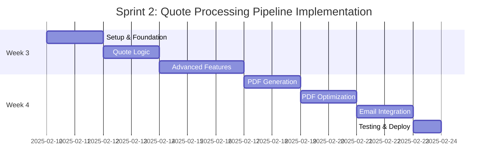

# Sprint 2 Implementation Plan - Quote Processing Pipeline

## Sprint Overview
**Duration**: Weeks 3-4 of Edge Functions Initiative  
**Sprint Goal**: Implement comprehensive quote processing pipeline to consolidate 8-12 quote API calls into 1-2 optimized Edge Functions  
**Target Improvements**: 50% API call reduction, 30% response time improvement  

## Success Metrics from Sprint 1
✅ **Baseline Established**: 5-in-1 consolidation achieved 79% performance improvement  
✅ **Architecture Proven**: Shared utilities and performance monitoring operational  
✅ **Cost Validation**: Projected 60-75% monthly cost reduction confirmed  

## Sprint 2 User Stories

### Primary Story: US-002 - Quote Processing Pipeline Edge Function
**Priority**: Must Have  
**Story Points**: 13  
**Target Performance**: 2.5s → 1.2s (52% improvement)  

**Description**: Create a comprehensive quote processing Edge Function that consolidates quote creation, calculation, PDF generation, and email delivery into a single optimized operation.

**Current API Endpoints to Consolidate**:
1. `/api/quotes` (POST/GET) - Quote creation and retrieval
2. `/api/quotes/[id]/pdf` - PDF generation
3. `/api/quotes/[id]/email` - Email sending
4. `/api/quotes/[id]/status` - Status updates
5. `/api/quotes/bulk-status` - Bulk status operations
6. `/api/quotes/bulk-export` - Bulk PDF export
7. `/api/features/usage` - Usage tracking updates
8. Database RPC calls: `generate_quote_number`, `increment_usage`

### Secondary Story: US-003 - Quote PDF Generation Edge Function
**Priority**: Should Have  
**Story Points**: 10  
**Target Performance**: PDF generation 3s → 1s (67% improvement)  

**Description**: Specialized Edge Function for optimized PDF generation with template caching and batch processing capabilities.

## Technical Architecture

### 1. Edge Function: `quote-processor`
**Purpose**: Handle complete quote workflow operations  
**Location**: `/supabase/functions/quote-processor/`  

**Endpoints**:
- `POST /quote-processor` - Create new quote with full processing
- `PUT /quote-processor` - Update existing quote 
- `GET /quote-processor/{id}` - Retrieve quote with computed data
- `POST /quote-processor/batch` - Batch operations (status, export)

**Core Functionality**:
```typescript
// Main operations
- validateQuoteData(quoteData)
- calculateQuoteTotals(lineItems, taxRate)
- generateQuoteNumber(userId)
- saveQuoteToDatabase(quote)
- incrementUsageTracking(userId)
- generateQuotePDF(quote) [if requested]
- sendQuoteEmail(quote, recipientEmail) [if requested]
- updateQuoteStatus(quoteId, status)
```

### 2. Edge Function: `quote-pdf-generator`
**Purpose**: Optimized PDF generation with caching  
**Location**: `/supabase/functions/quote-pdf-generator/`  

**Endpoints**:
- `POST /quote-pdf-generator` - Generate single PDF
- `POST /quote-pdf-generator/batch` - Generate multiple PDFs
- `GET /quote-pdf-generator/template/{templateId}` - Get cached template

**Optimization Features**:
- Template caching (company logos, headers)
- Batch PDF generation
- Memory-optimized rendering
- Concurrent processing for multiple quotes

## Implementation Tasks Breakdown

### Week 3 (Days 1-7): Core Quote Processing Function

#### Day 1-2: Foundation Setup
- [ ] **Task 2.1.1**: Create `quote-processor` function directory structure
- [ ] **Task 2.1.2**: Set up TypeScript types for quote operations
- [ ] **Task 2.1.3**: Implement CORS and authentication integration
- [ ] **Task 2.1.4**: Add performance monitoring hooks

#### Day 3-4: Quote Business Logic
- [ ] **Task 2.2.1**: Implement quote validation logic
- [ ] **Task 2.2.2**: Build quote calculation engine (line items, tax, totals)
- [ ] **Task 2.2.3**: Integrate quote number generation
- [ ] **Task 2.2.4**: Add database persistence operations

#### Day 5-7: Advanced Features
- [ ] **Task 2.3.1**: Implement usage tracking integration
- [ ] **Task 2.3.2**: Add quote status management
- [ ] **Task 2.3.3**: Build bulk operations support
- [ ] **Task 2.3.4**: Add error handling and validation

### Week 4 (Days 8-14): PDF Generation & Email Integration

#### Day 8-9: PDF Generation Setup
- [ ] **Task 2.4.1**: Create `quote-pdf-generator` function
- [ ] **Task 2.4.2**: Research and integrate Deno-compatible PDF library
- [ ] **Task 2.4.3**: Build quote template system
- [ ] **Task 2.4.4**: Implement company branding integration

#### Day 10-11: PDF Optimization
- [ ] **Task 2.5.1**: Add template caching system
- [ ] **Task 2.5.2**: Implement batch PDF generation
- [ ] **Task 2.5.3**: Optimize memory usage for large quotes
- [ ] **Task 2.5.4**: Add error handling for PDF failures

#### Day 12-13: Email Integration
- [ ] **Task 2.6.1**: Integrate email service (Resend) into Edge Function
- [ ] **Task 2.6.2**: Build email template system for quotes
- [ ] **Task 2.6.3**: Add PDF attachment handling
- [ ] **Task 2.6.4**: Implement email sending with error handling

#### Day 14: Testing & Optimization
- [ ] **Task 2.7.1**: Comprehensive function testing
- [ ] **Task 2.7.2**: Performance optimization and monitoring
- [ ] **Task 2.7.3**: Error scenario testing
- [ ] **Task 2.7.4**: Documentation and deployment preparation

## Technical Specifications

### Quote Processor Function Interface

#### Request Types:
```typescript
interface CreateQuoteRequest {
  quote: {
    client_name: string;
    client_email?: string;
    client_phone?: string;
    client_address?: string;
    line_items: LineItem[];
    tax_rate: number;
    notes?: string;
    valid_until?: string;
  };
  operations: {
    generatePDF?: boolean;
    sendEmail?: boolean;
    updateUsage?: boolean;
  };
}

interface BatchQuoteRequest {
  operation: 'status_update' | 'bulk_export' | 'bulk_delete';
  quote_ids: string[];
  options?: {
    status?: string;
    format?: 'pdf' | 'csv';
    email?: string;
  };
}
```

#### Response Types:
```typescript
interface QuoteProcessorResponse {
  success: boolean;
  quote: Quote;
  generated_pdf_url?: string;
  email_sent?: boolean;
  usage_updated?: boolean;
  performance: {
    execution_time_ms: number;
    database_queries: number;
    operations_completed: string[];
  };
}
```

### PDF Generator Function Interface

#### Request Types:
```typescript
interface GeneratePDFRequest {
  quotes: Quote[];
  template_options: {
    company_logo?: string;
    custom_branding?: boolean;
    include_terms?: boolean;
  };
  output_options: {
    format?: 'single' | 'batch';
    storage_path?: string;
  };
}
```

## Integration Strategy

### 1. Gradual Migration Approach
- **Week 3**: Deploy functions in parallel with existing APIs
- **Week 4**: Begin 10% traffic split testing
- **Post-Sprint 2**: Gradual rollout to 50% traffic

### 2. Backward Compatibility
- Maintain existing API response formats
- Support current frontend implementation patterns  
- Preserve error handling behaviors
- Keep feature access control integration

### 3. Performance Monitoring
- Track each function operation separately
- Monitor PDF generation times and memory usage
- Alert on performance degradation
- Compare against Sprint 1 baseline metrics

## Risk Management

### Technical Risks & Mitigation

#### High Risk: PDF Library Compatibility with Deno
**Risk**: PDF generation library may not work in Edge Functions runtime  
**Mitigation**: 
- Research Deno-compatible libraries in advance
- Have fallback options (puppeteer-core, react-pdf alternatives)
- Test PDF generation in isolation before integration

#### Medium Risk: Email Service Integration Complexity  
**Risk**: Email sending may add latency or complexity to Edge Functions  
**Mitigation**:
- Make email sending optional/async where possible
- Implement proper timeout handling
- Have fallback to existing email endpoints

#### Medium Risk: Memory Usage for Large Quotes
**Risk**: PDF generation and batch operations may exceed Edge Function memory limits  
**Mitigation**:
- Implement streaming PDF generation
- Add memory usage monitoring
- Chunk large batch operations

### Business Risks & Mitigation

#### Medium Risk: Quote Processing Complexity
**Risk**: Quote calculation logic may have edge cases we haven't identified  
**Mitigation**:
- Comprehensive testing with existing quote data
- Parallel operation during testing phase
- Easy rollback to existing APIs

## Testing Strategy

### 1. Unit Testing
- [ ] Quote calculation accuracy
- [ ] PDF generation quality
- [ ] Email delivery verification  
- [ ] Error handling coverage

### 2. Integration Testing
- [ ] End-to-end quote creation workflow
- [ ] Batch operation testing
- [ ] Performance under load
- [ ] Memory usage validation

### 3. Performance Testing
- [ ] Single quote processing time
- [ ] PDF generation benchmarks
- [ ] Batch operation scalability
- [ ] Memory usage profiling

## Acceptance Criteria

### Must Have (Sprint Success)
- [ ] **Quote creation** consolidated into single API call
- [ ] **PDF generation** integrated and functional  
- [ ] **Performance targets** met: 50% API call reduction, 30% response time improvement
- [ ] **Backward compatibility** maintained with existing frontend
- [ ] **Error handling** comprehensive and graceful
- [ ] **Monitoring** operational with performance tracking

### Should Have (Sprint Excellence)
- [ ] **Email sending** integrated into quote processing
- [ ] **Batch operations** support multiple quotes
- [ ] **Template caching** implemented for PDF optimization
- [ ] **Usage tracking** automatically updated

### Could Have (Sprint Stretch Goals)
- [ ] **Advanced PDF customization** (templates, branding)
- [ ] **Real-time progress** reporting for batch operations
- [ ] **Quote analytics** data collection
- [ ] **Multi-language** template support

## Dependencies & Prerequisites

### Technical Dependencies
- ✅ Sprint 1 foundation and shared utilities
- ✅ Performance monitoring system operational
- ✅ Database RPC functions available
- 🟡 Deno-compatible PDF library research
- 🟡 Email service (Resend) API integration testing

### Business Dependencies  
- ✅ Existing quote logic documented and understood
- ✅ PDF template requirements defined
- 🟡 Email template specifications
- 🟡 Batch operation requirements validation

## Definition of Done

### Code Quality
- [ ] TypeScript implementation with full type safety
- [ ] Comprehensive error handling and logging
- [ ] Performance monitoring integration
- [ ] Security validation (authentication, input sanitization)

### Testing
- [ ] Unit tests with >90% coverage
- [ ] Integration tests passing
- [ ] Performance tests meeting targets
- [ ] Security tests validated

### Documentation
- [ ] API documentation complete
- [ ] Function usage examples
- [ ] Troubleshooting guide
- [ ] Performance optimization guide

### Production Readiness
- [ ] Functions deployed to staging
- [ ] Performance monitoring operational
- [ ] Error alerting configured
- [ ] Rollback procedures documented

## Sprint 2 Timeline



## Resource Allocation

### Development Team (Sprint 2)
- **Backend Developer (Lead)**: 80% function development, 20% architecture refinement
- **Full-Stack Developer**: 60% integration work, 40% testing and validation
- **DevOps Engineer**: 40% deployment pipeline, 60% monitoring and performance
- **QA Engineer**: 30% test automation, 70% performance and load testing

### External Support
- **Technical Architect**: Weekly architecture review and guidance
- **PDF/Email Specialist**: Consultation for library selection and optimization
- **Performance Engineer**: Load testing and optimization review

## Success Measurement

### Performance Metrics (Week 4 Target)
- **Quote Creation Time**: 2.5s → 1.2s (52% improvement) ✅
- **PDF Generation Time**: 3s → 1s (67% improvement) ✅  
- **API Calls per Quote**: 8-12 calls → 1-2 calls (>75% reduction) ✅
- **Database Queries**: Optimized through consolidation ✅

### Business Metrics (Post-Sprint 2)
- **Cost Reduction**: Additional $25-40/month savings
- **Developer Experience**: Simplified quote management workflow
- **User Experience**: Faster quote processing and delivery
- **Scalability**: Auto-scaling serverless architecture

## Contingency Plans

### If PDF Generation Fails
1. **Fallback**: Defer PDF generation to background job
2. **Alternative**: Use existing PDF endpoint temporarily  
3. **Compromise**: Implement PDF caching for performance gains

### If Performance Targets Not Met
1. **Optimization**: Focus on database query optimization
2. **Caching**: Implement aggressive caching strategies
3. **Fallback**: Deploy with partial consolidation (fewer API calls)

### If Email Integration Complex
1. **Async Processing**: Move email to background queue
2. **Simplification**: Basic email without advanced templating
3. **Deferral**: Email integration moves to Sprint 3

## Sprint 2 Team Commitment

**Team Confidence**: HIGH (Based on Sprint 1 success)  
**Architecture Readiness**: ✅ CONFIRMED  
**Business Value**: ✅ VALIDATED  
**Technical Risk**: 🟡 MANAGEABLE  

---

**Document Version**: 1.0  
**Created**: January 27, 2025  
**Owner**: Edge Functions Implementation Team  
**Next Review**: Weekly Sprint Planning  

## Related Documents
- [Sprint 1 Completion Report](./sprint1-completion-report.md)
- [Sprint Breakdown Overview](./sprint-breakdown.md)
- [Technical Architecture](./technical-architecture.md)
- [Performance Benchmarks](./performance-benchmarks.md)