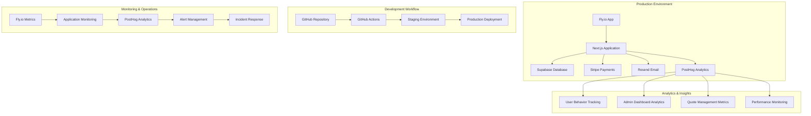

# QuoteKit Consolidated Deployment Plan

## 🎯 Overview

This directory contains the **final consolidated deployment plan** for QuoteKit, combining all analysis, planning, and technical specifications into a cohesive implementation strategy. This plan represents the culmination of comprehensive system analysis and strategic planning for production-ready deployment.

## 📋 Plan Components

### 1. [Consolidated Moscow Plan](./consolidated-moscow-plan.md)
**The Strategic Foundation**
- **Must Have**: Critical features for MVP deployment
- **Should Have**: Important features for enhanced functionality  
- **Could Have**: Nice-to-have features for future iterations
- **Won't Have**: Explicitly excluded features for this phase

**Key Highlights:**
- Prioritized feature matrix with business impact analysis
- Risk assessment and mitigation strategies
- Resource allocation and timeline estimates
- Success criteria and acceptance requirements

### 2. [Technical Specifications](./technical-specifications.md)
**The Implementation Blueprint**
- Detailed architecture and infrastructure requirements
- Database schema and migration strategies
- API specifications and integration points
- Security, monitoring, and performance requirements

**Key Highlights:**
- Complete technical architecture diagrams
- Infrastructure as Code (IaC) specifications
- Performance benchmarks and SLA requirements
- Security compliance and audit requirements

### 3. [Implementation Roadmap](./implementation-roadmap.md)
**The Execution Timeline**
- Phase-by-phase implementation schedule
- Milestone definitions and deliverables
- Resource requirements and team assignments
- Risk mitigation and contingency planning

**Key Highlights:**
- 4-phase deployment strategy with clear milestones
- Detailed timeline with dependencies and critical path
- Resource allocation and team responsibility matrix
- Quality gates and validation checkpoints

## 🚀 Quick Start Implementation Guide

### Phase 1: Foundation Setup (Week 1-2)
```bash
# 1. Environment Setup
cd /root/dev/.devcontainer/QuoteKit
cp docs/deployment/fly.io/fly-staging.toml ./fly.toml

# 2. Initialize Fly.io Application
flyctl auth login
flyctl apps create quotekit-staging

# 3. Configure Environment Variables
flyctl secrets set --app quotekit-staging \
  SUPABASE_URL="your-supabase-url" \
  SUPABASE_ANON_KEY="your-anon-key" \
  SUPABASE_SERVICE_ROLE_KEY="your-service-key" \
  NEXT_PUBLIC_POSTHOG_KEY="your-posthog-project-api-key" \
  NEXT_PUBLIC_POSTHOG_HOST="https://us.posthog.com" \
  POSTHOG_PERSONAL_API_KEY="your-posthog-personal-api-key"

# 4. Deploy Staging Environment
flyctl deploy --app quotekit-staging
```

### Phase 2: Core Features (Week 3-4)
- Implement authentication and user management
- Deploy quote management system
- Set up PDF generation capabilities
- Configure email notifications
- **Configure PostHog analytics and user tracking**

### Phase 3: Advanced Features (Week 5-6)
- Implement subscription management
- Deploy analytics and reporting
- Set up monitoring and alerting
- Configure backup and disaster recovery
- **Implement advanced PostHog features (funnels, cohorts, feature flags)**

### Phase 4: Production Readiness (Week 7-8)
- Performance optimization and load testing
- Security audit and penetration testing
- Documentation completion and team training
- Production deployment and go-live

## 📊 Implementation Status Dashboard

| Phase | Component | Status | Priority | Completion |
|-------|-----------|--------|----------|------------|
| 1 | Environment Setup | 🟡 Planning | Must Have | 0% |
| 1 | Fly.io Configuration | 🟡 Planning | Must Have | 0% |
| 1 | Database Migration | 🟡 Planning | Must Have | 0% |
| 2 | Authentication System | 🟡 Planning | Must Have | 0% |
| 2 | Quote Management | 🟡 Planning | Must Have | 0% |
| 2 | PDF Generation | 🟡 Planning | Must Have | 0% |
| 2 | PostHog Analytics | 🟡 Planning | Should Have | 0% |
| 3 | Subscription System | 🟡 Planning | Should Have | 0% |
| 3 | Analytics Dashboard | 🟡 Planning | Should Have | 0% |
| 3 | Monitoring Setup | 🟡 Planning | Should Have | 0% |
| 4 | Performance Testing | 🟡 Planning | Must Have | 0% |
| 4 | Security Audit | 🟡 Planning | Must Have | 0% |
| 4 | Production Deploy | 🟡 Planning | Must Have | 0% |

**Status Legend:**
- 🟡 Planning - Requirements defined, ready to start
- 🔵 In Progress - Active development
- 🟢 Complete - Implemented and tested
- 🔴 Blocked - Waiting for dependencies

## 🏗️ Architecture Overview



## 📚 Related Documentation

### Core Deployment Documentation
- [📋 Deployment Checklist](../../deployment-checklist.md) - Step-by-step deployment procedures
- [🏗️ Infrastructure Configuration](../../infrastructure-configuration.md) - Technical setup details
- [🔧 Environment Setup Guide](../../environment-setup-guide.md) - Configuration management
- [🚨 Disaster Recovery Plan](../../disaster-recovery-plan.md) - Business continuity planning

### Fly.io Specific Documentation
- [✈️ Fly.io Documentation](../fly-io-documentation.md) - Platform overview and capabilities
- [🎭 Staging Plan](../fly-io-staging-plan.md) - Staging environment strategy
- [⚙️ Setup Guide](../fly-staging-setup-guide.md) - Detailed setup procedures
- [🧪 Testing Procedures](../fly-staging-testing-procedures.md) - Comprehensive testing strategy
- [🔐 Environment Variables](../staging-environment-variables.md) - Configuration management
- [🔄 PR Preview Workflow](../fly-pr-preview.yml) - GitHub Actions automation

### Analysis and Verification
- [📊 System Analysis](../quotekit-system-analysis.md) - Technical system evaluation
- [✅ Alignment Verification](../alignment-verification-report.md) - Requirements alignment
- [🔍 Discrepancies Report](../discrepancies-and-corrections.md) - Issue identification and resolution
- [🏆 Certification Checklist](../certification-checklist.md) - Production readiness validation

## 🎯 Success Criteria

### Technical Success Metrics
- **Performance**: < 2s page load times, 99.9% uptime
- **Security**: Zero critical vulnerabilities, SOC 2 compliance
- **Scalability**: Support 1000+ concurrent users
- **Reliability**: 99.9% availability, < 1min recovery time

### Business Success Metrics
- **User Experience**: < 3 clicks to create quote, mobile responsive
- **Conversion**: 15%+ quote-to-customer conversion rate (tracked via PostHog)
- **Efficiency**: 50% reduction in quote creation time
- **Growth**: Support 10x user growth without architecture changes
- **Analytics**: 95%+ event tracking accuracy, real-time dashboard updates

## 📊 PostHog Analytics Integration

QuoteKit includes comprehensive analytics integration with PostHog for user behavior tracking, performance monitoring, and business intelligence.

### Analytics Features Implemented:

#### 🔍 **User Behavior Tracking**
- **Admin Actions**: Login tracking, user management, email campaigns
- **Quote Management**: Quote creation, editing, status changes, PDF generation
- **Email Operations**: Quote sending, template usage, delivery tracking
- **Page Views**: Automatic page view tracking with custom properties

#### 📈 **Admin Dashboard Analytics**
- **User Activity Monitoring**: Track admin user interactions and system usage
- **Custom Query Execution**: Monitor database query performance and usage
- **System Metrics**: Integration with PostHog for comprehensive system monitoring
- **Rate Limiting**: Track API usage and rate limit violations

#### 🎯 **Business Intelligence**
- **Quote Conversion Tracking**: Monitor quote-to-customer conversion rates
- **User Engagement**: Track feature usage and user journey analytics
- **Performance Metrics**: Monitor application performance and user experience
- **A/B Testing**: Feature flag support for controlled feature rollouts

### PostHog Configuration:

```typescript
// Client-side tracking (posthog-client.ts)
import posthog from 'posthog-js'

posthog.init(apiKey, {
  api_host: 'https://us.posthog.com',
  loaded: (posthog) => {
    // Custom initialization logic
  }
})

// Server-side tracking (posthog-admin.ts)
import { PostHog } from 'posthog-node'

export const posthogAdmin = new PostHog(
  process.env.POSTHOG_PROJECT_API_KEY,
  {
    host: process.env.POSTHOG_HOST || 'https://us.posthog.com',
  }
)
```

### Environment Variables Required:
- `NEXT_PUBLIC_POSTHOG_KEY`: Project API key for client-side tracking
- `NEXT_PUBLIC_POSTHOG_HOST`: PostHog instance URL (default: https://us.posthog.com)
- `POSTHOG_PERSONAL_API_KEY`: Personal API key for server-side operations
- `POSTHOG_PROJECT_ID`: Project ID for API operations

### Analytics Events Tracked:

#### Admin Events:
- `admin_login`: Admin user authentication
- `admin_action`: General admin actions with context
- `admin_user_management`: User management operations
- `admin_email_campaign`: Email campaign activities
- `admin_custom_query`: Database query execution

#### User Events:
- `quote_action`: Quote creation, editing, status changes
- `email_action`: Email sending and template usage
- `$pageview`: Page navigation with custom properties

### Integration Points:

1. **Admin Settings**: PostHog configuration management UI
2. **User Activity**: Real-time user activity tracking and reporting
3. **System Monitoring**: Integration with system health and performance metrics
4. **Rate Limiting**: Analytics-driven rate limiting and usage monitoring


### High-Risk Areas
1. **Database Migration**: Complex schema changes with zero downtime
2. **Payment Integration**: Stripe webhook reliability and security
3. **Performance**: PDF generation under high load
4. **Security**: Authentication and data protection compliance

### Mitigation Strategies
1. **Blue-Green Deployment**: Zero-downtime deployment strategy
2. **Circuit Breakers**: Fault tolerance for external services
3. **Load Testing**: Comprehensive performance validation
4. **Security Audits**: Regular penetration testing and compliance checks

## 📞 Support and Escalation

### Team Contacts
- **Technical Lead**: System architecture and implementation
- **DevOps Engineer**: Infrastructure and deployment
- **Security Officer**: Compliance and security validation
- **Product Manager**: Requirements and business validation

### Escalation Matrix
1. **Level 1**: Development team (< 2 hours response)
2. **Level 2**: Technical lead (< 4 hours response)
3. **Level 3**: Management escalation (< 8 hours response)
4. **Level 4**: Executive escalation (< 24 hours response)

## 🔄 Continuous Improvement

### Monitoring and Feedback
- **Performance Monitoring**: Real-time application metrics
- **User Feedback**: In-app feedback collection and analysis
- **Error Tracking**: Comprehensive error logging and alerting
- **Business Metrics**: KPI tracking and reporting via PostHog
- **User Analytics**: Behavior tracking, funnel analysis, and cohort studies

### Iteration Planning
- **Weekly Reviews**: Progress assessment and course correction
- **Monthly Retrospectives**: Process improvement and optimization
- **Quarterly Planning**: Feature roadmap and strategic alignment
- **Annual Architecture Review**: Technology stack evaluation and updates

---

## 🚀 Ready to Deploy?

This consolidated plan provides everything needed for successful QuoteKit deployment. Follow the implementation roadmap, use the technical specifications as your blueprint, and refer to the Moscow plan for prioritization decisions.

**Next Steps:**
1. Review all three plan documents thoroughly
2. Set up your development environment using the setup guides
3. Begin Phase 1 implementation following the roadmap
4. Use the certification checklist to validate each milestone

**Questions or Issues?**
- Check the related documentation for detailed guidance
- Review the discrepancies report for known issues and solutions
- Follow the escalation matrix for technical support

Let's build something amazing! 🎉
