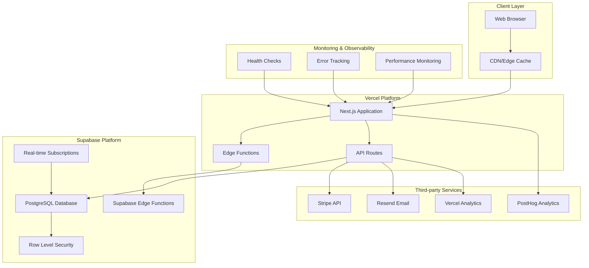

# QuoteKit Infrastructure Configuration
## Production Deployment on lawnquote.online

**Target Architecture:** Vercel + Supabase Cloud  
**Domain:** lawnquote.online  
**Environment:** Production

---

## Infrastructure Architecture



---

## 1. Vercel Configuration

### 1.1 Project Settings
```json
{
  "name": "lawnquote",
  "framework": "nextjs",
  "buildCommand": "npm run build",
  "outputDirectory": ".next",
  "installCommand": "npm install",
  "devCommand": "npm run dev"
}
```

### 1.2 Domain Configuration
```bash
# Primary domain
lawnquote.online

# Redirects
www.lawnquote.online → lawnquote.online (301 permanent)

# SSL/TLS
- Auto SSL certificate via Let's Encrypt
- TLS 1.2+ enforcement
- HSTS enabled
```

### 1.3 Environment Variables (Vercel Dashboard)
```bash
# Application
NEXT_PUBLIC_SITE_URL=https://lawnquote.online
NODE_ENV=production

# Database
NEXT_PUBLIC_SUPABASE_URL=https://[project-ref].supabase.co
NEXT_PUBLIC_SUPABASE_ANON_KEY=[anon-key]
SUPABASE_SERVICE_ROLE_KEY=[service-role-key]
SUPABASE_DB_PASSWORD=[db-password]

# Payment Processing
NEXT_PUBLIC_STRIPE_PUBLISHABLE_KEY=pk_live_[key]
STRIPE_SECRET_KEY=sk_live_[key]
STRIPE_WEBHOOK_SECRET=whsec_[secret]

# Email Service
RESEND_API_KEY=re_[api-key]

# Analytics
NEXT_PUBLIC_POSTHOG_KEY=phc_[key]
NEXT_PUBLIC_POSTHOG_HOST=https://us.posthog.com
POSTHOG_PROJECT_API_KEY=[project-key]
POSTHOG_PERSONAL_API_KEY=[personal-key]
POSTHOG_PROJECT_ID=[project-id]
```

### 1.4 Build Configuration
```javascript
// vercel.json
{
  "version": 2,
  "builds": [
    {
      "src": "package.json",
      "use": "@vercel/next"
    }
  ],
  "routes": [
    {
      "src": "/api/webhooks/stripe",
      "dest": "/api/webhooks/stripe",
      "headers": {
        "cache-control": "no-store"
      }
    }
  ],
  "functions": {
    "src/app/api/webhooks/stripe/route.ts": {
      "maxDuration": 30
    }
  },
  "headers": [
    {
      "source": "/(.*)",
      "headers": [
        {
          "key": "X-Frame-Options",
          "value": "DENY"
        },
        {
          "key": "X-Content-Type-Options",
          "value": "nosniff"
        },
        {
          "key": "Referrer-Policy",
          "value": "strict-origin-when-cross-origin"
        },
        {
          "key": "Strict-Transport-Security",
          "value": "max-age=31536000; includeSubDomains"
        }
      ]
    }
  ]
}
```

---

## 2. Supabase Configuration

### 2.1 Project Setup
```bash
# Project Details
Project Name: QuoteKit Production
Organization: [Your Organization]
Region: us-east-1 (or closest to primary users)
Plan: Pro Plan ($25/month)
```

### 2.2 Database Configuration
```sql
-- Connection Settings
Max Connections: 200
Connection Pooling: Enabled
Pool Size: 15-20 per pool
Pool Mode: Transaction

-- Performance Settings
shared_preload_libraries = 'pg_stat_statements'
max_connections = 200
shared_buffers = 256MB
effective_cache_size = 1GB
work_mem = 4MB
maintenance_work_mem = 64MB
```

### 2.3 Authentication Settings
```toml
[auth]
site_url = "https://lawnquote.online"
additional_redirect_urls = ["https://lawnquote.online/auth/callback"]
jwt_expiry = 3600
enable_refresh_token_rotation = true
enable_signup = true
minimum_password_length = 8

[auth.email]
enable_signup = true
enable_confirmations = true
double_confirm_changes = true
```

### 2.4 Edge Functions Configuration
```bash
# Deployed Functions
- quote-processor
- quote-pdf-generator
- batch-processor
- webhook-monitor
- security-hardening
- production-validator

# Resource Limits
Memory: 150MB per function
Timeout: 150 seconds
Concurrent Executions: 100
```

### 2.5 Row Level Security Policies
```sql
-- Users table
CREATE POLICY "Users can view own profile" ON users
    FOR SELECT USING (auth.uid() = id);

CREATE POLICY "Users can update own profile" ON users
    FOR UPDATE USING (auth.uid() = id);

-- Subscriptions table
CREATE POLICY "Users can view own subscriptions" ON subscriptions
    FOR SELECT USING (auth.uid() = user_id);

-- Quotes table
CREATE POLICY "Users can manage own quotes" ON quotes
    FOR ALL USING (auth.uid() = user_id);

-- Admin policies
CREATE POLICY "Admins can view all data" ON users
    FOR ALL USING (
        EXISTS (
            SELECT 1 FROM admin_users 
            WHERE user_id = auth.uid() AND active = true
        )
    );
```

---

## 3. Database Schema & Migrations

### 3.1 Migration Strategy
```bash
# Production Migration Process
1. Create database backup
2. Run migrations in transaction
3. Verify data integrity
4. Update application
5. Monitor for issues

# Rollback Strategy
- Automated backup before each migration
- Migration rollback scripts prepared
- Data integrity verification
- Application rollback procedures
```

### 3.2 Key Tables Configuration
```sql
-- Enable Row Level Security
ALTER TABLE users ENABLE ROW LEVEL SECURITY;
ALTER TABLE subscriptions ENABLE ROW LEVEL SECURITY;
ALTER TABLE quotes ENABLE ROW LEVEL SECURITY;
ALTER TABLE payment_methods ENABLE ROW LEVEL SECURITY;

-- Create performance indexes
CREATE INDEX idx_users_email ON users(email);
CREATE INDEX idx_subscriptions_user_id ON subscriptions(user_id);
CREATE INDEX idx_subscriptions_stripe_id ON subscriptions(stripe_subscription_id);
CREATE INDEX idx_quotes_user_id ON quotes(user_id);
CREATE INDEX idx_quotes_status ON quotes(status);

-- Performance monitoring
CREATE EXTENSION IF NOT EXISTS pg_stat_statements;
```

---

## 4. CDN & Static Assets

### 4.1 Vercel CDN Configuration
```javascript
// next.config.js
module.exports = {
  images: {
    domains: ['lawnquote.online'],
    formats: ['image/webp', 'image/avif'],
    minimumCacheTTL: 60,
  },
  headers: async () => [
    {
      source: '/assets/(.*)',
      headers: [
        {
          key: 'Cache-Control',
          value: 'public, max-age=31536000, immutable',
        },
      ],
    },
  ],
}
```

### 4.2 Asset Optimization
```bash
# Image optimization
- WebP format for modern browsers
- AVIF format for supported browsers
- Responsive image sizing
- Lazy loading implementation

# Static asset caching
- JavaScript/CSS: 1 year cache
- Images: 1 year cache with ETags
- API responses: No cache for dynamic content
- Static pages: 1 hour cache with revalidation
```

---

## 5. Monitoring & Observability

### 5.1 Health Check Endpoints
```typescript
// /api/health
export async function GET() {
  const checks = {
    database: await checkDatabaseConnection(),
    stripe: await checkStripeConnection(),
    email: await checkEmailService(),
    timestamp: new Date().toISOString(),
  };
  
  const isHealthy = Object.values(checks).every(check => 
    typeof check === 'object' ? check.status === 'ok' : true
  );
  
  return Response.json(checks, { 
    status: isHealthy ? 200 : 503 
  });
}
```

### 5.2 Performance Monitoring
```typescript
// Performance tracking configuration
const performanceConfig = {
  core_web_vitals: true,
  page_load_tracking: true,
  api_response_times: true,
  database_query_times: true,
  edge_function_performance: true,
};
```

### 5.3 Error Tracking & Alerting
```typescript
// Error tracking setup
const errorTracking = {
  critical_errors: {
    payment_failures: true,
    database_connection_issues: true,
    authentication_failures: true,
  },
  alert_channels: {
    email: 'admin@lawnquote.online',
    webhook: process.env.SLACK_WEBHOOK_URL,
  },
  response_time_thresholds: {
    api_routes: 2000, // ms
    page_loads: 3000, // ms
    database_queries: 500, // ms
  }
};
```

---

## 6. Backup & Disaster Recovery

### 6.1 Database Backup Strategy
```sql
-- Automated backup configuration
- Daily full backups at 2 AM UTC
- Point-in-time recovery enabled
- Backup retention: 30 days
- Cross-region backup replication
- Backup integrity verification

-- Manual backup procedures
pg_dump --verbose --no-acl --no-owner -h hostname -U username dbname > backup.sql
```

### 6.2 Application Backup
```bash
# Code repository
- Git repository with all deployment configurations
- Environment variable documentation
- Infrastructure as code definitions
- Deployment scripts and procedures

# Static assets
- CDN asset inventory
- Image and document backups
- Email template backups
- Configuration file snapshots
```

### 6.3 Recovery Procedures
```bash
# Database Recovery (RTO: 15 minutes, RPO: 1 hour)
1. Identify backup point for recovery
2. Create new database instance
3. Restore from backup
4. Update connection strings
5. Verify data integrity
6. Update DNS if necessary

# Application Recovery (RTO: 5 minutes, RPO: 0)
1. Revert to previous Vercel deployment
2. Verify functionality
3. Investigate and fix issues
4. Re-deploy when ready
```

---

## 7. Security Configuration

### 7.1 Network Security
```bash
# SSL/TLS Configuration
- TLS 1.2 minimum
- Strong cipher suites only
- HSTS enabled
- Certificate pinning considerations

# API Security
- Rate limiting: 100 req/min per IP
- Request size limits: 10MB max
- CORS properly configured
- Authentication required for sensitive endpoints
```

### 7.2 Data Security
```sql
-- Database security
- Connection encryption enforced
- Strong password policies
- Regular security updates
- Access logging enabled
- Sensitive data encryption at rest

-- Application security
- Input validation with Zod schemas
- SQL injection prevention
- XSS protection
- CSRF protection
- Secure session management
```

---

## 8. Performance Optimization

### 8.1 Application Performance
```javascript
// Bundle optimization
const nextConfig = {
  compress: true,
  poweredByHeader: false,
  generateEtags: true,
  
  webpack: (config, { isServer }) => {
    if (!isServer) {
      config.optimization.splitChunks.chunks = 'all';
    }
    return config;
  },
};
```

### 8.2 Database Performance
```sql
-- Query optimization
- Proper indexing strategy
- Query plan analysis
- Connection pooling
- Read replica considerations

-- Performance monitoring
SELECT * FROM pg_stat_statements 
WHERE calls > 1000 
ORDER BY total_time DESC;
```

---

## 9. Scaling Considerations

### 9.1 Horizontal Scaling
```bash
# Vercel Edge Functions
- Auto-scaling based on demand
- Global edge distribution
- Cold start optimization
- Function concurrency limits

# Database scaling
- Connection pooling optimization
- Read replica setup (if needed)
- Query optimization and caching
- Database partitioning considerations
```

### 9.2 Vertical Scaling
```bash
# Resource monitoring thresholds
CPU Usage: Alert at >70%, Scale at >80%
Memory Usage: Alert at >80%, Scale at >90%
Database Connections: Alert at >150, Scale at >180
Response Times: Alert at >2s, Scale at >3s
```

---

## 10. Cost Optimization

### 10.1 Resource Optimization
```bash
# Vercel
- Function execution time optimization
- Bandwidth usage monitoring
- Build time optimization
- Edge function usage tracking

# Supabase
- Database size monitoring
- Edge function execution tracking
- Bandwidth usage optimization
- Storage optimization
```

### 10.2 Cost Monitoring
```typescript
const costTracking = {
  vercel: {
    functions: 'Track execution time and invocations',
    bandwidth: 'Monitor data transfer',
    build_time: 'Optimize build duration'
  },
  supabase: {
    database_size: 'Monitor growth rate',
    edge_functions: 'Track invocations and compute time',
    bandwidth: 'Monitor API calls and data transfer'
  },
  stripe: {
    transaction_fees: '2.9% + $0.30 per transaction',
    volume_discounts: 'Monitor for discount eligibility'
  }
};
```

---

## Implementation Checklist

### Pre-Deployment
- [ ] All environment variables configured
- [ ] DNS records updated
- [ ] SSL certificates ready
- [ ] Backup procedures tested
- [ ] Monitoring systems configured

### Deployment Day
- [ ] Database migrations applied
- [ ] Application deployed to Vercel
- [ ] Edge functions deployed to Supabase
- [ ] Webhook endpoints configured
- [ ] Health checks passing

### Post-Deployment
- [ ] Performance monitoring active
- [ ] Error tracking configured
- [ ] Backup verification completed
- [ ] Security scan performed
- [ ] User acceptance testing passed

---

**Configuration Owner:** DevOps Team  
**Last Updated:** 2025-08-10  
**Next Review:** Post-deployment + 7 days