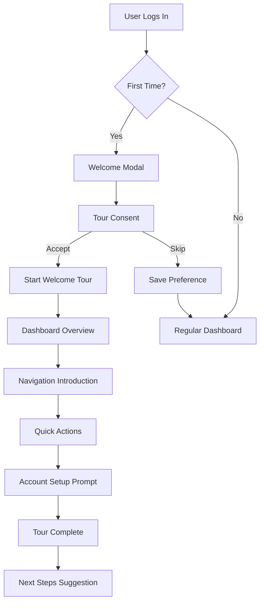
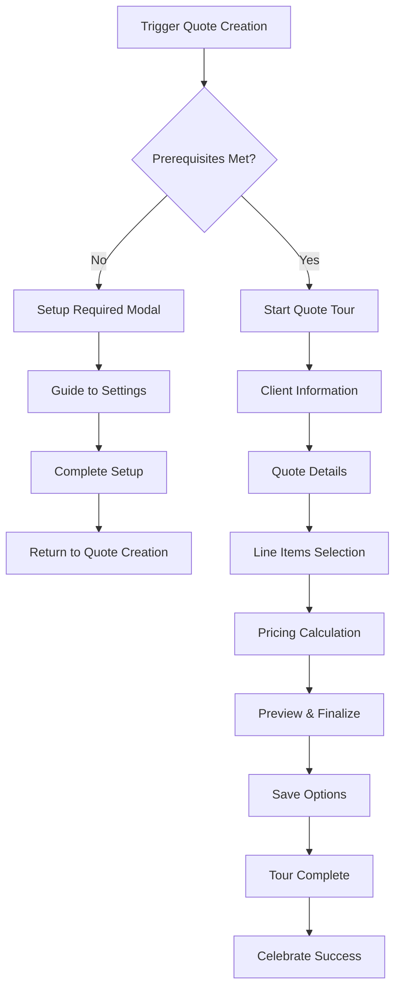
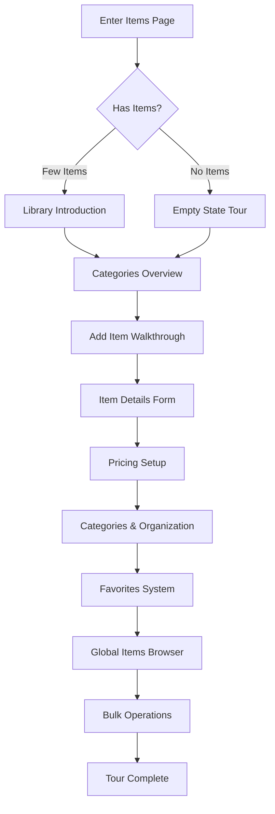
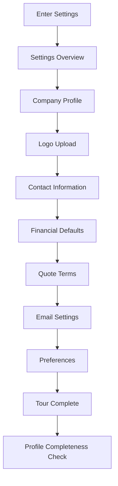

# User Journey Mapping: Driver.js Onboarding Flows

## Overview

This document maps out comprehensive user journeys for the driver.js onboarding implementation in LawnQuote. Each journey is designed to guide users through specific workflows while considering their experience level, subscription tier, and device type.

## User Personas

### Primary Personas

#### 1. Sarah - Small Business Owner (Free Tier)
- **Background**: Runs a small landscaping business, tech-savvy but time-constrained
- **Goals**: Quick quote creation, professional presentation, cost management
- **Pain Points**: Complex software, time-consuming setup, feature overload
- **Device Usage**: Primarily mobile, occasional desktop

#### 2. Mike - Growing Contractor (Pro Tier)
- **Background**: Established landscaping company, moderate tech skills
- **Goals**: Efficient workflow, client management, business growth
- **Pain Points**: Scaling operations, maintaining quality, training staff
- **Device Usage**: Desktop for office work, mobile for field operations

#### 3. Lisa - Enterprise Manager (Enterprise Tier)
- **Background**: Large landscaping company, delegates tech tasks
- **Goals**: Team coordination, advanced reporting, integration capabilities
- **Pain Points**: Complex workflows, team training, system integration
- **Device Usage**: Desktop-focused, expects full feature access

## Journey Maps

### Journey 1: First-Time User Welcome (Universal)

#### Trigger Conditions
- User completes signup process
- First login to dashboard
- No previous onboarding completion

#### Journey Flow



#### Detailed Steps

**Step 1: Welcome Modal**
- **Element**: Full screen overlay
- **Title**: "Welcome to LawnQuote!"
- **Description**: "Let's get you set up with a quick 2-minute tour of your new quote management system."
- **Actions**: ["Start Tour", "Skip for Now"]
- **Analytics**: Track acceptance rate

**Step 2: Dashboard Overview**
- **Element**: `.dashboard-container`
- **Title**: "Your Command Center"
- **Description**: "This is your dashboard where you'll see quote summaries, recent activity, and quick actions."
- **Position**: center
- **Interactive**: false

**Step 3: Navigation Sidebar**
- **Element**: `.app-sidebar`
- **Title**: "Main Navigation"
- **Description**: "Access all features from this sidebar. Quotes, Items, Settings, and more."
- **Position**: right, align: start
- **Interactive**: false

**Step 4: Quick Actions Panel**
- **Element**: `.quick-actions`
- **Title**: "Quick Actions"
- **Description**: "Create new quotes, add items, or access frequently used features instantly."
- **Position**: bottom, align: center
- **Interactive**: true

**Step 5: Account Menu**
- **Element**: `.account-menu`
- **Title**: "Account & Settings"
- **Description**: "Manage your profile, subscription, and system preferences here."
- **Position**: left, align: end
- **Interactive**: false

**Step 6: Next Steps**
- **Element**: Modal overlay
- **Title**: "You're All Set!"
- **Description**: "Ready to create your first quote? We'll guide you through that next."
- **Actions**: ["Create First Quote", "Explore on My Own"]

#### Success Metrics
- **Completion Rate**: Target 75%+
- **Time to Complete**: Target <3 minutes
- **Skip Rate**: Monitor <25%
- **Next Action Rate**: Track follow-through

### Journey 2: Quote Creation Walkthrough

#### Trigger Conditions
- User clicks "Create New Quote" for first time
- User completes welcome tour and chooses "Create First Quote"
- Manual trigger from help menu

#### Pre-Journey Validation
```typescript
const canStartQuoteCreation = () => {
  return {
    hasCompanyInfo: user.company_name && user.company_email,
    hasItems: userItems.length > 0 || globalItems.length > 0,
    hasPermission: userTier !== 'free' || quotesThisMonth < 3
  };
};
```

#### Journey Flow



#### Detailed Steps

**Step 1: Client Information**
- **Element**: `.client-selector`
- **Title**: "Choose Your Client"
- **Description**: "Select an existing client or create a new one. This information will appear on your quote."
- **Position**: top, align: start
- **Interactive**: true
- **Validation**: `() => selectedClient !== null`

**Step 2: Quote Details**
- **Element**: `.quote-details-form`
- **Title**: "Quote Information"
- **Description**: "Add a title, description, and set the quote validity period."
- **Position**: right, align: start
- **Interactive**: true
- **Validation**: `() => quoteTitle.length > 0`

**Step 3: Line Items - Introduction**
- **Element**: `.line-items-section`
- **Title**: "Add Your Services"
- **Description**: "This is where you'll add the services and materials for this quote."
- **Position**: top, align: center
- **Interactive**: false

**Step 4: Line Items - Add Item**
- **Element**: `.add-item-button`
- **Title**: "Add Your First Item"
- **Description**: "Click here to add services or materials from your item library."
- **Position**: bottom, align: start
- **Interactive**: true
- **OnClick**: Open item selection dialog

**Step 5: Item Selection Dialog**
- **Element**: `.item-selection-dialog`
- **Title**: "Choose Items"
- **Description**: "Browse your item library or search for specific services. You can also create new items on the fly."
- **Position**: center
- **Interactive**: true

**Step 6: Pricing Calculation**
- **Element**: `.pricing-summary`
- **Title**: "Automatic Calculations"
- **Description**: "Watch as your quote total updates automatically. You can adjust quantities and pricing as needed."
- **Position**: left, align: end
- **Interactive**: false

**Step 7: Quote Preview**
- **Element**: `.quote-preview-button`
- **Title**: "Preview Your Quote"
- **Description**: "See exactly how your quote will look to clients before sending."
- **Position**: top, align: center
- **Interactive**: true

**Step 8: Save & Send Options**
- **Element**: `.quote-actions`
- **Title**: "Save and Share"
- **Description**: "Save as draft, generate PDF, or send directly to your client via email."
- **Position**: bottom, align: center
- **Interactive**: false

**Step 9: Success Celebration**
- **Element**: Modal overlay
- **Title**: "🎉 Quote Created Successfully!"
- **Description**: "You've created your first quote! You can find it in your quotes list and make changes anytime."
- **Actions**: ["View Quote", "Create Another", "Go to Dashboard"]

#### Tier-Specific Variations

**Free Tier Users:**
- Show quota information: "Quote 1 of 3 this month"
- Highlight upgrade prompts for advanced features
- Limit certain customization options

**Pro Tier Users:**
- Show advanced features: custom templates, bulk actions
- Demonstrate integration capabilities
- Highlight time-saving features

#### Mobile Adaptations
- Simplified step descriptions
- Larger touch targets
- Swipe gestures for navigation
- Condensed information display

### Journey 3: Item Library Management

#### Trigger Conditions
- User navigates to Items page for first time
- User has fewer than 5 items in library
- Manual trigger from help system

#### Journey Flow



#### Detailed Steps

**Step 1: Library Overview**
- **Element**: `.item-library-container`
- **Title**: "Your Item Library"
- **Description**: "This is your central hub for managing all services and materials you offer."
- **Position**: center
- **Interactive**: false

**Step 2: Categories System**
- **Element**: `.category-filters`
- **Title**: "Organize with Categories"
- **Description**: "Use categories to organize your items. We've pre-loaded common landscaping categories."
- **Position**: top, align: start
- **Interactive**: true

**Step 3: Add New Item**
- **Element**: `.add-item-button`
- **Title**: "Add Your First Item"
- **Description**: "Let's add a service or material to your library. Click here to get started."
- **Position**: bottom, align: center
- **Interactive**: true

**Step 4: Item Form - Basic Info**
- **Element**: `.item-form .basic-info`
- **Title**: "Item Details"
- **Description**: "Give your item a clear name and description that clients will understand."
- **Position**: right, align: start
- **Interactive**: true

**Step 5: Item Form - Pricing**
- **Element**: `.item-form .pricing-section`
- **Title**: "Set Your Pricing"
- **Description**: "Choose between fixed pricing, per-unit pricing, or hourly rates based on your service type."
- **Position**: left, align: center
- **Interactive**: true

**Step 6: Categories Assignment**
- **Element**: `.item-form .category-selector`
- **Title**: "Categorize Your Item"
- **Description**: "Assign categories to make items easy to find when creating quotes."
- **Position**: top, align: end
- **Interactive**: true

**Step 7: Global Items Browser**
- **Element**: `.global-items-section`
- **Title**: "Browse Global Items"
- **Description**: "Access thousands of pre-configured landscaping items to save time setting up your library."
- **Position**: center
- **Interactive**: true
- **TierRestriction**: "Pro feature highlight for free users"

**Step 8: Favorites System**
- **Element**: `.favorites-toggle`
- **Title**: "Mark Favorites"
- **Description**: "Star your most-used items to access them quickly when creating quotes."
- **Position**: right, align: center
- **Interactive**: true

#### Success Metrics
- **Items Added**: Track items added during tour
- **Category Usage**: Monitor category assignment
- **Global Items Adoption**: Track usage of global items
- **Favorites Usage**: Monitor favorite marking behavior

### Journey 4: Settings Configuration

#### Trigger Conditions
- User navigates to Settings for first time
- Incomplete company profile detected
- Manual trigger from onboarding checklist

#### Journey Flow



#### Detailed Steps

**Step 1: Settings Overview**
- **Element**: `.settings-container`
- **Title**: "Customize Your Experience"
- **Description**: "Configure your company information, defaults, and preferences to streamline quote creation."
- **Position**: center
- **Interactive**: false

**Step 2: Company Profile**
- **Element**: `.company-profile-card`
- **Title**: "Company Information"
- **Description**: "This information appears on all your quotes and communications with clients."
- **Position**: top, align: start
- **Interactive**: true

**Step 3: Logo Upload**
- **Element**: `.logo-upload-section`
- **Title**: "Add Your Logo"
- **Description**: "Upload your company logo to appear on quotes and give them a professional look."
- **Position**: right, align: center
- **Interactive**: true
- **TierRestriction**: "Pro feature for free users"

**Step 4: Financial Defaults**
- **Element**: `.financial-defaults-card`
- **Title**: "Set Default Values"
- **Description**: "Configure default tax rates, payment terms, and other financial settings to save time."
- **Position**: bottom, align: start
- **Interactive**: true

**Step 5: Quote Terms**
- **Element**: `.quote-terms-card`
- **Title**: "Standard Terms & Conditions"
- **Description**: "Set up your standard terms and conditions to automatically include on quotes."
- **Position**: left, align: center
- **Interactive**: true

**Step 6: Email Configuration**
- **Element**: `.email-settings-section`
- **Title**: "Email Settings"
- **Description**: "Configure how quotes are sent to clients and customize email templates."
- **Position**: top, align: end
- **Interactive**: true
- **TierRestriction**: "Advanced email features for Pro users"

### Journey 5: Mobile-First Experience

#### Unique Mobile Considerations

**Touch-Optimized Tours:**
- Larger popover sizes for readability
- Touch-friendly button spacing
- Swipe gestures for navigation
- Simplified step content

**Mobile-Specific Steps:**

**Step 1: Mobile Navigation**
- **Element**: `.mobile-menu-trigger`
- **Title**: "Mobile Menu"
- **Description**: "Tap here to access all features on mobile."
- **Position**: bottom, align: start
- **Gesture**: Tap to demonstrate

**Step 2: Quick Actions**
- **Element**: `.mobile-quick-actions`
- **Title**: "Quick Actions"
- **Description**: "Swipe up for quick access to create quotes and add items."
- **Position**: center
- **Gesture**: Swipe up demonstration

**Step 3: Mobile Quote Creation**
- **Element**: `.mobile-quote-form`
- **Title**: "Mobile Quote Creation"
- **Description**: "Create quotes on the go with our mobile-optimized interface."
- **Position**: top, align: center
- **Interactive**: true

### Journey 6: Tier-Specific Onboarding

#### Free Tier Journey Modifications

**Value Proposition Integration:**
- Highlight limitations with upgrade prompts
- Show "locked" features with explanations
- Demonstrate value of Pro features
- Include upgrade CTAs at strategic points

**Free Tier Specific Steps:**

**Step 1: Quota Awareness**
- **Element**: `.quota-indicator`
- **Title**: "Your Free Plan Limits"
- **Description**: "You can create 3 quotes per month on the free plan. Upgrade for unlimited quotes."
- **Position**: top, align: center
- **Actions**: ["Learn More", "Continue Tour"]

**Step 2: Feature Previews**
- **Element**: `.pro-feature-preview`
- **Title**: "Pro Feature Preview"
- **Description**: "This advanced feature is available with LawnQuote Pro. See how it could help your business."
- **Position**: center
- **Interactive**: false
- **Actions**: ["Upgrade Now", "Continue Tour"]

#### Pro Tier Journey Enhancements

**Advanced Feature Focus:**
- Highlight Pro-exclusive features
- Demonstrate advanced workflows
- Show integration capabilities
- Emphasize time-saving features

**Pro Tier Specific Steps:**

**Step 1: Advanced Features Welcome**
- **Element**: Modal overlay
- **Title**: "Welcome to LawnQuote Pro!"
- **Description**: "You now have access to advanced features like custom templates, bulk operations, and priority support."
- **Actions**: ["Explore Pro Features", "Standard Tour"]

**Step 2: Custom Templates**
- **Element**: `.template-section`
- **Title**: "Custom Quote Templates"
- **Description**: "Create reusable templates for different service types to speed up quote creation."
- **Position**: center
- **Interactive**: true

## Journey Analytics & Optimization

### Key Metrics to Track

#### Completion Metrics
- **Overall Completion Rate**: Percentage of users who complete entire journey
- **Step-by-Step Completion**: Completion rate for each individual step
- **Drop-off Points**: Identify where users most commonly abandon tours
- **Time to Complete**: Average time spent on each journey

#### Engagement Metrics
- **Interaction Rate**: Percentage of interactive steps where users engage
- **Skip Rate**: How often users skip optional steps
- **Replay Rate**: Users who restart or replay tours
- **Help Seeking**: Users who access additional help during tours

#### Business Impact Metrics
- **Feature Adoption**: Usage of features introduced in tours
- **Quote Creation Rate**: Quotes created within 24 hours of tour completion
- **Retention Impact**: 7-day and 30-day retention for tour completers vs. skippers
- **Upgrade Conversion**: Free users who upgrade after seeing Pro features

### A/B Testing Framework

#### Test Variations
1. **Tour Length**: Short vs. comprehensive tours
2. **Interaction Level**: Passive viewing vs. hands-on practice
3. **Timing**: Immediate vs. delayed tour triggers
4. **Personalization**: Generic vs. role-based content

#### Testing Implementation
```typescript
interface TourVariant {
  id: string;
  name: string;
  config: TourConfig;
  targetAudience: UserSegment;
  successMetrics: string[];
}

const tourVariants: TourVariant[] = [
  {
    id: 'welcome_short',
    name: 'Short Welcome Tour',
    config: shortWelcomeTour,
    targetAudience: 'time_constrained',
    successMetrics: ['completion_rate', 'feature_adoption']
  },
  {
    id: 'welcome_comprehensive',
    name: 'Comprehensive Welcome Tour',
    config: comprehensiveWelcomeTour,
    targetAudience: 'detail_oriented',
    successMetrics: ['user_confidence', 'support_tickets']
  }
];
```

### Continuous Improvement Process

#### Monthly Review Cycle
1. **Week 1**: Analyze completion and engagement metrics
2. **Week 2**: Identify improvement opportunities
3. **Week 3**: Implement and test changes
4. **Week 4**: Monitor impact and plan next iteration

#### Feedback Integration
- **In-Tour Feedback**: Quick rating system after each journey
- **Post-Tour Surveys**: Detailed feedback collection
- **User Interviews**: Qualitative insights from select users
- **Support Ticket Analysis**: Common issues and confusion points

---

**Document Version**: 1.0  
**Last Updated**: January 2025  
**Next Review**: After Sprint 1 completion
