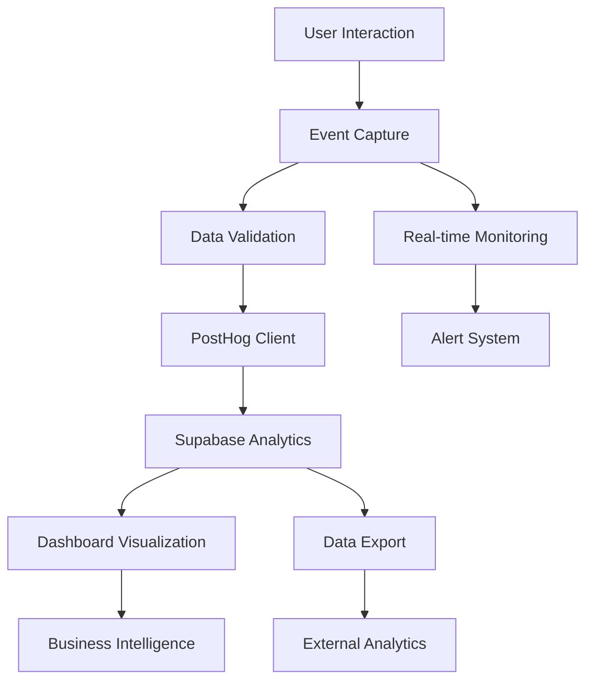

# Analytics Integration: Driver.js Onboarding Tracking

## Overview

This document outlines the comprehensive analytics strategy for tracking user onboarding behavior, tour effectiveness, and business impact of the driver.js implementation in LawnQuote.

## Analytics Architecture

### Data Flow



### Integration Points

1. **PostHog**: Primary analytics platform for event tracking
2. **Supabase**: Database storage for detailed onboarding data
3. **Custom Dashboard**: Real-time monitoring and insights
4. **External Tools**: Data export for advanced analysis

## Event Taxonomy

### Core Events

#### 1. Tour Lifecycle Events

```typescript
interface TourLifecycleEvent {
  event_name: 'tour_started' | 'tour_completed' | 'tour_skipped' | 'tour_abandoned';
  properties: {
    tour_id: string;
    tour_name: string;
    user_id: string;
    session_id: string;
    timestamp: string;
    user_tier: 'free' | 'pro' | 'enterprise';
    device_type: 'desktop' | 'mobile' | 'tablet';
    browser: string;
    tour_trigger: 'auto' | 'manual' | 'help_button';
    total_steps: number;
    completed_steps?: number;
    duration_seconds?: number;
    abandon_step?: number;
    abandon_reason?: string;
  };
}
```

#### 2. Step-Level Events

```typescript
interface StepEvent {
  event_name: 'step_viewed' | 'step_completed' | 'step_skipped' | 'step_interaction';
  properties: {
    tour_id: string;
    step_id: string;
    step_index: number;
    step_title: string;
    user_id: string;
    session_id: string;
    timestamp: string;
    time_on_step_seconds: number;
    interaction_type?: 'click' | 'hover' | 'focus' | 'scroll';
    element_selector?: string;
    validation_passed?: boolean;
    help_requested?: boolean;
  };
}
```

#### 3. Business Impact Events

```typescript
interface BusinessImpactEvent {
  event_name: 'feature_adopted' | 'quote_created_post_tour' | 'upgrade_after_tour';
  properties: {
    tour_id: string;
    user_id: string;
    feature_name?: string;
    time_since_tour_minutes: number;
    conversion_value?: number;
    previous_tier?: string;
    new_tier?: string;
  };
}
```

## Implementation

### 1. Analytics Service

**File**: `src/libs/analytics/onboarding-analytics.ts`

```typescript
class OnboardingAnalytics {
  private posthog: PostHog;
  private supabase: SupabaseClient;
  
  constructor(posthog: PostHog, supabase: SupabaseClient) {
    this.posthog = posthog;
    this.supabase = supabase;
  }

  // Tour Lifecycle Tracking
  async trackTourStart(tourId: string, context: TourContext) {
    const event: TourLifecycleEvent = {
      event_name: 'tour_started',
      properties: {
        tour_id: tourId,
        tour_name: context.tourName,
        user_id: context.userId,
        session_id: context.sessionId,
        timestamp: new Date().toISOString(),
        user_tier: context.userTier,
        device_type: this.getDeviceType(),
        browser: this.getBrowser(),
        tour_trigger: context.trigger,
        total_steps: context.totalSteps
      }
    };

    // Send to PostHog
    this.posthog.capture(event.event_name, event.properties);
    
    // Store in Supabase
    await this.supabase
      .from('onboarding_analytics')
      .insert({
        user_id: context.userId,
        tour_id: tourId,
        event_type: 'tour_start',
        event_data: event.properties,
        session_id: context.sessionId,
        device_type: this.getDeviceType()
      });
  }

  async trackTourComplete(tourId: string, context: TourContext, duration: number) {
    const event: TourLifecycleEvent = {
      event_name: 'tour_completed',
      properties: {
        tour_id: tourId,
        tour_name: context.tourName,
        user_id: context.userId,
        session_id: context.sessionId,
        timestamp: new Date().toISOString(),
        user_tier: context.userTier,
        device_type: this.getDeviceType(),
        browser: this.getBrowser(),
        tour_trigger: context.trigger,
        total_steps: context.totalSteps,
        completed_steps: context.totalSteps,
        duration_seconds: duration
      }
    };

    this.posthog.capture(event.event_name, event.properties);
    
    await this.supabase
      .from('onboarding_analytics')
      .insert({
        user_id: context.userId,
        tour_id: tourId,
        event_type: 'tour_complete',
        event_data: event.properties,
        session_id: context.sessionId,
        device_type: this.getDeviceType()
      });

    // Update user progress
    await this.updateUserProgress(context.userId, tourId, 'completed');
  }

  async trackStepView(tourId: string, stepId: string, context: StepContext) {
    const event: StepEvent = {
      event_name: 'step_viewed',
      properties: {
        tour_id: tourId,
        step_id: stepId,
        step_index: context.stepIndex,
        step_title: context.stepTitle,
        user_id: context.userId,
        session_id: context.sessionId,
        timestamp: new Date().toISOString(),
        time_on_step_seconds: 0
      }
    };

    this.posthog.capture(event.event_name, event.properties);
  }

  async trackStepComplete(tourId: string, stepId: string, context: StepContext, timeOnStep: number) {
    const event: StepEvent = {
      event_name: 'step_completed',
      properties: {
        tour_id: tourId,
        step_id: stepId,
        step_index: context.stepIndex,
        step_title: context.stepTitle,
        user_id: context.userId,
        session_id: context.sessionId,
        timestamp: new Date().toISOString(),
        time_on_step_seconds: timeOnStep,
        validation_passed: context.validationPassed
      }
    };

    this.posthog.capture(event.event_name, event.properties);
    
    await this.supabase
      .from('onboarding_analytics')
      .insert({
        user_id: context.userId,
        tour_id: tourId,
        step_id: stepId,
        event_type: 'step_complete',
        event_data: event.properties,
        session_id: context.sessionId,
        device_type: this.getDeviceType()
      });
  }

  // Business Impact Tracking
  async trackFeatureAdoption(featureName: string, tourId: string, userId: string) {
    const timeSinceTour = await this.getTimeSinceTourCompletion(userId, tourId);
    
    const event: BusinessImpactEvent = {
      event_name: 'feature_adopted',
      properties: {
        tour_id: tourId,
        user_id: userId,
        feature_name: featureName,
        time_since_tour_minutes: timeSinceTour
      }
    };

    this.posthog.capture(event.event_name, event.properties);
  }

  async trackQuoteCreatedPostTour(userId: string, tourId: string) {
    const timeSinceTour = await this.getTimeSinceTourCompletion(userId, tourId);
    
    const event: BusinessImpactEvent = {
      event_name: 'quote_created_post_tour',
      properties: {
        tour_id: tourId,
        user_id: userId,
        time_since_tour_minutes: timeSinceTour
      }
    };

    this.posthog.capture(event.event_name, event.properties);
  }

  // Utility Methods
  private getDeviceType(): 'desktop' | 'mobile' | 'tablet' {
    if (typeof window === 'undefined') return 'desktop';
    
    const width = window.innerWidth;
    if (width < 768) return 'mobile';
    if (width < 1024) return 'tablet';
    return 'desktop';
  }

  private getBrowser(): string {
    if (typeof window === 'undefined') return 'unknown';
    return navigator.userAgent;
  }

  private async getTimeSinceTourCompletion(userId: string, tourId: string): Promise<number> {
    const { data } = await this.supabase
      .from('user_onboarding_progress')
      .select('completed_at')
      .eq('user_id', userId)
      .eq('tour_id', tourId)
      .eq('status', 'completed')
      .single();

    if (!data?.completed_at) return 0;
    
    const completedAt = new Date(data.completed_at);
    const now = new Date();
    return Math.floor((now.getTime() - completedAt.getTime()) / (1000 * 60));
  }

  private async updateUserProgress(userId: string, tourId: string, status: string) {
    await this.supabase
      .from('user_onboarding_progress')
      .upsert({
        user_id: userId,
        tour_id: tourId,
        status,
        completed_at: status === 'completed' ? new Date().toISOString() : null,
        last_active_at: new Date().toISOString()
      });
  }
}
```

### 2. React Hook Integration

**File**: `src/hooks/useOnboardingAnalytics.ts`

```typescript
export function useOnboardingAnalytics() {
  const posthog = usePostHog();
  const { supabase } = useSupabase();
  const { user } = useUser();
  
  const analytics = useMemo(() => 
    new OnboardingAnalytics(posthog, supabase), 
    [posthog, supabase]
  );

  const trackTourStart = useCallback(async (tourId: string, tourName: string, trigger: string) => {
    if (!user) return;
    
    const context: TourContext = {
      userId: user.id,
      sessionId: generateSessionId(),
      tourName,
      userTier: user.tier,
      trigger,
      totalSteps: getTourStepCount(tourId)
    };
    
    await analytics.trackTourStart(tourId, context);
  }, [analytics, user]);

  const trackTourComplete = useCallback(async (tourId: string, duration: number) => {
    if (!user) return;
    
    await analytics.trackTourComplete(tourId, {
      userId: user.id,
      sessionId: getCurrentSessionId(),
      tourName: getTourName(tourId),
      userTier: user.tier,
      trigger: 'manual', // This should be stored from tour start
      totalSteps: getTourStepCount(tourId)
    }, duration);
  }, [analytics, user]);

  const trackFeatureAdoption = useCallback(async (featureName: string, tourId?: string) => {
    if (!user) return;
    
    if (tourId) {
      await analytics.trackFeatureAdoption(featureName, tourId, user.id);
    }
  }, [analytics, user]);

  return {
    trackTourStart,
    trackTourComplete,
    trackFeatureAdoption,
    trackStepView: analytics.trackStepView.bind(analytics),
    trackStepComplete: analytics.trackStepComplete.bind(analytics)
  };
}
```

### 3. Driver.js Integration

**File**: `src/libs/onboarding/analytics-driver.ts`

```typescript
export function createAnalyticsEnabledDriver(config: Config, tourId: string): Driver {
  const { trackTourStart, trackTourComplete, trackStepView, trackStepComplete } = useOnboardingAnalytics();
  
  let tourStartTime: number;
  let stepStartTime: number;
  
  const enhancedConfig: Config = {
    ...config,
    
    // Tour lifecycle hooks
    onHighlightStarted: (element, step, options) => {
      if (options.state.activeIndex === 0) {
        // First step - track tour start
        tourStartTime = Date.now();
        trackTourStart(tourId, config.tourName || tourId, 'manual');
      }
      
      // Track step view
      stepStartTime = Date.now();
      trackStepView(tourId, step.id || `step-${options.state.activeIndex}`, {
        stepIndex: options.state.activeIndex || 0,
        stepTitle: step.popover?.title || '',
        userId: getCurrentUserId(),
        sessionId: getCurrentSessionId()
      });
      
      // Call original handler if exists
      config.onHighlightStarted?.(element, step, options);
    },

    onHighlighted: (element, step, options) => {
      // Track step completion
      const timeOnStep = Date.now() - stepStartTime;
      trackStepComplete(tourId, step.id || `step-${options.state.activeIndex}`, {
        stepIndex: options.state.activeIndex || 0,
        stepTitle: step.popover?.title || '',
        userId: getCurrentUserId(),
        sessionId: getCurrentSessionId(),
        validationPassed: true // Assume validation passed if step completed
      }, Math.floor(timeOnStep / 1000));
      
      config.onHighlighted?.(element, step, options);
    },

    onDestroyed: (element, step, options) => {
      // Track tour completion or abandonment
      const tourDuration = Date.now() - tourStartTime;
      const isComplete = options.state.activeIndex === (config.steps?.length || 1) - 1;
      
      if (isComplete) {
        trackTourComplete(tourId, Math.floor(tourDuration / 1000));
      } else {
        // Track abandonment
        trackTourAbandon(tourId, options.state.activeIndex || 0, Math.floor(tourDuration / 1000));
      }
      
      config.onDestroyed?.(element, step, options);
    }
  };

  return driver(enhancedConfig);
}
```

## Analytics Dashboard

### 1. Real-time Metrics Component

**File**: `src/components/analytics/OnboardingMetrics.tsx`

```typescript
interface OnboardingMetricsProps {
  timeframe?: 'hour' | 'day' | 'week' | 'month';
  tourId?: string;
  refreshInterval?: number;
}

export function OnboardingMetrics({ 
  timeframe = 'day', 
  tourId,
  refreshInterval = 30000 
}: OnboardingMetricsProps) {
  const { data: metrics, isLoading } = useOnboardingMetrics(timeframe, tourId, refreshInterval);
  
  if (isLoading) return <MetricsSkeleton />;

  return (
    <div className="onboarding-metrics grid grid-cols-1 md:grid-cols-2 lg:grid-cols-4 gap-4">
      <MetricCard
        title="Tours Started"
        value={metrics.toursStarted}
        change={metrics.toursStartedChange}
        trend={metrics.toursStartedTrend}
        icon={<Play className="h-4 w-4" />}
      />
      
      <MetricCard
        title="Completion Rate"
        value={`${metrics.completionRate}%`}
        change={metrics.completionRateChange}
        trend={metrics.completionRateTrend}
        icon={<CheckCircle className="h-4 w-4" />}
      />
      
      <MetricCard
        title="Avg. Duration"
        value={`${metrics.avgDuration}min`}
        change={metrics.avgDurationChange}
        trend={metrics.avgDurationTrend}
        icon={<Clock className="h-4 w-4" />}
      />
      
      <MetricCard
        title="Feature Adoption"
        value={`${metrics.featureAdoption}%`}
        change={metrics.featureAdoptionChange}
        trend={metrics.featureAdoptionTrend}
        icon={<TrendingUp className="h-4 w-4" />}
      />
    </div>
  );
}
```

### 2. Tour Performance Analysis

**File**: `src/components/analytics/TourPerformanceChart.tsx`

```typescript
interface TourPerformanceChartProps {
  tourId: string;
  timeframe: 'week' | 'month' | 'quarter';
}

export function TourPerformanceChart({ tourId, timeframe }: TourPerformanceChartProps) {
  const { data: performanceData } = useTourPerformance(tourId, timeframe);
  
  const chartData = performanceData?.map(day => ({
    date: day.date,
    started: day.toursStarted,
    completed: day.toursCompleted,
    abandoned: day.toursAbandoned,
    completionRate: (day.toursCompleted / day.toursStarted) * 100
  })) || [];

  return (
    <Card>
      <CardHeader>
        <CardTitle>Tour Performance Over Time</CardTitle>
        <CardDescription>
          Tracking starts, completions, and abandonment rates
        </CardDescription>
      </CardHeader>
      <CardContent>
        <ResponsiveContainer width="100%" height={300}>
          <LineChart data={chartData}>
            <CartesianGrid strokeDasharray="3 3" />
            <XAxis dataKey="date" />
            <YAxis yAxisId="left" />
            <YAxis yAxisId="right" orientation="right" />
            <Tooltip />
            <Legend />
            
            <Bar yAxisId="left" dataKey="started" fill="#8884d8" name="Started" />
            <Bar yAxisId="left" dataKey="completed" fill="#82ca9d" name="Completed" />
            <Bar yAxisId="left" dataKey="abandoned" fill="#ffc658" name="Abandoned" />
            <Line 
              yAxisId="right" 
              type="monotone" 
              dataKey="completionRate" 
              stroke="#ff7300" 
              name="Completion Rate %" 
            />
          </LineChart>
        </ResponsiveContainer>
      </CardContent>
    </Card>
  );
}
```

### 3. Step-by-Step Analysis

**File**: `src/components/analytics/StepAnalysis.tsx`

```typescript
interface StepAnalysisProps {
  tourId: string;
  timeframe: 'week' | 'month';
}

export function StepAnalysis({ tourId, timeframe }: StepAnalysisProps) {
  const { data: stepData } = useStepAnalysis(tourId, timeframe);
  
  return (
    <Card>
      <CardHeader>
        <CardTitle>Step-by-Step Analysis</CardTitle>
        <CardDescription>
          Identify where users drop off in the tour
        </CardDescription>
      </CardHeader>
      <CardContent>
        <div className="space-y-4">
          {stepData?.map((step, index) => (
            <div key={step.stepId} className="flex items-center justify-between p-3 border rounded">
              <div className="flex items-center gap-3">
                <div className="flex items-center justify-center w-8 h-8 bg-primary text-primary-foreground rounded-full text-sm">
                  {index + 1}
                </div>
                <div>
                  <h4 className="font-medium">{step.title}</h4>
                  <p className="text-sm text-muted-foreground">
                    Avg. time: {step.avgTimeSeconds}s
                  </p>
                </div>
              </div>
              
              <div className="flex items-center gap-4">
                <div className="text-right">
                  <p className="text-sm font-medium">{step.completionRate}%</p>
                  <p className="text-xs text-muted-foreground">completion</p>
                </div>
                
                <div className="w-24 h-2 bg-muted rounded-full overflow-hidden">
                  <div 
                    className="h-full bg-primary transition-all"
                    style={{ width: `${step.completionRate}%` }}
                  />
                </div>
                
                {step.dropOffRate > 20 && (
                  <AlertTriangle className="h-4 w-4 text-yellow-500" />
                )}
              </div>
            </div>
          ))}
        </div>
      </CardContent>
    </Card>
  );
}
```

## Data Queries and APIs

### 1. Analytics API Endpoints

**File**: `src/app/api/analytics/onboarding/route.ts`

```typescript
export async function GET(request: Request) {
  const { searchParams } = new URL(request.url);
  const timeframe = searchParams.get('timeframe') || 'day';
  const tourId = searchParams.get('tourId');
  
  try {
    const metrics = await getOnboardingMetrics(timeframe, tourId);
    return NextResponse.json(metrics);
  } catch (error) {
    return NextResponse.json({ error: 'Failed to fetch metrics' }, { status: 500 });
  }
}

async function getOnboardingMetrics(timeframe: string, tourId?: string) {
  const supabase = createServerClient();
  
  let query = supabase
    .from('onboarding_analytics')
    .select('*')
    .gte('created_at', getTimeframeStart(timeframe));
    
  if (tourId) {
    query = query.eq('tour_id', tourId);
  }
  
  const { data: events } = await query;
  
  return {
    toursStarted: events?.filter(e => e.event_type === 'tour_start').length || 0,
    toursCompleted: events?.filter(e => e.event_type === 'tour_complete').length || 0,
    toursAbandoned: events?.filter(e => e.event_type === 'tour_abandon').length || 0,
    avgDuration: calculateAverageDuration(events || []),
    completionRate: calculateCompletionRate(events || []),
    featureAdoption: calculateFeatureAdoption(events || [])
  };
}
```

### 2. Custom Hooks for Data Fetching

**File**: `src/hooks/useOnboardingMetrics.ts`

```typescript
export function useOnboardingMetrics(
  timeframe: string, 
  tourId?: string, 
  refreshInterval?: number
) {
  return useQuery({
    queryKey: ['onboarding-metrics', timeframe, tourId],
    queryFn: () => fetchOnboardingMetrics(timeframe, tourId),
    refetchInterval: refreshInterval,
    staleTime: 30000 // 30 seconds
  });
}

export function useTourPerformance(tourId: string, timeframe: string) {
  return useQuery({
    queryKey: ['tour-performance', tourId, timeframe],
    queryFn: () => fetchTourPerformance(tourId, timeframe),
    staleTime: 60000 // 1 minute
  });
}

export function useStepAnalysis(tourId: string, timeframe: string) {
  return useQuery({
    queryKey: ['step-analysis', tourId, timeframe],
    queryFn: () => fetchStepAnalysis(tourId, timeframe),
    staleTime: 300000 // 5 minutes
  });
}
```

## Reporting and Insights

### 1. Automated Reports

**File**: `src/libs/analytics/automated-reports.ts`

```typescript
class OnboardingReportGenerator {
  async generateWeeklyReport(): Promise<OnboardingReport> {
    const metrics = await this.getWeeklyMetrics();
    const insights = await this.generateInsights(metrics);
    
    return {
      period: 'week',
      metrics,
      insights,
      recommendations: this.generateRecommendations(metrics, insights),
      generatedAt: new Date().toISOString()
    };
  }

  private async generateInsights(metrics: OnboardingMetrics): Promise<Insight[]> {
    const insights: Insight[] = [];
    
    // Completion rate insights
    if (metrics.completionRate < 70) {
      insights.push({
        type: 'warning',
        title: 'Low Completion Rate',
        description: `Tour completion rate is ${metrics.completionRate}%, below the target of 70%`,
        impact: 'high',
        actionItems: [
          'Review tour length and complexity',
          'Analyze drop-off points',
          'Consider A/B testing shorter tours'
        ]
      });
    }
    
    // Duration insights
    if (metrics.avgDuration > 300) { // 5 minutes
      insights.push({
        type: 'info',
        title: 'Long Tour Duration',
        description: `Average tour duration is ${metrics.avgDuration} seconds`,
        impact: 'medium',
        actionItems: [
          'Consider breaking into multiple shorter tours',
          'Remove non-essential steps',
          'Add skip options for experienced users'
        ]
      });
    }
    
    return insights;
  }
}
```

### 2. Alert System

**File**: `src/libs/analytics/alert-system.ts`

```typescript
class OnboardingAlertSystem {
  private thresholds = {
    completionRate: { min: 70, max: 100 },
    abandonmentRate: { min: 0, max: 30 },
    avgDuration: { min: 60, max: 300 }
  };

  async checkAlerts(): Promise<Alert[]> {
    const metrics = await this.getCurrentMetrics();
    const alerts: Alert[] = [];
    
    // Check completion rate
    if (metrics.completionRate < this.thresholds.completionRate.min) {
      alerts.push({
        type: 'critical',
        metric: 'completion_rate',
        value: metrics.completionRate,
        threshold: this.thresholds.completionRate.min,
        message: `Tour completion rate dropped to ${metrics.completionRate}%`,
        timestamp: new Date().toISOString()
      });
    }
    
    // Check abandonment rate
    if (metrics.abandonmentRate > this.thresholds.abandonmentRate.max) {
      alerts.push({
        type: 'warning',
        metric: 'abandonment_rate',
        value: metrics.abandonmentRate,
        threshold: this.thresholds.abandonmentRate.max,
        message: `Tour abandonment rate increased to ${metrics.abandonmentRate}%`,
        timestamp: new Date().toISOString()
      });
    }
    
    return alerts;
  }

  async sendAlerts(alerts: Alert[]): Promise<void> {
    for (const alert of alerts) {
      // Send to monitoring system
      await this.sendToMonitoring(alert);
      
      // Send email notification for critical alerts
      if (alert.type === 'critical') {
        await this.sendEmailAlert(alert);
      }
      
      // Log to analytics
      await this.logAlert(alert);
    }
  }
}
```

---

**Document Version**: 1.0  
**Last Updated**: January 2025  
**Next Review**: After analytics implementation
