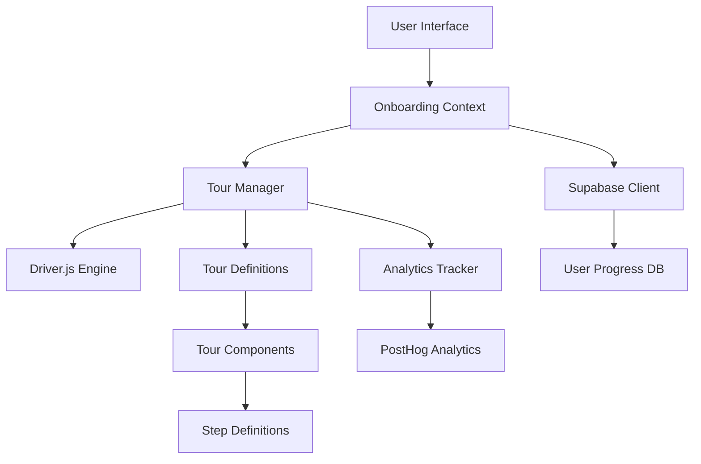

# Technical Architecture: Driver.js Integration

## Overview

This document outlines the technical architecture for integrating driver.js into LawnQuote's Next.js 15 application. The architecture emphasizes type safety, performance, maintainability, and seamless integration with existing systems.

## Architecture Principles

### 1. Type-First Development
- Full TypeScript integration with driver.js
- Strict type definitions for tour configurations
- Type-safe tour step definitions
- Compile-time validation of tour structures

### 2. Context-Driven State Management
- React Context for global onboarding state
- Supabase integration for persistence
- Session-based tour management
- Progressive onboarding tracking

### 3. Component-Based Tour System
- Reusable tour components
- Composable tour steps
- Theme-consistent styling
- Accessibility-first design

### 4. Performance Optimization
- Lazy loading of tour definitions
- Code splitting for tour modules
- Minimal bundle impact
- Efficient re-rendering strategies

## System Architecture



## Core Components

### 1. Onboarding Context Provider

**File**: `src/contexts/onboarding-context.tsx`

```typescript
interface OnboardingContextType {
  // State
  isOnboardingActive: boolean;
  currentTour: string | null;
  userProgress: OnboardingProgress;
  
  // Actions
  startTour: (tourId: string, options?: TourOptions) => Promise<void>;
  completeTour: (tourId: string) => Promise<void>;
  skipTour: (tourId: string) => Promise<void>;
  resetOnboarding: () => Promise<void>;
  
  // Utilities
  isTourCompleted: (tourId: string) => boolean;
  shouldShowTour: (tourId: string) => boolean;
  getTourProgress: (tourId: string) => TourProgress;
}

interface OnboardingProgress {
  completedTours: string[];
  skippedTours: string[];
  currentStep: number;
  lastActiveDate: string;
  totalStepsCompleted: number;
}
```

### 2. Tour Manager Service

**File**: `src/libs/onboarding/tour-manager.ts`

```typescript
class TourManager {
  private driverInstance: Driver | null = null;
  private currentTourId: string | null = null;
  
  // Core Methods
  async initializeTour(tourId: string, config: TourConfig): Promise<void>
  async startTour(tourId: string): Promise<void>
  async pauseTour(): Promise<void>
  async resumeTour(): Promise<void>
  async completeTour(): Promise<void>
  async destroyTour(): Promise<void>
  
  // State Management
  getCurrentTour(): string | null
  isActive(): boolean
  getProgress(): TourProgress
  
  // Event Handling
  onStepChange(callback: StepChangeCallback): void
  onTourComplete(callback: TourCompleteCallback): void
  onTourSkip(callback: TourSkipCallback): void
}
```

### 3. Tour Configuration System

**File**: `src/libs/onboarding/tour-configs.ts`

```typescript
interface TourStep {
  id: string;
  element?: string;
  title: string;
  description: string;
  position?: 'top' | 'right' | 'bottom' | 'left';
  align?: 'start' | 'center' | 'end';
  showButtons?: ('next' | 'previous' | 'close')[];
  onBeforeHighlight?: (element: Element) => Promise<void>;
  onAfterHighlight?: (element: Element) => Promise<void>;
  validation?: () => boolean;
  interactive?: boolean;
}

interface TourConfig {
  id: string;
  name: string;
  description: string;
  steps: TourStep[];
  prerequisites?: string[];
  userTiers?: ('free' | 'pro' | 'enterprise')[];
  deviceTypes?: ('desktop' | 'mobile' | 'tablet')[];
  triggers?: TourTrigger[];
  analytics?: AnalyticsConfig;
}

// Predefined Tours
export const TOUR_CONFIGS: Record<string, TourConfig> = {
  WELCOME_TOUR: {
    id: 'welcome',
    name: 'Welcome to LawnQuote',
    description: 'Get started with your quote management system',
    steps: [/* ... */],
    userTiers: ['free', 'pro'],
    deviceTypes: ['desktop', 'mobile']
  },
  QUOTE_CREATION: {
    id: 'quote-creation',
    name: 'Create Your First Quote',
    description: 'Learn how to create professional quotes',
    steps: [/* ... */],
    prerequisites: ['welcome']
  }
  // ... more tours
};
```

### 4. Database Integration

**File**: `src/libs/onboarding/onboarding-service.ts`

```typescript
class OnboardingService {
  constructor(private supabase: SupabaseClient) {}
  
  // Progress Management
  async getUserProgress(userId: string): Promise<OnboardingProgress>
  async updateProgress(userId: string, progress: Partial<OnboardingProgress>): Promise<void>
  async markTourCompleted(userId: string, tourId: string): Promise<void>
  async markTourSkipped(userId: string, tourId: string): Promise<void>
  
  // Analytics
  async trackTourStart(userId: string, tourId: string): Promise<void>
  async trackStepCompletion(userId: string, tourId: string, stepId: string): Promise<void>
  async trackTourCompletion(userId: string, tourId: string, duration: number): Promise<void>
  
  // User Preferences
  async getUserPreferences(userId: string): Promise<OnboardingPreferences>
  async updatePreferences(userId: string, preferences: Partial<OnboardingPreferences>): Promise<void>
}
```

## Database Schema

### Onboarding Tables

```sql
-- User onboarding progress
CREATE TABLE user_onboarding_progress (
  id UUID PRIMARY KEY DEFAULT gen_random_uuid(),
  user_id UUID REFERENCES auth.users(id) ON DELETE CASCADE,
  tour_id TEXT NOT NULL,
  status TEXT CHECK (status IN ('not_started', 'in_progress', 'completed', 'skipped')) DEFAULT 'not_started',
  current_step INTEGER DEFAULT 0,
  total_steps INTEGER,
  started_at TIMESTAMP WITH TIME ZONE,
  completed_at TIMESTAMP WITH TIME ZONE,
  last_active_at TIMESTAMP WITH TIME ZONE DEFAULT NOW(),
  metadata JSONB DEFAULT '{}',
  created_at TIMESTAMP WITH TIME ZONE DEFAULT NOW(),
  updated_at TIMESTAMP WITH TIME ZONE DEFAULT NOW(),
  
  UNIQUE(user_id, tour_id)
);

-- Onboarding analytics events
CREATE TABLE onboarding_analytics (
  id UUID PRIMARY KEY DEFAULT gen_random_uuid(),
  user_id UUID REFERENCES auth.users(id) ON DELETE CASCADE,
  tour_id TEXT NOT NULL,
  step_id TEXT,
  event_type TEXT CHECK (event_type IN ('tour_start', 'step_view', 'step_complete', 'tour_complete', 'tour_skip', 'tour_abandon')) NOT NULL,
  event_data JSONB DEFAULT '{}',
  session_id TEXT,
  user_agent TEXT,
  device_type TEXT,
  created_at TIMESTAMP WITH TIME ZONE DEFAULT NOW()
);

-- User onboarding preferences
CREATE TABLE user_onboarding_preferences (
  user_id UUID PRIMARY KEY REFERENCES auth.users(id) ON DELETE CASCADE,
  show_tooltips BOOLEAN DEFAULT true,
  auto_start_tours BOOLEAN DEFAULT true,
  preferred_tour_speed TEXT CHECK (preferred_tour_speed IN ('slow', 'normal', 'fast')) DEFAULT 'normal',
  skip_completed_tours BOOLEAN DEFAULT true,
  enable_animations BOOLEAN DEFAULT true,
  preferences JSONB DEFAULT '{}',
  created_at TIMESTAMP WITH TIME ZONE DEFAULT NOW(),
  updated_at TIMESTAMP WITH TIME ZONE DEFAULT NOW()
);

-- Indexes for performance
CREATE INDEX idx_user_onboarding_progress_user_id ON user_onboarding_progress(user_id);
CREATE INDEX idx_user_onboarding_progress_status ON user_onboarding_progress(status);
CREATE INDEX idx_onboarding_analytics_user_id ON onboarding_analytics(user_id);
CREATE INDEX idx_onboarding_analytics_tour_id ON onboarding_analytics(tour_id);
CREATE INDEX idx_onboarding_analytics_event_type ON onboarding_analytics(event_type);
CREATE INDEX idx_onboarding_analytics_created_at ON onboarding_analytics(created_at);
```

### Row Level Security (RLS)

```sql
-- Enable RLS
ALTER TABLE user_onboarding_progress ENABLE ROW LEVEL SECURITY;
ALTER TABLE onboarding_analytics ENABLE ROW LEVEL SECURITY;
ALTER TABLE user_onboarding_preferences ENABLE ROW LEVEL SECURITY;

-- Policies for user_onboarding_progress
CREATE POLICY "Users can view their own onboarding progress" ON user_onboarding_progress
  FOR SELECT USING (auth.uid() = user_id);

CREATE POLICY "Users can update their own onboarding progress" ON user_onboarding_progress
  FOR ALL USING (auth.uid() = user_id);

-- Policies for onboarding_analytics
CREATE POLICY "Users can insert their own analytics" ON onboarding_analytics
  FOR INSERT WITH CHECK (auth.uid() = user_id);

CREATE POLICY "Admins can view all analytics" ON onboarding_analytics
  FOR SELECT USING (
    EXISTS (
      SELECT 1 FROM user_profiles 
      WHERE user_id = auth.uid() 
      AND role = 'admin'
    )
  );

-- Policies for user_onboarding_preferences
CREATE POLICY "Users can manage their own preferences" ON user_onboarding_preferences
  FOR ALL USING (auth.uid() = user_id);
```

## Component Architecture

### 1. Tour Provider Component

**File**: `src/components/onboarding/OnboardingProvider.tsx`

```typescript
interface OnboardingProviderProps {
  children: React.ReactNode;
  autoStart?: boolean;
  enableAnalytics?: boolean;
}

export function OnboardingProvider({ 
  children, 
  autoStart = true, 
  enableAnalytics = true 
}: OnboardingProviderProps) {
  // Implementation
}
```

### 2. Tour Trigger Components

**File**: `src/components/onboarding/TourTrigger.tsx`

```typescript
interface TourTriggerProps {
  tourId: string;
  trigger?: 'click' | 'hover' | 'focus' | 'auto';
  delay?: number;
  children?: React.ReactNode;
  className?: string;
}

export function TourTrigger({ tourId, trigger = 'click', ...props }: TourTriggerProps) {
  // Implementation
}
```

### 3. Tour Step Components

**File**: `src/components/onboarding/TourStep.tsx`

```typescript
interface TourStepProps {
  id: string;
  title: string;
  description: string;
  element?: string;
  position?: PopoverPosition;
  interactive?: boolean;
  validation?: () => boolean;
  onBeforeShow?: () => Promise<void>;
  onAfterShow?: () => Promise<void>;
}

export function TourStep(props: TourStepProps) {
  // Implementation
}
```

## Styling and Theming

### 1. CSS Custom Properties

**File**: `src/styles/onboarding.css`

```css
:root {
  /* Tour Colors */
  --tour-primary: hsl(var(--primary));
  --tour-secondary: hsl(var(--secondary));
  --tour-background: hsl(var(--background));
  --tour-foreground: hsl(var(--foreground));
  --tour-border: hsl(var(--border));
  
  /* Tour Spacing */
  --tour-padding: 1rem;
  --tour-border-radius: 0.5rem;
  --tour-shadow: 0 10px 15px -3px rgb(0 0 0 / 0.1);
  
  /* Tour Animation */
  --tour-transition: all 0.2s ease-in-out;
  --tour-animation-duration: 300ms;
}

/* Driver.js Custom Styles */
.driver-popover.lawnquote-tour {
  background: var(--tour-background);
  border: 1px solid var(--tour-border);
  border-radius: var(--tour-border-radius);
  box-shadow: var(--tour-shadow);
  font-family: var(--font-sans);
}

.driver-popover.lawnquote-tour .driver-popover-title {
  color: var(--tour-foreground);
  font-size: 1.125rem;
  font-weight: 600;
  margin-bottom: 0.5rem;
}

.driver-popover.lawnquote-tour .driver-popover-description {
  color: var(--tour-foreground);
  font-size: 0.875rem;
  line-height: 1.5;
  margin-bottom: 1rem;
}

.driver-popover.lawnquote-tour button {
  background: var(--tour-primary);
  color: var(--tour-background);
  border: none;
  border-radius: calc(var(--tour-border-radius) - 2px);
  padding: 0.5rem 1rem;
  font-size: 0.875rem;
  font-weight: 500;
  transition: var(--tour-transition);
}

.driver-popover.lawnquote-tour button:hover {
  opacity: 0.9;
}

/* Mobile Responsive */
@media (max-width: 768px) {
  .driver-popover.lawnquote-tour {
    max-width: calc(100vw - 2rem);
    margin: 1rem;
  }
  
  .driver-popover.lawnquote-tour .driver-popover-title {
    font-size: 1rem;
  }
  
  .driver-popover.lawnquote-tour .driver-popover-description {
    font-size: 0.8rem;
  }
}

/* Dark Mode Support */
@media (prefers-color-scheme: dark) {
  .driver-popover.lawnquote-tour {
    --tour-background: hsl(var(--background));
    --tour-foreground: hsl(var(--foreground));
    --tour-border: hsl(var(--border));
  }
}

/* High Contrast Mode */
@media (prefers-contrast: high) {
  .driver-popover.lawnquote-tour {
    border-width: 2px;
    box-shadow: none;
  }
}

/* Reduced Motion */
@media (prefers-reduced-motion: reduce) {
  .driver-popover.lawnquote-tour * {
    animation-duration: 0.01ms !important;
    animation-iteration-count: 1 !important;
    transition-duration: 0.01ms !important;
  }
}
```

### 2. Theme Integration

**File**: `src/libs/onboarding/theme-config.ts`

```typescript
import { Config } from 'driver.js';

export function createThemeConfig(): Partial<Config> {
  return {
    popoverClass: 'lawnquote-tour',
    stagePadding: 8,
    stageRadius: 6,
    overlayOpacity: 0.5,
    smoothScroll: true,
    allowClose: true,
    overlayClickBehavior: 'close',
    showProgress: true,
    progressText: '{{current}} of {{total}}',
    nextBtnText: 'Next',
    prevBtnText: 'Previous',
    doneBtnText: 'Done',
    showButtons: ['next', 'previous', 'close'],
    allowKeyboardControl: true,
    animate: true
  };
}
```

## Performance Optimization

### 1. Code Splitting

**File**: `src/libs/onboarding/lazy-tours.ts`

```typescript
// Lazy load tour definitions
export const lazyTours = {
  welcome: () => import('./tours/welcome-tour'),
  quoteCreation: () => import('./tours/quote-creation-tour'),
  itemLibrary: () => import('./tours/item-library-tour'),
  settings: () => import('./tours/settings-tour')
};

export async function loadTour(tourId: string): Promise<TourConfig> {
  const loader = lazyTours[tourId as keyof typeof lazyTours];
  if (!loader) {
    throw new Error(`Tour ${tourId} not found`);
  }
  
  const module = await loader();
  return module.default;
}
```

### 2. Bundle Analysis

```typescript
// webpack-bundle-analyzer configuration
const withBundleAnalyzer = require('@next/bundle-analyzer')({
  enabled: process.env.ANALYZE === 'true',
});

module.exports = withBundleAnalyzer({
  // Next.js config
  experimental: {
    optimizePackageImports: ['driver.js']
  }
});
```

## Error Handling

### 1. Error Boundary

**File**: `src/components/onboarding/OnboardingErrorBoundary.tsx`

```typescript
interface OnboardingErrorBoundaryState {
  hasError: boolean;
  error?: Error;
  tourId?: string;
}

export class OnboardingErrorBoundary extends React.Component<
  React.PropsWithChildren<{}>,
  OnboardingErrorBoundaryState
> {
  constructor(props: React.PropsWithChildren<{}>) {
    super(props);
    this.state = { hasError: false };
  }

  static getDerivedStateFromError(error: Error): OnboardingErrorBoundaryState {
    return { hasError: true, error };
  }

  componentDidCatch(error: Error, errorInfo: React.ErrorInfo) {
    // Log error to analytics
    console.error('Onboarding error:', error, errorInfo);
    
    // Report to error tracking service
    if (typeof window !== 'undefined' && window.posthog) {
      window.posthog.capture('onboarding_error', {
        error: error.message,
        stack: error.stack,
        componentStack: errorInfo.componentStack
      });
    }
  }

  render() {
    if (this.state.hasError) {
      return (
        <div className="p-4 border border-red-200 rounded-lg bg-red-50">
          <h3 className="text-red-800 font-medium">Tour Error</h3>
          <p className="text-red-600 text-sm mt-1">
            Something went wrong with the onboarding tour. You can continue using the application normally.
          </p>
          <button
            onClick={() => this.setState({ hasError: false })}
            className="mt-2 text-sm text-red-600 underline"
          >
            Dismiss
          </button>
        </div>
      );
    }

    return this.props.children;
  }
}
```

### 2. Graceful Degradation

```typescript
// Fallback for when driver.js fails to load
export function createFallbackTour(): TourManager {
  return {
    async startTour() {
      console.warn('Tour system unavailable, showing fallback help');
      // Show alternative help system
    },
    async completeTour() {
      // Mark as completed in database
    },
    // ... other methods with fallback implementations
  };
}
```

## Testing Strategy

### 1. Unit Tests

**File**: `src/libs/onboarding/__tests__/tour-manager.test.ts`

```typescript
import { TourManager } from '../tour-manager';
import { TOUR_CONFIGS } from '../tour-configs';

describe('TourManager', () => {
  let tourManager: TourManager;

  beforeEach(() => {
    tourManager = new TourManager();
  });

  test('should initialize tour correctly', async () => {
    await tourManager.initializeTour('welcome', TOUR_CONFIGS.WELCOME_TOUR);
    expect(tourManager.getCurrentTour()).toBe('welcome');
  });

  test('should track progress correctly', async () => {
    await tourManager.startTour('welcome');
    const progress = tourManager.getProgress();
    expect(progress.currentStep).toBe(0);
  });

  // ... more tests
});
```

### 2. Integration Tests

**File**: `src/components/onboarding/__tests__/OnboardingProvider.test.tsx`

```typescript
import { render, screen, waitFor } from '@testing-library/react';
import { OnboardingProvider } from '../OnboardingProvider';
import { createMockSupabaseClient } from '@/test-utils/supabase-mock';

describe('OnboardingProvider', () => {
  test('should provide onboarding context', async () => {
    const mockSupabase = createMockSupabaseClient();
    
    render(
      <OnboardingProvider supabaseClient={mockSupabase}>
        <TestComponent />
      </OnboardingProvider>
    );

    await waitFor(() => {
      expect(screen.getByText('Onboarding Ready')).toBeInTheDocument();
    });
  });

  // ... more tests
});
```

### 3. E2E Tests

**File**: `tests/e2e/onboarding.spec.ts`

```typescript
import { test, expect } from '@playwright/test';

test.describe('Onboarding Tours', () => {
  test('should complete welcome tour', async ({ page }) => {
    await page.goto('/dashboard');
    
    // Wait for tour to start
    await expect(page.locator('.driver-popover')).toBeVisible();
    
    // Complete tour steps
    await page.click('[data-testid="tour-next-button"]');
    await page.click('[data-testid="tour-next-button"]');
    await page.click('[data-testid="tour-done-button"]');
    
    // Verify completion
    await expect(page.locator('.driver-popover')).not.toBeVisible();
  });

  test('should work on mobile devices', async ({ page }) => {
    await page.setViewportSize({ width: 375, height: 667 });
    await page.goto('/dashboard');
    
    await expect(page.locator('.driver-popover')).toBeVisible();
    // ... mobile-specific tests
  });
});
```

## Deployment Considerations

### 1. Environment Configuration

```typescript
// Environment-specific tour configurations
export const getTourConfig = () => {
  const isDevelopment = process.env.NODE_ENV === 'development';
  const isProduction = process.env.NODE_ENV === 'production';
  
  return {
    enableAnalytics: isProduction,
    debugMode: isDevelopment,
    autoStart: !isDevelopment,
    skipAnimations: process.env.SKIP_ANIMATIONS === 'true'
  };
};
```

### 2. Feature Flags

```typescript
// Feature flag integration
export function shouldShowTour(tourId: string, user: User): boolean {
  const featureFlags = getFeatureFlags(user);
  
  return featureFlags[`onboarding_${tourId}`] ?? true;
}
```

### 3. Performance Monitoring

```typescript
// Performance tracking
export function trackTourPerformance(tourId: string, metrics: PerformanceMetrics) {
  if (typeof window !== 'undefined' && window.posthog) {
    window.posthog.capture('tour_performance', {
      tour_id: tourId,
      load_time: metrics.loadTime,
      render_time: metrics.renderTime,
      interaction_delay: metrics.interactionDelay
    });
  }
}
```

---

**Document Version**: 1.0  
**Last Updated**: January 2025  
**Next Review**: End of Sprint 1
