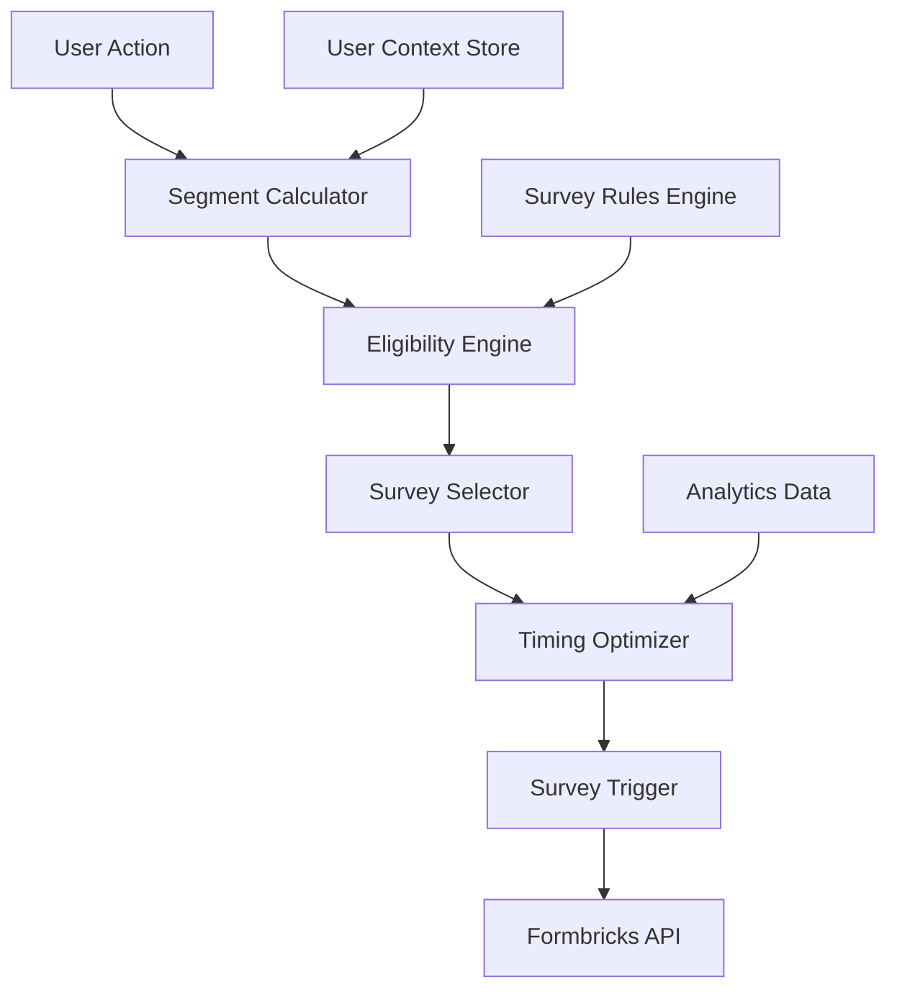

# FB-017: Targeting Logic Specification

**Sprint 5 Technical Document**  
**Last Updated**: 2025-08-17

## Overview

This document specifies the technical implementation for intelligent survey targeting in the QuoteKit Formbricks integration. The targeting logic ensures users receive relevant surveys at optimal times based on their segment classification and behavior patterns.

## Architecture Overview

### 1. System Components



### 2. Core Services

- **Segment Calculator**: Determines user segments in real-time
- **Eligibility Engine**: Evaluates survey targeting rules
- **Survey Selector**: Chooses appropriate survey for segment
- **Timing Optimizer**: Calculates optimal survey timing
- **Survey Trigger**: Initiates survey display via Formbricks

## Targeting Logic Implementation

### 1. Segment-Based Survey Mapping

```typescript
interface SurveyTargetingConfig {
  surveyId: string;
  segments: UserSegment[];
  conditions: TargetingConditions;
  timing: TimingConfiguration;
  frequency: FrequencyRules;
  priority: number;
}

interface TargetingConditions {
  // User criteria
  subscriptionTiers?: SubscriptionTier[];
  usagePatterns?: UsagePattern[];
  businessValues?: BusinessValue[];
  
  // Behavioral criteria
  minQuotesCreated?: number;
  maxQuotesCreated?: number;
  hasFeatureUsage?: string[];
  complexityPreference?: ComplexityPreference[];
  
  // Temporal criteria
  daysSinceSignup?: { min?: number; max?: number };
  daysSinceLastActive?: { min?: number; max?: number };
  daysSinceLastSurvey?: number;
  
  // Contextual criteria
  currentPage?: string[];
  deviceType?: ('desktop' | 'mobile')[];
  timezone?: string[];
  
  // Exclusion criteria
  excludeIf?: {
    recentSurveyParticipant?: boolean;
    activeSuportTicket?: boolean;
    churned?: boolean;
    optedOut?: boolean;
  };
}
```

### 2. Survey Targeting Configuration

```typescript
const SURVEY_TARGETING_CONFIGS: SurveyTargetingConfig[] = [
  // New Free User Onboarding
  {
    surveyId: 'new-free-user-onboarding',
    segments: ['new_free_user'],
    conditions: {
      subscriptionTiers: [SubscriptionTier.FREE],
      usagePatterns: [UsagePattern.NEW_USER],
      daysSinceSignup: { min: 3, max: 14 },
      minQuotesCreated: 0,
      maxQuotesCreated: 5,
      daysSinceLastSurvey: 14,
      excludeIf: {
        recentSurveyParticipant: true,
        churned: true
      }
    },
    timing: {
      triggerEvents: ['dashboard_visit_3rd', 'days_since_signup_7'],
      optimalHours: [10, 14, 16], // 10 AM, 2 PM, 4 PM
      avoidWeekends: true,
      delayAfterTrigger: 300000 // 5 minutes
    },
    frequency: {
      maxPerUser: 1,
      cooldownDays: 30
    },
    priority: 10
  },
  
  // Trial User Conversion Intent
  {
    surveyId: 'trial-user-conversion',
    segments: ['new_trial_user'],
    conditions: {
      subscriptionTiers: [SubscriptionTier.TRIAL],
      daysSinceSignup: { min: 5, max: 12 },
      minQuotesCreated: 2,
      daysSinceLastSurvey: 7,
      excludeIf: {
        recentSurveyParticipant: true
      }
    },
    timing: {
      triggerEvents: ['quote_created_5th', 'trial_day_7'],
      optimalHours: [11, 15], // Business hours
      preferredDays: ['tuesday', 'wednesday', 'thursday'],
      delayAfterTrigger: 600000 // 10 minutes
    },
    frequency: {
      maxPerUser: 1,
      cooldownDays: 90
    },
    priority: 15
  },
  
  // Growing Pro User Experience
  {
    surveyId: 'growing-pro-user-experience',
    segments: ['growing_pro_user'],
    conditions: {
      subscriptionTiers: [SubscriptionTier.PRO],
      usagePatterns: [UsagePattern.REGULAR_USER],
      businessValues: [BusinessValue.GROWING],
      minQuotesCreated: 20,
      daysSinceLastSurvey: 30,
      hasFeatureUsage: ['templates', 'custom_branding']
    },
    timing: {
      triggerEvents: ['quote_created_25th', 'monthly_active_user'],
      optimalHours: [13, 16], // Post-lunch productivity hours
      avoidMondays: true,
      delayAfterTrigger: 1800000 // 30 minutes
    },
    frequency: {
      maxPerUser: 4, // Quarterly
      cooldownDays: 90
    },
    priority: 8
  },
  
  // Power Enterprise User Strategic
  {
    surveyId: 'power-enterprise-strategic',
    segments: ['power_enterprise_user'],
    conditions: {
      subscriptionTiers: [SubscriptionTier.ENTERPRISE],
      usagePatterns: [UsagePattern.POWER_USER],
      businessValues: [BusinessValue.ENTERPRISE],
      minQuotesCreated: 100,
      daysSinceLastSurvey: 90,
      hasFeatureUsage: ['team_collaboration', 'advanced_reporting']
    },
    timing: {
      triggerEvents: ['quarterly_usage_milestone'],
      optimalHours: [10, 14], // Strategic thinking hours
      preferredDays: ['tuesday', 'wednesday'],
      delayAfterTrigger: 3600000 // 1 hour
    },
    frequency: {
      maxPerUser: 4, // Quarterly
      cooldownDays: 90
    },
    priority: 20
  },
  
  // Dormant High-Value Reactivation
  {
    surveyId: 'dormant-high-value-reactivation',
    segments: ['dormant_high_value_user'],
    conditions: {
      usagePatterns: [UsagePattern.DORMANT_USER],
      businessValues: [BusinessValue.ESTABLISHED, BusinessValue.ENTERPRISE],
      daysSinceLastActive: { min: 45, max: 180 },
      daysSinceLastSurvey: 180
    },
    timing: {
      triggerEvents: ['dormancy_45_days'],
      optimalHours: [11, 15], // Re-engagement hours
      preferredDays: ['tuesday', 'thursday'],
      delayAfterTrigger: 0 // Immediate
    },
    frequency: {
      maxPerUser: 2, // Give two chances
      cooldownDays: 180
    },
    priority: 12
  },
  
  // Template Power User Advanced
  {
    surveyId: 'template-power-user-advanced',
    segments: ['template_power_user'],
    conditions: {
      hasFeatureUsage: ['template_creation'],
      minQuotesCreated: 30,
      daysSinceLastSurvey: 60,
      // Custom condition for template creation count
      customConditions: {
        minTemplatesCreated: 10
      }
    },
    timing: {
      triggerEvents: ['template_created_10th'],
      optimalHours: [14, 17], // Creative/productive hours
      delayAfterTrigger: 900000 // 15 minutes
    },
    frequency: {
      maxPerUser: 2,
      cooldownDays: 120
    },
    priority: 7
  },
  
  // Mobile-First User Experience
  {
    surveyId: 'mobile-first-user-experience',
    segments: ['mobile_first_user'],
    conditions: {
      deviceType: ['mobile'],
      // Custom condition for mobile usage percentage
      customConditions: {
        mobileUsagePercentage: { min: 60 }
      },
      minQuotesCreated: 15,
      daysSinceLastSurvey: 45
    },
    timing: {
      triggerEvents: ['mobile_quote_creation_milestone'],
      optimalHours: [12, 18], // Mobile-friendly hours
      delayAfterTrigger: 600000 // 10 minutes
    },
    frequency: {
      maxPerUser: 3,
      cooldownDays: 60
    },
    priority: 9
  }
];
```

### 3. Eligibility Engine Implementation

```typescript
class SurveyEligibilityEngine {
  private userContextService: UserContextService;
  private segmentService: SegmentService;
  private analyticsService: AnalyticsService;

  constructor(
    userContextService: UserContextService,
    segmentService: SegmentService,
    analyticsService: AnalyticsService
  ) {
    this.userContextService = userContextService;
    this.segmentService = segmentService;
    this.analyticsService = analyticsService;
  }

  /**
   * Check if user is eligible for a specific survey
   */
  async checkEligibility(
    userId: string, 
    surveyConfig: SurveyTargetingConfig
  ): Promise<EligibilityResult> {
    const userContext = await this.userContextService.getUserContext(userId);
    const userSegments = await this.segmentService.getUserSegments(userId);
    const surveyHistory = await this.analyticsService.getUserSurveyHistory(userId);

    // Check segment membership
    const segmentMatch = this.checkSegmentMatch(userSegments, surveyConfig.segments);
    if (!segmentMatch.eligible) {
      return { eligible: false, reason: 'segment_mismatch', details: segmentMatch };
    }

    // Check basic conditions
    const conditionsMatch = this.checkConditions(userContext, surveyConfig.conditions);
    if (!conditionsMatch.eligible) {
      return { eligible: false, reason: 'conditions_not_met', details: conditionsMatch };
    }

    // Check frequency rules
    const frequencyCheck = this.checkFrequencyRules(
      surveyHistory, 
      surveyConfig.frequency,
      surveyConfig.surveyId
    );
    if (!frequencyCheck.eligible) {
      return { eligible: false, reason: 'frequency_limit', details: frequencyCheck };
    }

    // Check exclusion criteria
    const exclusionCheck = this.checkExclusions(userContext, surveyConfig.conditions.excludeIf);
    if (!exclusionCheck.eligible) {
      return { eligible: false, reason: 'excluded', details: exclusionCheck };
    }

    return { 
      eligible: true, 
      reason: 'eligible',
      confidence: this.calculateConfidence(userContext, surveyConfig),
      optimalTiming: this.calculateOptimalTiming(userContext, surveyConfig.timing)
    };
  }

  /**
   * Get all eligible surveys for a user, ranked by priority
   */
  async getEligibleSurveys(userId: string): Promise<EligibleSurvey[]> {
    const eligibleSurveys: EligibleSurvey[] = [];

    for (const surveyConfig of SURVEY_TARGETING_CONFIGS) {
      const eligibility = await this.checkEligibility(userId, surveyConfig);
      
      if (eligibility.eligible) {
        eligibleSurveys.push({
          surveyId: surveyConfig.surveyId,
          priority: surveyConfig.priority,
          confidence: eligibility.confidence || 0.5,
          optimalTiming: eligibility.optimalTiming,
          config: surveyConfig
        });
      }
    }

    // Sort by priority (higher = more important) and confidence
    return eligibleSurveys.sort((a, b) => {
      if (a.priority !== b.priority) {
        return b.priority - a.priority;
      }
      return b.confidence - a.confidence;
    });
  }

  /**
   * Check if user segments match survey requirements
   */
  private checkSegmentMatch(
    userSegments: UserSegment[], 
    requiredSegments: string[]
  ): EligibilityCheck {
    const userSegmentIds = userSegments.map(s => s.segmentId);
    const hasMatch = requiredSegments.some(segment => 
      userSegmentIds.includes(segment)
    );

    return {
      eligible: hasMatch,
      details: {
        userSegments: userSegmentIds,
        requiredSegments,
        matchFound: hasMatch
      }
    };
  }

  /**
   * Check if user meets survey conditions
   */
  private checkConditions(
    userContext: UserContext, 
    conditions: TargetingConditions
  ): EligibilityCheck {
    const checks: Record<string, boolean> = {};

    // Subscription tier check
    if (conditions.subscriptionTiers) {
      checks.subscriptionTier = conditions.subscriptionTiers.includes(
        userContext.subscriptionTier
      );
    }

    // Usage pattern check
    if (conditions.usagePatterns) {
      checks.usagePattern = conditions.usagePatterns.includes(
        userContext.usagePattern
      );
    }

    // Quote count checks
    if (conditions.minQuotesCreated !== undefined) {
      checks.minQuotes = userContext.quotesCreated >= conditions.minQuotesCreated;
    }
    if (conditions.maxQuotesCreated !== undefined) {
      checks.maxQuotes = userContext.quotesCreated <= conditions.maxQuotesCreated;
    }

    // Feature usage checks
    if (conditions.hasFeatureUsage) {
      checks.featureUsage = conditions.hasFeatureUsage.every(feature =>
        userContext.featuresUsed.includes(feature)
      );
    }

    // Time-based checks
    if (conditions.daysSinceSignup) {
      const daysSinceSignup = this.daysBetween(userContext.signupDate, new Date());
      checks.daysSinceSignup = this.checkRange(
        daysSinceSignup, 
        conditions.daysSinceSignup
      );
    }

    if (conditions.daysSinceLastActive) {
      const daysSinceActive = this.daysBetween(userContext.lastActiveDate, new Date());
      checks.daysSinceLastActive = this.checkRange(
        daysSinceActive, 
        conditions.daysSinceLastActive
      );
    }

    // All checks must pass
    const allPassed = Object.values(checks).every(Boolean);

    return {
      eligible: allPassed,
      details: {
        individualChecks: checks,
        allPassed
      }
    };
  }

  /**
   * Check frequency rules
   */
  private checkFrequencyRules(
    surveyHistory: SurveyHistory[],
    frequency: FrequencyRules,
    surveyId: string
  ): EligibilityCheck {
    const relevantHistory = surveyHistory.filter(h => h.surveyId === surveyId);
    
    // Check max per user
    if (relevantHistory.length >= frequency.maxPerUser) {
      return {
        eligible: false,
        details: {
          reason: 'max_per_user_exceeded',
          count: relevantHistory.length,
          limit: frequency.maxPerUser
        }
      };
    }

    // Check cooldown period
    if (relevantHistory.length > 0) {
      const lastSurvey = relevantHistory[relevantHistory.length - 1];
      const daysSinceLastSurvey = this.daysBetween(lastSurvey.completedAt, new Date());
      
      if (daysSinceLastSurvey < frequency.cooldownDays) {
        return {
          eligible: false,
          details: {
            reason: 'cooldown_active',
            daysSinceLastSurvey,
            cooldownDays: frequency.cooldownDays
          }
        };
      }
    }

    return { eligible: true, details: { passed: true } };
  }

  /**
   * Calculate confidence score for survey relevance
   */
  private calculateConfidence(
    userContext: UserContext, 
    surveyConfig: SurveyTargetingConfig
  ): number {
    let confidence = 0.5; // Base confidence

    // Increase confidence for perfect segment matches
    if (surveyConfig.conditions.subscriptionTiers?.includes(userContext.subscriptionTier)) {
      confidence += 0.2;
    }

    // Increase confidence for engaged users
    if (userContext.quotesCreated > 10) {
      confidence += 0.1;
    }

    // Increase confidence for recent activity
    const daysSinceActive = this.daysBetween(userContext.lastActiveDate, new Date());
    if (daysSinceActive < 7) {
      confidence += 0.1;
    }

    // Decrease confidence for dormant users
    if (daysSinceActive > 30) {
      confidence -= 0.2;
    }

    return Math.max(0.1, Math.min(1.0, confidence));
  }

  /**
   * Calculate optimal timing for survey delivery
   */
  private calculateOptimalTiming(
    userContext: UserContext,
    timingConfig: TimingConfiguration
  ): Date {
    const now = new Date();
    const userTimezone = userContext.timezone || 'UTC';
    
    // Get user's local time
    const userTime = new Date(now.toLocaleString("en-US", { timeZone: userTimezone }));
    
    // Find next optimal hour
    const optimalHours = timingConfig.optimalHours || [14]; // Default 2 PM
    const currentHour = userTime.getHours();
    
    let targetHour = optimalHours.find(hour => hour > currentHour) || optimalHours[0];
    let targetDate = new Date(userTime);
    
    // If no optimal hour today, schedule for tomorrow
    if (targetHour <= currentHour) {
      targetDate.setDate(targetDate.getDate() + 1);
    }
    
    targetDate.setHours(targetHour, 0, 0, 0);
    
    // Avoid weekends if specified
    if (timingConfig.avoidWeekends) {
      const dayOfWeek = targetDate.getDay();
      if (dayOfWeek === 0 || dayOfWeek === 6) { // Sunday or Saturday
        targetDate.setDate(targetDate.getDate() + (dayOfWeek === 0 ? 1 : 2));
      }
    }
    
    // Apply delay after trigger if specified
    if (timingConfig.delayAfterTrigger) {
      targetDate = new Date(Math.max(
        targetDate.getTime(),
        now.getTime() + timingConfig.delayAfterTrigger
      ));
    }
    
    return targetDate;
  }

  /**
   * Utility: Calculate days between dates
   */
  private daysBetween(date1: Date, date2: Date): number {
    const oneDay = 24 * 60 * 60 * 1000;
    return Math.round(Math.abs((date2.getTime() - date1.getTime()) / oneDay));
  }

  /**
   * Utility: Check if value is within range
   */
  private checkRange(value: number, range: { min?: number; max?: number }): boolean {
    if (range.min !== undefined && value < range.min) return false;
    if (range.max !== undefined && value > range.max) return false;
    return true;
  }
}
```

### 4. Survey Trigger Implementation

```typescript
class SurveyTriggerService {
  private eligibilityEngine: SurveyEligibilityEngine;
  private formbricksService: FormbricksService;
  private schedulerService: SchedulerService;

  /**
   * Trigger survey evaluation for user action
   */
  async evaluateTriggers(userId: string, eventName: string): Promise<void> {
    // Get surveys that have this event as a trigger
    const triggeredSurveys = SURVEY_TARGETING_CONFIGS.filter(config =>
      config.timing.triggerEvents?.includes(eventName)
    );

    for (const surveyConfig of triggeredSurveys) {
      await this.processSurveyTrigger(userId, surveyConfig);
    }
  }

  /**
   * Process individual survey trigger
   */
  private async processSurveyTrigger(
    userId: string, 
    surveyConfig: SurveyTargetingConfig
  ): Promise<void> {
    const eligibility = await this.eligibilityEngine.checkEligibility(
      userId, 
      surveyConfig
    );

    if (!eligibility.eligible) {
      console.log(`Survey ${surveyConfig.surveyId} not eligible for user ${userId}:`, 
        eligibility.reason);
      return;
    }

    // Schedule survey delivery at optimal time
    const deliveryTime = eligibility.optimalTiming || new Date();
    
    await this.schedulerService.scheduleSurvey({
      userId,
      surveyId: surveyConfig.surveyId,
      scheduledFor: deliveryTime,
      priority: surveyConfig.priority,
      eligibilitySnapshot: eligibility
    });

    console.log(`Survey ${surveyConfig.surveyId} scheduled for user ${userId} at`, 
      deliveryTime);
  }

  /**
   * Execute scheduled survey delivery
   */
  async deliverScheduledSurvey(scheduleItem: ScheduledSurvey): Promise<void> {
    // Re-verify eligibility at delivery time
    const currentEligibility = await this.eligibilityEngine.checkEligibility(
      scheduleItem.userId,
      SURVEY_TARGETING_CONFIGS.find(c => c.surveyId === scheduleItem.surveyId)!
    );

    if (!currentEligibility.eligible) {
      console.log(`Survey ${scheduleItem.surveyId} no longer eligible for user ${scheduleItem.userId}`);
      return;
    }

    // Trigger survey in Formbricks
    await this.formbricksService.triggerSurvey(
      scheduleItem.userId,
      scheduleItem.surveyId
    );

    // Log delivery for analytics
    await this.analyticsService.logSurveyDelivery({
      userId: scheduleItem.userId,
      surveyId: scheduleItem.surveyId,
      deliveredAt: new Date(),
      scheduledFor: scheduleItem.scheduledFor,
      eligibilityScore: currentEligibility.confidence
    });
  }
}
```

### 5. Smart Conflict Resolution

```typescript
class SurveyConflictResolver {
  /**
   * Resolve conflicts when multiple surveys are eligible
   */
  async resolveConflicts(eligibleSurveys: EligibleSurvey[]): Promise<EligibleSurvey[]> {
    if (eligibleSurveys.length <= 1) return eligibleSurveys;

    // Rule 1: Never show more than one survey per day
    const today = new Date().toDateString();
    const todaySurveys = eligibleSurveys.filter(survey => 
      survey.optimalTiming?.toDateString() === today
    );

    if (todaySurveys.length > 1) {
      // Keep only highest priority survey for today
      const highestPriority = Math.max(...todaySurveys.map(s => s.priority));
      return eligibleSurveys.filter(survey => 
        survey.optimalTiming?.toDateString() !== today ||
        survey.priority === highestPriority
      );
    }

    // Rule 2: Space out surveys by at least 3 days
    const sortedByTime = eligibleSurveys.sort((a, b) => 
      (a.optimalTiming?.getTime() || 0) - (b.optimalTiming?.getTime() || 0)
    );

    const spacedSurveys = [sortedByTime[0]];
    for (let i = 1; i < sortedByTime.length; i++) {
      const lastSurvey = spacedSurveys[spacedSurveys.length - 1];
      const currentSurvey = sortedByTime[i];
      
      const daysBetween = this.daysBetween(
        lastSurvey.optimalTiming || new Date(),
        currentSurvey.optimalTiming || new Date()
      );

      if (daysBetween >= 3) {
        spacedSurveys.push(currentSurvey);
      } else if (currentSurvey.priority > lastSurvey.priority) {
        // Replace with higher priority survey
        spacedSurveys[spacedSurveys.length - 1] = currentSurvey;
      }
    }

    return spacedSurveys;
  }

  private daysBetween(date1: Date, date2: Date): number {
    const oneDay = 24 * 60 * 60 * 1000;
    return Math.round(Math.abs((date2.getTime() - date1.getTime()) / oneDay));
  }
}
```

## Performance Optimizations

### 1. Caching Strategy

```typescript
class SurveyTargetingCache {
  private segmentCache = new Map<string, UserSegment[]>();
  private eligibilityCache = new Map<string, EligibilityResult>();
  private userContextCache = new Map<string, UserContext>();

  async getCachedSegments(userId: string): Promise<UserSegment[] | null> {
    const cached = this.segmentCache.get(userId);
    if (cached && this.isCacheValid(userId, 'segments', 300000)) { // 5 min TTL
      return cached;
    }
    return null;
  }

  setCachedSegments(userId: string, segments: UserSegment[]): void {
    this.segmentCache.set(userId, segments);
    this.setCacheTimestamp(userId, 'segments');
  }

  // Similar methods for eligibility and user context caching...
}
```

### 2. Batch Processing

```typescript
class BatchSurveyProcessor {
  async processBatchTriggers(userEvents: UserEvent[]): Promise<void> {
    // Group events by user
    const eventsByUser = this.groupEventsByUser(userEvents);
    
    // Process users in parallel batches
    const batchSize = 10;
    const userIds = Object.keys(eventsByUser);
    
    for (let i = 0; i < userIds.length; i += batchSize) {
      const batch = userIds.slice(i, i + batchSize);
      
      await Promise.all(
        batch.map(userId => 
          this.processUserEvents(userId, eventsByUser[userId])
        )
      );
    }
  }
}
```

## Testing Strategy

### 1. Unit Tests

```typescript
describe('SurveyEligibilityEngine', () => {
  it('should correctly identify eligible users for new user survey', async () => {
    const mockUser = createMockUser({
      subscriptionTier: SubscriptionTier.FREE,
      quotesCreated: 3,
      daysSinceSignup: 5
    });

    const eligibility = await eligibilityEngine.checkEligibility(
      mockUser.id,
      SURVEY_TARGETING_CONFIGS.find(c => c.surveyId === 'new-free-user-onboarding')!
    );

    expect(eligibility.eligible).toBe(true);
    expect(eligibility.confidence).toBeGreaterThan(0.5);
  });

  it('should exclude users who recently completed surveys', async () => {
    const mockUser = createMockUser({
      lastSurveyDate: new Date(Date.now() - 5 * 24 * 60 * 60 * 1000) // 5 days ago
    });

    const eligibility = await eligibilityEngine.checkEligibility(
      mockUser.id,
      createMockSurveyConfig({ cooldownDays: 7 })
    );

    expect(eligibility.eligible).toBe(false);
    expect(eligibility.reason).toBe('frequency_limit');
  });
});
```

### 2. Integration Tests

```typescript
describe('Survey Targeting Integration', () => {
  it('should deliver appropriate survey to new trial user', async () => {
    // Setup test user
    const testUser = await createTestUser({
      subscriptionTier: SubscriptionTier.TRIAL,
      signupDate: new Date(Date.now() - 7 * 24 * 60 * 60 * 1000) // 7 days ago
    });

    // Trigger quote creation event
    await surveyTriggerService.evaluateTriggers(testUser.id, 'quote_created_5th');

    // Verify survey was scheduled
    const scheduledSurveys = await getScheduledSurveys(testUser.id);
    expect(scheduledSurveys).toHaveLength(1);
    expect(scheduledSurveys[0].surveyId).toBe('trial-user-conversion');
  });
});
```

## Monitoring & Analytics

### 1. Key Metrics

- **Targeting Accuracy**: % of surveys delivered to correct segments
- **Completion Rate by Segment**: Track engagement across segments
- **Survey Relevance Score**: User-reported relevance ratings
- **Conflict Resolution Effectiveness**: Survey spacing and priority handling

### 2. Dashboard Alerts

- Alert when completion rates drop below segment targets
- Alert for high survey conflicts or delivery failures
- Alert for segment classification accuracy issues

---

**Document Status**: ✅ Complete technical specification ready for implementation  
**Next Steps**: Implement core services and begin testing with sample surveys