# Technical Architecture

## Implementation Status: ✅ **FULLY IMPLEMENTED**

**Sprint 1 Complete**: All core architecture components have been successfully implemented and are operational.

## System Architecture Overview

```mermaid
graph TB
    subgraph "QuoteKit Frontend - ✅ IMPLEMENTED"
        QK[QuoteKit App]
        FB[Formbricks SDK ✅]
        FW[Feedback Widgets]
        FP[FormbricksProvider ✅]
        FM[FormbricksManager ✅]
        QK --> FP
        FP --> FM
        FM --> FB
        FB --> FW
    end
    
    subgraph "Formbricks Platform - ✅ CONFIGURED"
        FC[Formbricks Cloud ✅]
        API[Formbricks API ✅]
        DB[(Survey Data ✅)]
        TS[Test Survey ✅]
        FC --> API
        API --> DB
        FC --> TS
    end
    
    subgraph "QuoteKit Backend"
        QKB[QuoteKit API]
        QKDB[(QuoteKit DB)]
        QKB --> QKDB
    end
    
    FB --> API
    QK --> QKB
    FW --> QKB
    
    style QK fill:#0D9373
    style FB fill:#FF6B6B
    style FC fill:#4C6EF5
    style FP fill:#10B981
    style FM fill:#10B981
```



## Integration Architecture - ✅ **IMPLEMENTED**

### Client-Side Integration - ✅ **COMPLETE**

#### SDK Installation and Setup - ✅ **IMPLEMENTED**
```typescript
// /src/libs/formbricks/formbricks-manager.ts - ✅ IMPLEMENTED
import formbricks from "@formbricks/js";

export class FormbricksManager {
  private static instance: FormbricksManager;
  private initialized = false;

  static getInstance(): FormbricksManager {
    if (!FormbricksManager.instance) {
      FormbricksManager.instance = new FormbricksManager();
    }
    return FormbricksManager.instance;
  }

  initialize(config: { environmentId: string; appUrl: string }): void {
    if (this.initialized) return;

    try {
      formbricks.setup({
        environmentId: config.environmentId,
        appUrl: config.appUrl,
      });
      
      this.initialized = true;
    } catch (error) {
      console.error('Formbricks initialization failed:', error);
    }
  }

  setAttributes(attributes: Record<string, any>): void {
    if (!this.initialized) return;
    
    try {
      formbricks.setAttributes(attributes);
    } catch (error) {
      console.error('Failed to set attributes:', error);
    }
  }

  registerRouteChange(): void {
    if (!this.initialized) return;
    
    try {
      formbricks.registerRouteChange();
    } catch (error) {
      console.error('Failed to register route change:', error);
    }
  }
}
```

  static getInstance(): FormbricksManager {
    if (!FormbricksManager.instance) {
      FormbricksManager.instance = new FormbricksManager();
    }
    return FormbricksManager.instance;
  }

  async initialize(user: User) {
    if (this.initialized) return;

    try {
      await formbricks.init({
        environmentId: process.env.NEXT_PUBLIC_FORMBRICKS_ENV_ID!,
        apiHost: process.env.NEXT_PUBLIC_FORMBRICKS_API_HOST!,
        userId: user.id,
      });

      this.setUserAttributes(user);
      this.initialized = true;
    } catch (error) {
      console.error('Formbricks initialization failed:', error);
    }
  }

  private setUserAttributes(user: User) {
    formbricks.setAttributes({
      email: user.email,
      subscriptionTier: user.subscriptionTier,
      quotesCreated: user.stats.totalQuotes,
      revenue: user.stats.totalRevenue,
      industry: user.profile?.industry,
      companySize: user.profile?.companySize,
      signupDate: user.createdAt.toISOString(),
      lastActive: user.lastLoginAt?.toISOString(),
    });
  }

  trackEvent(eventName: string, properties?: Record<string, any>) {
    if (!this.initialized) return;
    
    formbricks.track(eventName, {
      timestamp: new Date().toISOString(),
      ...properties,
    });
  }
}
```

#### Provider Component
```typescript
// components/providers/FormbricksProvider.tsx
'use client';

import { useEffect } from 'react';
import { useAuth } from '@/hooks/useAuth';
import { FormbricksManager } from '@/packages/formbricks';

export function FormbricksProvider() {
  const { user } = useAuth();

  useEffect(() => {
    if (user) {
      const manager = FormbricksManager.getInstance();
      manager.initialize(user);
    }
  }, [user]);

  return null;
}
```

### Event Tracking System

#### Core Events
```typescript
// types/formbricks-events.ts
export interface FormbricksEvent {
  name: string;
  properties?: Record<string, any>;
  context?: {
    page: string;
    section: string;
    userTier: string;
    sessionId: string;
  };
}

export const FORMBRICKS_EVENTS = {
  // Dashboard Events
  DASHBOARD_VISIT: 'dashboard_visit',
  USAGE_LIMIT_REACHED: 'usage_limit_reached',
  UPGRADE_PROMPT_SHOWN: 'upgrade_prompt_shown',
  
  // Quote Events
  QUOTE_CREATED: 'quote_created',
  QUOTE_SENT: 'quote_sent',
  QUOTE_ACCEPTED: 'quote_accepted',
  COMPLEX_QUOTE_CREATED: 'complex_quote_created',
  
  // User Journey Events
  ONBOARDING_COMPLETED: 'onboarding_completed',
  FIRST_QUOTE_CREATED: 'first_quote_created',
  POWER_USER_MILESTONE: 'power_user_milestone',
  
  // Conversion Events
  UPGRADE_INITIATED: 'upgrade_initiated',
  UPGRADE_COMPLETED: 'upgrade_completed',
  UPGRADE_ABANDONED: 'upgrade_abandoned',
  
  // Feature Usage
  FEATURE_DISCOVERED: 'feature_discovered',
  FEATURE_USED: 'feature_used',
  HELP_REQUESTED: 'help_requested',
} as const;
```

#### Event Tracking Hooks
```typescript
// hooks/useFormbricksTracking.ts
import { useCallback } from 'react';
import { FormbricksManager } from '@/packages/formbricks';
import { useAuth } from './useAuth';
import { useRouter } from 'next/navigation';

export function useFormbricksTracking() {
  const { user } = useAuth();
  const router = useRouter();

  const trackEvent = useCallback((
    eventName: string, 
    properties?: Record<string, any>
  ) => {
    const manager = FormbricksManager.getInstance();
    
    const context = {
      page: router.pathname,
      userTier: user?.subscriptionTier || 'unknown',
      sessionId: user?.sessionId || 'anonymous',
      timestamp: new Date().toISOString(),
    };

    manager.trackEvent(eventName, {
      ...properties,
      context,
    });
  }, [user, router]);

  return { trackEvent };
}
```

### Survey Components

#### Feedback Widget Component
```typescript
// components/feedback/FeedbackWidget.tsx
import { useState, useEffect } from 'react';
import { MessageCircle, X } from 'lucide-react';
import { useFormbricksTracking } from '@/hooks/useFormbricksTracking';

interface FeedbackWidgetProps {
  position?: 'bottom-right' | 'bottom-left' | 'top-right' | 'top-left';
  triggers?: string[];
  context?: Record<string, any>;
}

export function FeedbackWidget({ 
  position = 'bottom-right',
  triggers = [],
  context = {}
}: FeedbackWidgetProps) {
  const [isVisible, setIsVisible] = useState(false);
  const [isDismissed, setIsDismissed] = useState(false);
  const { trackEvent } = useFormbricksTracking();

  useEffect(() => {
    // Show widget based on triggers
    const shouldShow = triggers.some(trigger => 
      context[trigger] === true
    );

    if (shouldShow && !isDismissed) {
      setIsVisible(true);
      trackEvent('feedback_widget_shown', { triggers, context });
    }
  }, [triggers, context, isDismissed, trackEvent]);

  const handleClick = () => {
    trackEvent('feedback_widget_clicked');
    // Trigger Formbricks survey
    window.formbricks?.track('feedback_requested', context);
  };

  const handleDismiss = () => {
    setIsDismissed(true);
    setIsVisible(false);
    trackEvent('feedback_widget_dismissed');
  };

  if (!isVisible) return null;

  const positionClasses = {
    'bottom-right': 'bottom-6 right-6',
    'bottom-left': 'bottom-6 left-6',
    'top-right': 'top-6 right-6',
    'top-left': 'top-6 left-6',
  };

  return (
    <div className={`fixed ${positionClasses[position]} z-50`}>
      <div className="bg-forest-green text-white rounded-full p-4 shadow-lg hover:shadow-xl transition-shadow cursor-pointer group">
        <button
          onClick={handleClick}
          className="flex items-center space-x-2"
          aria-label="Provide feedback"
        >
          <MessageCircle className="w-6 h-6" />
          <span className="hidden group-hover:block text-sm font-medium">
            Feedback
          </span>
        </button>
        
        <button
          onClick={handleDismiss}
          className="absolute -top-2 -right-2 bg-red-500 text-white rounded-full p-1 hover:bg-red-600"
          aria-label="Dismiss feedback widget"
        >
          <X className="w-3 h-3" />
        </button>
      </div>
    </div>
  );
}
```

#### Contextual Survey Trigger
```typescript
// components/feedback/SurveyTrigger.tsx
import { useEffect } from 'react';
import { useFormbricksTracking } from '@/hooks/useFormbricksTracking';

interface SurveyTriggerProps {
  eventName: string;
  condition: boolean;
  context?: Record<string, any>;
  delay?: number;
}

export function SurveyTrigger({ 
  eventName, 
  condition, 
  context = {},
  delay = 0 
}: SurveyTriggerProps) {
  const { trackEvent } = useFormbricksTracking();

  useEffect(() => {
    if (condition) {
      const timer = setTimeout(() => {
        trackEvent(eventName, context);
      }, delay);

      return () => clearTimeout(timer);
    }
  }, [condition, eventName, context, delay, trackEvent]);

  return null;
}
```

## Data Flow Architecture

### User Context Synchronization
```typescript
// services/formbricks-sync.ts
export class FormbricksSync {
  static async syncUserData(user: User) {
    const manager = FormbricksManager.getInstance();
    
    // Update user attributes
    await manager.setUserAttributes({
      subscriptionTier: user.subscriptionTier,
      quotesThisMonth: user.stats.quotesThisMonth,
      totalRevenue: user.stats.totalRevenue,
      lastQuoteCreated: user.stats.lastQuoteCreated?.toISOString(),
      featureUsage: user.featureUsage,
    });
  }

  static async handleSubscriptionChange(user: User, oldTier: string, newTier: string) {
    const manager = FormbricksManager.getInstance();
    
    await manager.trackEvent('subscription_changed', {
      oldTier,
      newTier,
      upgradeDate: new Date().toISOString(),
    });

    // Trigger post-upgrade survey
    setTimeout(() => {
      manager.trackEvent('post_upgrade_survey_eligible');
    }, 24 * 60 * 60 * 1000); // 24 hours delay
  }
}
```

### Survey Response Handling
```typescript
// services/survey-response-handler.ts
export class SurveyResponseHandler {
  static async handleResponse(response: SurveyResponse) {
    // Store in QuoteKit database for analysis
    await prisma.userFeedback.create({
      data: {
        userId: response.userId,
        surveyId: response.surveyId,
        surveyType: response.surveyType,
        responses: response.data,
        context: response.context,
        sentiment: this.analyzeSentiment(response.data),
        createdAt: new Date(),
      },
    });

    // Trigger automated actions based on response
    await this.processAutomatedActions(response);
  }

  private static async processAutomatedActions(response: SurveyResponse) {
    // Negative feedback handling
    if (response.sentiment === 'negative') {
      await this.triggerCustomerSuccessAlert(response);
    }

    // Feature request handling
    if (response.type === 'feature_request') {
      await this.createFeatureRequestTicket(response);
    }

    // Churn risk detection
    if (response.churnRisk > 0.7) {
      await this.triggerChurnPreventionWorkflow(response);
    }
  }
}
```

## Performance Considerations

### Lazy Loading Strategy
```typescript
// utils/formbricks-loader.ts
export class FormbricksLoader {
  private static loaded = false;

  static async loadSDK(): Promise<void> {
    if (this.loaded) return;

    return new Promise((resolve, reject) => {
      const script = document.createElement('script');
      script.src = `${process.env.NEXT_PUBLIC_FORMBRICKS_API_HOST}/js/formbricks.umd.cjs`;
      script.async = true;
      
      script.onload = () => {
        this.loaded = true;
        resolve();
      };
      
      script.onerror = () => {
        reject(new Error('Failed to load Formbricks SDK'));
      };

      document.head.appendChild(script);
    });
  }

  static async initializeWhenReady(user: User) {
    try {
      await this.loadSDK();
      const manager = FormbricksManager.getInstance();
      await manager.initialize(user);
    } catch (error) {
      console.error('Formbricks initialization failed:', error);
      // Graceful degradation - app continues to work
    }
  }
}
```

### Error Handling and Fallbacks
```typescript
// utils/formbricks-error-handler.ts
export class FormbricksErrorHandler {
  static handleError(error: Error, context: string) {
    console.error(`Formbricks error in ${context}:`, error);
    
    // Report to monitoring service
    if (process.env.NODE_ENV === 'production') {
      // Send to error tracking service
      this.reportError(error, context);
    }
    
    // Graceful degradation
    this.enableFallbackMode();
  }

  private static enableFallbackMode() {
    // Disable survey triggers
    window.formbricksDisabled = true;
    
    // Show alternative feedback collection
    this.showFallbackFeedback();
  }

  private static showFallbackFeedback() {
    // Simple mailto link or contact form
    const fallbackWidget = document.createElement('div');
    fallbackWidget.innerHTML = `
      <a href="mailto:feedback@quotekit.com" 
         class="fixed bottom-6 right-6 bg-forest-green text-white p-4 rounded-full">
        📧 Feedback
      </a>
    `;
    document.body.appendChild(fallbackWidget);
  }
}
```

## Security and Privacy

### Data Protection
```typescript
// utils/privacy-manager.ts
export class PrivacyManager {
  static async checkConsent(): Promise<boolean> {
    // Check user's privacy preferences
    const consent = localStorage.getItem('formbricks-consent');
    return consent === 'granted';
  }

  static async requestConsent(): Promise<boolean> {
    // Show consent dialog
    return new Promise((resolve) => {
      const dialog = this.createConsentDialog(resolve);
      document.body.appendChild(dialog);
    });
  }

  static revokeConsent() {
    localStorage.setItem('formbricks-consent', 'revoked');
    // Clear any stored data
    this.clearStoredData();
  }

  private static clearStoredData() {
    // Clear Formbricks local storage
    Object.keys(localStorage)
      .filter(key => key.startsWith('formbricks-'))
      .forEach(key => localStorage.removeItem(key));
  }
}
```

## Monitoring and Analytics

### Performance Monitoring
```typescript
// utils/performance-monitor.ts
export class PerformanceMonitor {
  static trackSDKLoadTime() {
    const startTime = performance.now();
    
    return {
      end: () => {
        const loadTime = performance.now() - startTime;
        this.reportMetric('formbricks_sdk_load_time', loadTime);
      }
    };
  }

  static trackSurveyPerformance(surveyId: string) {
    const startTime = performance.now();
    
    return {
      complete: () => {
        const completionTime = performance.now() - startTime;
        this.reportMetric('survey_completion_time', completionTime, {
          surveyId
        });
      }
    };
  }

  private static reportMetric(name: string, value: number, tags?: Record<string, string>) {
    // Send to analytics service
    if (window.gtag) {
      window.gtag('event', name, {
        value: Math.round(value),
        ...tags
      });
    }
  }
}
```

This technical architecture provides a robust foundation for integrating Formbricks into QuoteKit while maintaining performance, security, and user experience standards.
