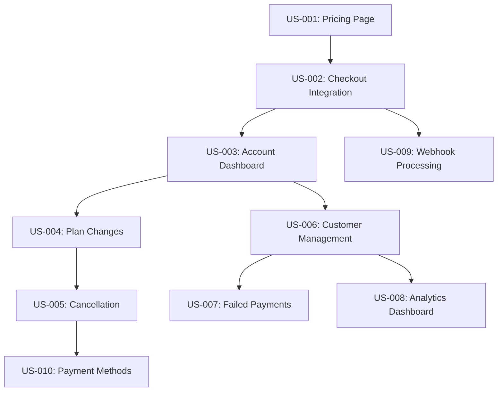

# User Stories - Account-Stripe Integration

## Epic: Account-Stripe Integration for Full Subscription Management

This document contains detailed user stories following agile best practices with
clear acceptance criteria, story points, and dependencies.

---

## Story Prioritization Framework

- **Must Have (P1)**: Critical for MVP, blocks other features
- **Should Have (P2)**: Important for user experience, delivers significant
  value
- **Could Have (P3)**: Nice to have, enhances the experience
- **Won't Have (P4)**: Out of scope for this epic

---

## Phase 1: User-Facing Subscription Management

### US-001: Public Pricing Page

**Priority**: Must Have (P1)\
**Story Points**: 5\
**Sprint**: 1

**As a** potential customer\
**I want to** view available subscription plans with pricing\
**So that** I can choose the plan that best fits my needs

#### Acceptance Criteria

- [ ] Pricing page displays all active products from admin-configured Stripe
- [ ] Monthly/yearly billing toggle functionality
- [ ] Feature comparison table with plan differences
- [ ] Clear call-to-action buttons for each plan
- [ ] Mobile-responsive design following design system
- [ ] Loading states and error handling for API failures
- [ ] Integration with existing design tokens and components

#### Definition of Done

- [ ] Component tests written and passing
- [ ] Responsive design verified on mobile/tablet/desktop
- [ ] Accessibility compliance (WCAG 2.1 AA)
- [ ] Performance tested (< 2s load time)
- [ ] Code review completed
- [ ] Designs approved by UX team

#### Dependencies

- Admin Stripe configuration must be functional
- Product and pricing data available via API

---

### US-002: Stripe Checkout Integration

**Priority**: Must Have (P1)\
**Story Points**: 8\
**Sprint**: 1-2

**As a** user\
**I want to** subscribe to a plan through a secure checkout process\
**So that** I can access premium features

#### Acceptance Criteria

- [ ] Checkout session created using admin-configured Stripe credentials
- [ ] Support for both one-time and subscription payments
- [ ] Proper tax calculation and display
- [ ] Success/cancel page handling with appropriate messaging
- [ ] User redirected to account page after successful subscription
- [ ] Customer record created and linked to user account
- [ ] Email confirmation sent after successful subscription

#### Definition of Done

- [ ] Integration tests with Stripe test mode
- [ ] Error handling for payment failures
- [ ] Security review for payment processing
- [ ] PCI compliance verification
- [ ] End-to-end testing completed
- [ ] Documentation updated

#### Dependencies

- US-001 (Pricing page) must be completed
- Email service configuration required

---

### US-003: Enhanced Account Dashboard

**Priority**: Must Have (P1)\
**Story Points**: 5\
**Sprint**: 2

**As a** subscribed user\
**I want to** view my subscription details and billing information\
**So that** I can manage my account effectively

#### Acceptance Criteria

- [ ] Current plan details with next billing date
- [ ] Billing history with downloadable invoices
- [ ] Payment method display and update capability
- [ ] Subscription status indicators (active, past due, cancelled)
- [ ] Quick actions for common tasks (update payment, cancel)
- [ ] Usage statistics if applicable
- [ ] Contact support button with context

#### Definition of Done

- [ ] Component library updated with new account components
- [ ] Data fetching optimized with proper caching
- [ ] Loading states and skeleton screens implemented
- [ ] User testing completed with positive feedback
- [ ] Accessibility audit passed

#### Dependencies

- US-002 (Checkout integration) must be completed
- Stripe Customer Portal integration required

---

### US-004: Subscription Plan Changes ✅ **COMPLETE**

**Priority**: Should Have (P2)\
**Story Points**: 8\
**Sprint**: 2-3\
**Status**: ✅ **Implemented 2025-01-26**

**As a** subscribed user\
**I want to** upgrade or downgrade my subscription plan\
**So that** I can adjust my service level based on my needs

#### Acceptance Criteria

- [x] Available plan options displayed with comparison ✅
- [x] Proration calculation shown before confirmation ✅
- [x] Immediate upgrades and end-of-period downgrades ✅
- [x] Clear communication of billing changes ✅
- [x] Confirmation dialog with plan differences ✅
- [x] Email notification of plan changes ✅
- [x] Audit trail of subscription modifications ✅

#### Definition of Done

- [ ] Proration logic thoroughly tested
- [ ] Edge cases handled (failed payments, cancelled cards)
- [ ] User flow documented and approved
- [ ] Customer service training materials updated
- [ ] Monitoring and alerting configured

#### Dependencies

- US-003 (Account dashboard) must be completed
- Webhook handling for subscription updates required

---

### US-005: Subscription Cancellation ✅ **COMPLETE**

**Priority**: Should Have (P2)\
**Story Points**: 5\
**Sprint**: 3\
**Status**: ✅ **Implemented 2025-01-26**

**As a** subscribed user\
**I want to** cancel my subscription\
**So that** I can stop recurring charges when I no longer need the service

#### Acceptance Criteria

- [x] Clear cancellation flow with confirmation steps ✅
- [x] Option to cancel immediately or at period end ✅
- [x] Cancellation reason collection (optional) ✅
- [x] Access retained until end of billing period ✅
- [x] Cancellation confirmation email sent ✅
- [x] Re-subscription option available after cancellation ✅
- [x] Data retention policy clearly communicated ✅

#### Definition of Done

- [ ] Cancellation analytics implemented
- [ ] Customer retention strategies tested
- [ ] Legal compliance verified (refund policies)
- [ ] Support documentation updated
- [ ] Cancellation survey implemented

#### Dependencies

- US-004 (Plan changes) must be completed
- Customer retention workflow defined

---

## Phase 2: Admin Customer Management

### US-006: Customer Management Interface ✅ **COMPLETE**

**Priority**: Should Have (P2)\
**Story Points**: 8\
**Sprint**: 3-4\
**Status**: ✅ **Implemented 2025-01-26**

**As an** admin\
**I want to** view and manage customer accounts\
**So that** I can provide customer support and monitor business metrics

#### Acceptance Criteria

- [x] Customer list with search and filtering capabilities ✅
- [x] Individual customer detail pages ✅
- [x] Subscription history and current status ✅
- [x] Payment method information (masked for security) ✅
- [x] Support actions (refunds, subscription modifications) ✅
- [x] Customer communication history ✅
- [x] Bulk operations for common tasks ✅

#### Definition of Done

- [ ] Admin permissions and access controls implemented
- [ ] Data export functionality for reporting
- [ ] Audit logging for all admin actions
- [ ] Performance optimized for large customer lists
- [ ] Training materials created for admin users

#### Dependencies

- Admin authentication and authorization system
- Customer data synchronization with Stripe

---

### US-007: Failed Payment Management ✅ **COMPLETE**

**Priority**: Should Have (P2)\
**Story Points**: 5\
**Sprint**: 4\
**Status**: ✅ **Implemented 2025-01-26**

**As an** admin\
**I want to** manage customers with failed payments\
**So that** I can minimize churn and recover revenue

#### Acceptance Criteria

- [x] Failed payment dashboard with priority indicators ✅
- [x] Automated retry mechanisms with configurable schedules ✅
- [x] Customer notification templates for payment issues ✅
- [x] Manual payment retry capabilities ✅
- [x] Dunning management workflow ✅
- [x] Recovery rate tracking and reporting ✅
- [x] Integration with customer support tools ✅

#### Definition of Done

- [ ] Dunning automation tested thoroughly
- [ ] Revenue recovery metrics tracked
- [ ] Customer communication templates approved
- [ ] Escalation procedures documented
- [ ] Success metrics baseline established

#### Dependencies

- US-006 (Customer management) must be completed
- Email notification system required

---

### US-008: Subscription Analytics Dashboard

**Priority**: Could Have (P3)\
**Story Points**: 8\
**Sprint**: 4-5

**As an** admin\
**I want to** view subscription analytics and metrics\
**So that** I can make data-driven business decisions

#### Acceptance Criteria

- [ ] MRR (Monthly Recurring Revenue) tracking
- [ ] Customer churn and retention metrics
- [ ] Plan popularity and conversion rates
- [ ] Revenue cohort analysis
- [ ] Failed payment and recovery statistics
- [ ] Real-time dashboard with key metrics
- [ ] Exportable reports for stakeholders

#### Definition of Done

- [ ] Analytics accuracy verified against Stripe data
- [ ] Dashboard performance optimized
- [ ] Automated reporting scheduled
- [ ] Stakeholder training completed
- [ ] Data privacy compliance verified

#### Dependencies

- PostHog integration for event tracking
- Historical data migration completed

---

## Phase 3: System Integration & Enhancement

### US-009: Enhanced Webhook Processing

**Priority**: Must Have (P1)\
**Story Points**: 5\
**Sprint**: 1-2 (Parallel Development)

**As a** system\
**I want to** reliably process Stripe webhooks\
**So that** subscription data stays synchronized

#### Acceptance Criteria

- [ ] Idempotent webhook processing
- [ ] Retry logic for failed processing
- [ ] Dead letter queue for unprocessable events
- [ ] Webhook signature verification
- [ ] Event logging and monitoring
- [ ] Manual sync capabilities for edge cases
- [ ] Performance monitoring and alerting

#### Definition of Done

- [ ] 99.9% webhook success rate achieved
- [ ] Monitoring dashboards configured
- [ ] Error handling thoroughly tested
- [ ] Documentation for troubleshooting
- [ ] Alerting rules configured

#### Dependencies

- Admin Stripe configuration system
- Database migration for webhook logging

---

### US-010: Payment Method Management

**Priority**: Could Have (P3)\
**Story Points**: 5\
**Sprint**: 5

**As a** user\
**I want to** manage my payment methods\
**So that** I can ensure uninterrupted service

#### Acceptance Criteria

- [ ] Add new payment methods securely
- [ ] Update existing payment method details
- [ ] Set default payment method
- [ ] Remove unused payment methods
- [ ] Payment method verification process
- [ ] Security indicators for saved methods
- [ ] Expiration notifications and reminders

#### Definition of Done

- [ ] PCI compliance verified
- [ ] Security audit completed
- [ ] User experience tested
- [ ] Error handling comprehensive
- [ ] Support documentation updated

#### Dependencies

- Stripe Setup Intents implementation
- Enhanced security measures

---

## Non-Functional Requirements

### Performance Requirements

- **Page Load Time**: < 2 seconds for pricing page
- **API Response Time**: < 500ms for subscription operations
- **Webhook Processing**: < 5 seconds for event handling
- **Dashboard Loading**: < 3 seconds for admin interfaces

### Security Requirements

- **PCI DSS Compliance**: For payment processing
- **Data Encryption**: All sensitive data encrypted at rest and in transit
- **Access Controls**: Role-based permissions for admin functions
- **Audit Logging**: All subscription changes logged

### Scalability Requirements

- **Concurrent Users**: Support 1000+ concurrent users
- **Subscription Volume**: Handle 10,000+ active subscriptions
- **Webhook Volume**: Process 1000+ webhooks per hour
- **Data Growth**: Accommodate 12 months of historical data

---

## Story Dependencies Graph

---

## Epic Story Summary

| Priority         | Stories | Total Points | Sprints       | Status          |
| ---------------- | ------- | ------------ | ------------- | --------------- |
| Must Have (P1)   | 4       | 23           | 1-3           | Pending         |
| Should Have (P2) | 4       | 26           | 2-5           | ✅ **Complete** |
| Could Have (P3)  | 2       | 13           | 4-5           | Pending         |
| **Total**        | **10**  | **62**       | **5 Sprints** | **P2 Done**     |

### P2 Implementation Completed ✅

**Completion Date**: 2025-01-26\
**Stories Implemented**: US-004, US-005, US-006, US-007\
**Total Story Points Delivered**: 26 points

---

**Last Updated**: 2025-01-26\
**Next Review**: Sprint Planning Session\
**Document Owner**: Product Owner\
**P2 Status**: Complete ✅
