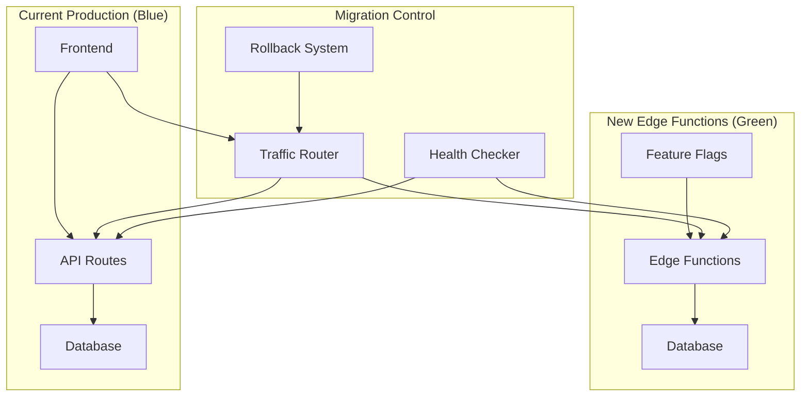

# Sprint 4: Zero-Downtime Migration Strategy
**Edge Functions Cost Optimization Initiative**

## Overview

This document outlines the comprehensive zero-downtime migration strategy for transitioning QuoteKit from traditional API patterns to a fully optimized Edge Functions architecture. Sprint 4 focuses on production-ready migration with minimal service disruption.

## Migration Architecture

### Blue-Green Deployment Pattern

## Migration Phases

### Phase 1: Preparation (Pre-Migration)
- Database schema validation
- Edge Function deployment verification
- Traffic routing infrastructure setup
- Monitoring systems activation

### Phase 2: Gradual Traffic Shift (Migration)
- Feature flag controlled rollout
- Progressive traffic routing (5% → 25% → 50% → 100%)
- Real-time performance monitoring
- Automated rollback triggers

### Phase 3: Validation (Post-Migration)
- Performance benchmark validation
- Error rate monitoring
- User experience verification
- Cost optimization confirmation

### Phase 4: Cleanup (Completion)
- Legacy API decommissioning
- Monitoring system consolidation
- Documentation updates
- Success metrics reporting

## Technical Implementation

### Migration Control System
- **Feature Flags**: Granular control over function activation
- **Traffic Splitting**: Progressive rollout with instant rollback
- **Health Monitoring**: Continuous validation of system health
- **Performance Tracking**: Real-time metrics comparison

### Risk Mitigation
- **Automated Rollback**: Instant reversion on error threshold breach
- **Circuit Breakers**: Protection against cascade failures
- **Canary Releases**: Limited exposure testing before full rollout
- **Data Consistency**: Transactional integrity during migration

## Success Criteria

### Technical Metrics
- Zero service downtime during migration
- Response time improvements maintained (60%+)
- Error rate stays below 0.1%
- Database performance remains stable

### Business Metrics
- User experience unimpacted
- Cost reduction targets achieved
- Operational efficiency improved
- System reliability enhanced

## Rollback Procedures

### Automatic Rollback Triggers
- Error rate exceeds 1%
- Response time degrades by more than 20%
- Database connection failures
- Edge Function deployment failures

### Manual Rollback Process
1. Feature flag deactivation
2. Traffic routing to legacy systems
3. Edge Function isolation
4. System health verification
5. Incident documentation

## Migration Timeline

### Week 1: Infrastructure Preparation
- Migration control system deployment
- Feature flag implementation
- Monitoring enhancement
- Pre-migration testing

### Week 2: Progressive Rollout
- Day 1-2: 5% traffic shift
- Day 3-4: 25% traffic shift
- Day 5-6: 50% traffic shift
- Day 7: 100% migration (if successful)

### Week 3: Validation & Optimization
- Performance validation
- Cost analysis
- User feedback collection
- System optimization

### Week 4: Cleanup & Documentation
- Legacy system decommissioning
- Documentation updates
- Success metrics compilation
- Post-migration review

## Monitoring & Alerting

### Key Metrics Dashboard
- Migration progress percentage
- Error rates (current vs baseline)
- Response times (current vs target)
- Database performance metrics
- User experience indicators

### Alert Thresholds
- **Critical**: Error rate > 1% or response time > 150% baseline
- **Warning**: Error rate > 0.5% or response time > 125% baseline
- **Info**: Traffic split percentage changes

## Communication Plan

### Stakeholder Updates
- **Real-time Dashboard**: Migration progress visualization
- **Hourly Reports**: Technical metrics summary
- **Daily Briefings**: Business impact assessment
- **Incident Notifications**: Immediate issue alerts

### Documentation Requirements
- Migration logs and audit trails
- Performance comparison reports
- Issue resolution documentation
- Success metrics compilation

## Contingency Planning

### Scenario Planning
1. **Partial Failure**: Specific function rollback with traffic rerouting
2. **Complete Failure**: Full system rollback with incident response
3. **Performance Degradation**: Traffic splitting adjustment
4. **Database Issues**: Connection failover and performance tuning

### Recovery Procedures
- Automated detection and response systems
- Manual intervention protocols
- Data integrity verification processes
- Service restoration validation

## Post-Migration Optimization

### Performance Tuning
- Cold start optimization implementation
- Memory usage optimization
- Database query optimization
- Caching strategy enhancement

### Cost Validation
- Actual vs projected cost analysis
- Resource utilization optimization
- Scaling efficiency assessment
- ROI calculation and reporting

## Quality Gates

### Pre-Migration Checklist
- [ ] All Edge Functions deployed and tested
- [ ] Feature flags operational
- [ ] Monitoring systems active
- [ ] Rollback procedures verified
- [ ] Team training completed

### Migration Checkpoints
- [ ] 5% traffic successful
- [ ] 25% traffic successful
- [ ] 50% traffic successful
- [ ] Performance targets met
- [ ] Error rates within limits

### Post-Migration Validation
- [ ] 100% traffic migrated successfully
- [ ] Performance improvements confirmed
- [ ] Cost reduction achieved
- [ ] User experience maintained
- [ ] System stability verified

---

**Document Version**: 1.0  
**Last Updated**: February 7, 2025  
**Sprint**: 4 - Production Optimization & Global Deployment  
**Owner**: Technical Lead & DevOps Team