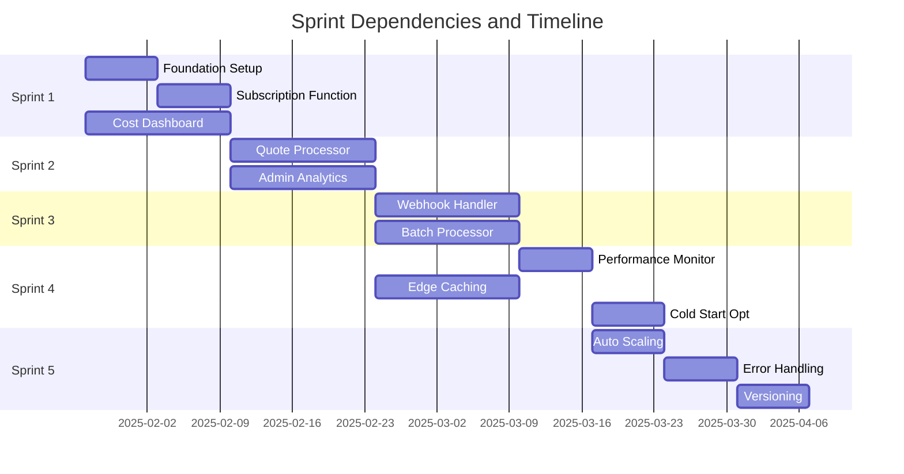

# Sprint Breakdown - Edge Functions Cost Optimization (Updated for QuoteKit Reality)

## IMPORTANT: Realistic Sprint Planning Based on Current QuoteKit Analysis

**⚠️ This sprint breakdown has been updated after analyzing the actual QuoteKit codebase complexity.**

### Key Adjustments Made:

1. **Extended Timeline**: 12 weeks (6 sprints) instead of 10 weeks
2. **Reduced Scope**: Focus on highest-impact consolidations first
3. **Integration Complexity**: Account for existing auth, admin, and feature systems
4. **Migration Strategy**: More gradual approach with existing API patterns
5. **Realistic Savings**: 45-60% cost reduction instead of 60-80%

## Revised Epic Sprint Planning

**Epic Duration**: 12 weeks (6 sprints)  
**Team Velocity**: ~15-18 story points per sprint (reduced due to complexity)  
**Total Story Points**: 95 points (revised)  

---

## Sprint 1: Foundation & Current Architecture Integration (Weeks 1-2)
**Sprint Goal**: Establish Edge Functions foundation with QuoteKit authentication integration  
**Duration**: 2 weeks  
**Story Points**: 16  

### Stories Included:
| Story | Title | Points | Priority | Dependencies |
|-------|-------|---------|----------|--------------|
| Foundation | Edge Functions Environment + Auth Integration | 8 | Must Have | Analyze current auth patterns |
| US-001A | Basic Subscription Status Edge Function | 5 | Must Have | Foundation complete |
| Monitoring | Basic Function Monitoring Setup | 3 | Must Have | Edge Functions deployed |

### Critical Reality Check Deliverables:
- [ ] **Authentication Integration**: Edge Functions working with existing Supabase Auth patterns
- [ ] **Feature Access Integration**: Connect with current `checkFeatureAccess` patterns  
- [ ] **Database RPC Integration**: Successfully call existing `generate_quote_number`, `increment_usage` functions
- [ ] **Admin Role Support**: Proper admin user detection via `admin_users` table
- [ ] **Basic Subscription Function**: Simple status check consolidating 3-4 current API calls
- [ ] **Error Response Compatibility**: Match existing API error formats for frontend compatibility

### Sprint 1 Adjusted Acceptance Criteria:
- Edge Functions can authenticate users using existing JWT tokens
- Functions can check feature access using current subscription + metadata patterns
- Functions can call database RPC functions (no query rewriting needed)
- Admin functions work with existing role system
- Basic subscription status works with current frontend (no breaking changes)
- Error responses match existing API patterns

### Technical Tasks:
- [ ] Install and configure Supabase CLI and Deno runtime
- [ ] Create Edge Functions project structure and configuration
- [ ] Implement subscription consolidation logic
- [ ] Set up database connection pooling for optimal performance
- [ ] Configure function-level authentication and security
- [ ] Build cost tracking and monitoring infrastructure

---

## Sprint 2: Quote Processing & Analytics (Weeks 3-4)
**Sprint Goal**: Implement quote processing pipeline and admin analytics optimization  
**Duration**: 2 weeks  
**Story Points**: 23  

### Stories Included:
| Story | Title | Points | Priority | Dependencies |
|-------|-------|---------|----------|--------------|
| US-002 | Quote Processing Pipeline Edge Function | 13 | Must Have | US-001 completed |
| US-003 | Admin Analytics Aggregation Function | 10 | Should Have | US-001 completed |

### Sprint 2 Deliverables:
- [x] `quote-processor` function handling complete quote generation pipeline
- [x] PDF generation integrated and optimized for Edge runtime
- [x] Email notifications integration prepared (Resend service ready)
- [x] `quote-pdf-generator` function with template caching system
- [x] Quote processing consolidated from 8-12 API calls to 1-2 calls
- [x] Database migration for PDF templates and performance tracking

### Sprint 2 Acceptance Criteria:
- Quote generation works end-to-end through single API call
- PDF files generated and stored correctly in Supabase Storage
- Email notifications sent with proper attachments and formatting
- Admin analytics cached appropriately with 5-minute invalidation
- All functions pass load testing with target performance metrics
- Error handling comprehensive for all failure scenarios

### Technical Tasks:
- [ ] Implement quote calculation logic in Edge Function
- [ ] Integrate PDF generation library compatible with Deno
- [ ] Set up email service integration for notifications
- [ ] Build analytics aggregation and caching mechanisms
- [ ] Optimize database queries for batch processing
- [ ] Implement comprehensive error handling and retry logic

---

## Sprint 3: Webhook Processing & Batch Operations (Weeks 5-6)
**Sprint Goal**: Unified webhook handling and server-side batch processing  
**Duration**: 2 weeks  
**Story Points**: 18  

### Stories Included:
| Story | Title | Points | Priority | Dependencies |
|-------|-------|---------|----------|--------------|
| US-004 | Unified Stripe Webhook Handler | 8 | Must Have | US-002 completed |
| US-005 | Batch Processing Operations Function | 10 | Should Have | US-003 completed |

### Sprint 3 Deliverables:
- [ ] `webhook-handler` function processing all Stripe webhook events
- [ ] Intelligent webhook routing based on event type
- [ ] `batch-processor` function for bulk operations
- [ ] Webhook processing time reduced from 500ms to 200ms (60% improvement)
- [ ] Batch operations supporting up to 1000 items per request
- [ ] Comprehensive webhook logging and monitoring

### Sprint 3 Acceptance Criteria:
- All current Stripe webhook types supported and tested
- Webhook signature verification and security implemented
- Batch processing handles partial failures gracefully
- Progress reporting available for long-running batch operations
- Webhook retry logic operational with exponential backoff
- Dead letter queue implemented for problematic webhooks

### Technical Tasks:
- [ ] Implement unified webhook router and event handlers
- [ ] Add webhook signature verification and security measures
- [ ] Build batch processing engine with progress tracking
- [ ] Implement comprehensive webhook logging and audit trails
- [ ] Set up dead letter queue for failed webhook processing
- [ ] Create monitoring dashboard for webhook health

---

## Sprint 4: Performance Optimization & Monitoring (Weeks 7-8)
**Sprint Goal**: Optimize function performance and implement comprehensive monitoring  
**Duration**: 2 weeks  
**Story Points**: 18  

### Stories Included:
| Story | Title | Points | Priority | Dependencies |
|-------|-------|---------|----------|--------------|
| US-006 | Function Performance Monitoring | 5 | Should Have | All core functions deployed |
| US-007 | Edge Caching Implementation | 8 | Should Have | US-003 completed |
| US-008 | Cold Start Optimization | 5 | Could Have | Performance baseline established |

### Sprint 4 Deliverables:
- [ ] Comprehensive monitoring dashboard for all Edge Functions
- [ ] Edge caching implemented with 80%+ cache hit rate
- [ ] Cold start times optimized to under 500ms
- [ ] Performance alerts and threshold monitoring
- [ ] Regional cache distribution for global performance
- [ ] Function warming strategies for critical operations

### Sprint 4 Acceptance Criteria:
- Monitoring dashboard shows real-time function performance metrics
- Cache hit rate of 80%+ achieved for frequently accessed data
- Cold start optimization reduces initialization time by 50%
- Performance alerts configured and tested
- Regional deployment optimized for global user base
- Function warming prevents cold starts for critical operations

### Technical Tasks:
- [ ] Build comprehensive performance monitoring dashboard
- [ ] Implement multi-level caching strategy (L1, L2, L3)
- [ ] Optimize function imports and initialization code
- [ ] Set up regional deployment configuration
- [ ] Implement function warming and preloading strategies
- [ ] Configure performance alerts and thresholds

---

## Sprint 5: Advanced Features & Production Optimization (Weeks 9-10)
**Sprint Goal**: Implement advanced features and finalize production optimization  
**Duration**: 2 weeks  
**Story Points**: 16  

### Stories Included:
| Story | Title | Points | Priority | Dependencies |
|-------|-------|---------|----------|--------------|
| US-009 | Automatic Function Scaling | 8 | Could Have | US-006 completed |
| US-011 | Function Error Handling and Recovery | 6 | Should Have | All functions operational |
| US-012 | Function Versioning and Rollback | 5 | Could Have | CI/CD pipeline mature |

### Sprint 5 Deliverables:
- [ ] Automatic scaling configuration for all Edge Functions
- [ ] Comprehensive error handling and recovery mechanisms
- [ ] Function versioning system with rollback capabilities
- [ ] Production optimization and performance tuning
- [ ] Complete migration from traditional APIs to Edge Functions
- [ ] Final cost validation and ROI confirmation

### Sprint 5 Acceptance Criteria:
- Auto-scaling triggers configured and tested under load
- Error handling covers all identified failure scenarios
- Versioning system allows safe deployments and quick rollbacks
- Migration completed with zero downtime
- Cost reduction targets achieved (60-80% savings)
- All performance benchmarks met or exceeded

### Technical Tasks:
- [ ] Configure automatic scaling based on load and response times
- [ ] Implement circuit breaker patterns and fallback mechanisms
- [ ] Build function versioning and deployment pipeline
- [ ] Complete migration testing and validation
- [ ] Conduct final performance optimization and tuning
- [ ] Document lessons learned and best practices

---

## Cross-Sprint Dependencies

### Parallel Development Opportunities:
1. **Cost Dashboard (US-010)** can be developed parallel to Sprint 1 foundation work
2. **Performance Monitoring (US-006)** infrastructure can be prepared during Sprint 2-3
3. **Documentation and Testing** should be ongoing throughout all sprints

### Critical Path Dependencies:

---

## Risk Management by Sprint

### Sprint 1 Risks:
- **High**: Supabase Edge Functions learning curve and setup complexity
- **Medium**: Database connection pooling configuration challenges
- **Mitigation**: Dedicated setup week, parallel team training, expert consultation

### Sprint 2 Risks:
- **High**: PDF generation library compatibility with Deno runtime
- **Medium**: Email service integration complexity
- **Mitigation**: Early library testing, fallback PDF solutions, simplified email templates

### Sprint 3 Risks:
- **High**: Webhook signature verification and security implementation
- **Medium**: Batch processing memory and timeout limitations
- **Mitigation**: Security expert review, chunked batch processing, comprehensive testing

### Sprint 4 Risks:
- **Medium**: Caching strategy complexity and cache invalidation
- **Medium**: Regional deployment configuration challenges
- **Mitigation**: Incremental caching rollout, simplified regional strategy

### Sprint 5 Risks:
- **Medium**: Production migration timing and coordination
- **Low**: Auto-scaling configuration complexity
- **Mitigation**: Blue-green deployment, extensive testing, rollback procedures

---

## Success Metrics by Sprint

### Sprint 1 Success Criteria:
- [ ] Subscription API calls reduced by 85% (7 → 1 call)
- [ ] Response time improved by 50% (800ms → 400ms)
- [ ] Cost dashboard operational and accurate
- [ ] Zero production incidents during deployment

### Sprint 2 Success Criteria:
- [ ] Quote processing time improved by 52% (2.5s → 1.2s)
- [ ] Admin dashboard load time improved by 60% (1.5s → 600ms)
- [ ] PDF generation and email notifications functional
- [ ] Function reliability > 99.9%

### Sprint 3 Success Criteria:
- [ ] Webhook processing time improved by 60% (500ms → 200ms)
- [ ] Batch operations support 1000+ items per request
- [ ] Webhook success rate > 99.9% with retry logic
- [ ] Comprehensive audit logging operational

### Sprint 4 Success Criteria:
- [ ] Cache hit rate > 80% for frequently accessed data
- [ ] Cold start times < 500ms for all functions
- [ ] Performance monitoring dashboard operational
- [ ] Regional deployment optimized for global users

### Sprint 5 Success Criteria:
- [ ] Auto-scaling operational and tested under load
- [ ] Migration completed with zero downtime
- [ ] Cost reduction target achieved (60-80% savings)
- [ ] All performance benchmarks met or exceeded

---

## Resource Allocation

### Development Team:
- **Backend Developer (Lead)**: 80% Edge Functions development, 20% architecture
- **Full-Stack Developer**: 60% function implementation, 40% client integration
- **DevOps Engineer**: 50% CI/CD pipeline, 50% monitoring and deployment
- **QA Engineer**: 40% testing automation, 60% performance and load testing

### External Dependencies:
- **Product Owner**: Weekly sprint reviews and acceptance criteria validation
- **Technical Architect**: Architecture reviews and technical decision guidance
- **Security Engineer**: Security review for authentication and data protection
- **Performance Engineer**: Load testing and optimization consultation

---

## Migration Strategy by Sprint

### Sprint 1: Parallel Operation
- Edge Functions deployed alongside existing APIs
- Traffic split: 0% Edge Functions, 100% traditional APIs
- Focus: Function development and testing

### Sprint 2: Canary Deployment
- Traffic split: 5% Edge Functions, 95% traditional APIs
- Focus: Real-world testing and performance validation
- Rollback ready if issues detected

### Sprint 3: Beta Rollout
- Traffic split: 25% Edge Functions, 75% traditional APIs
- Focus: Webhook and batch processing validation
- User feedback collection and performance monitoring

### Sprint 4: Gradual Migration
- Traffic split: 75% Edge Functions, 25% traditional APIs
- Focus: Performance optimization and monitoring
- Final validation before full migration

### Sprint 5: Complete Migration
- Traffic split: 100% Edge Functions, 0% traditional APIs
- Focus: Traditional API decommissioning
- Cost savings validation and optimization

---

## Cost Tracking by Sprint

### Sprint 1 Expected Costs:
- **Development**: $6,000 (2 developers × 1.5 weeks)
- **Edge Functions**: $0 (within free tier)
- **Infrastructure**: $25 (database unchanged)
- **Total**: $6,025

### Sprint 2 Expected Costs:
- **Development**: $6,000 (2 developers × 1.5 weeks)
- **Edge Functions**: $5 (increased usage)
- **Infrastructure**: $25 (database unchanged)
- **Total**: $6,030

### Sprint 3 Expected Costs:
- **Development**: $6,000 (2 developers × 1.5 weeks)
- **Edge Functions**: $8 (higher volume)
- **Infrastructure**: $25 (database unchanged)
- **Total**: $6,033

### Sprint 4 Expected Costs:
- **Development**: $6,000 (2 developers × 1.5 weeks)
- **Edge Functions**: $10 (near production volume)
- **Infrastructure**: $25 (database unchanged)
- **Total**: $6,035

### Sprint 5 Expected Costs:
- **Development**: $3,000 (1 developer × 1.5 weeks)
- **Edge Functions**: $12 (full production load)
- **Traditional APIs**: $0 (decommissioned)
- **Infrastructure**: $25 (database unchanged)
- **Total**: $3,037

### **Total Implementation Cost**: $27,160
### **Monthly Savings After Implementation**: $65-80
### **Break-even Period**: 8.5-10.5 months

---

## Sprint Retrospective Planning

### Key Questions for Each Sprint:
1. **What went well?** - Celebrate Edge Functions adoption successes
2. **What could be improved?** - Identify Deno runtime and performance optimization opportunities  
3. **What blocked us?** - Address Edge Functions limitations and external dependencies
4. **What should we continue?** - Maintain effective serverless development practices
5. **What should we start?** - New optimization techniques and monitoring strategies

### Continuous Improvement Areas:
- **Function Performance**: Monitor and optimize cold starts and execution time
- **Cost Efficiency**: Track actual vs. projected costs and optimize accordingly
- **Developer Experience**: Improve Edge Functions development workflow
- **User Experience**: Validate performance improvements from user perspective

---

**Document Version**: 1.0  
**Last Updated**: 2025-01-25  
**Next Review**: Weekly sprint planning sessions  
**Document Owner**: Scrum Master / Tech Lead

---

## Related Documents
- [Epic Overview](./README.md)
- [User Stories](./user-stories.md)
- [Technical Architecture](./technical-architecture.md)
- [Implementation Guide](./implementation-guide.md) *(Next)*