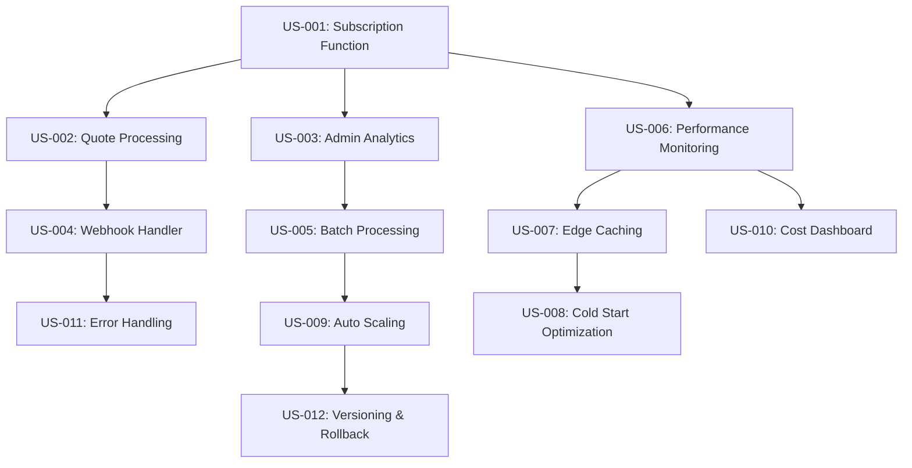

# User Stories - Edge Functions Cost Optimization

## Epic: Supabase Edge Functions Implementation for Cost Reduction and Performance Optimization

This document contains detailed user stories following agile best practices with clear acceptance criteria, story points, and dependencies for implementing Edge Functions to achieve 60-80% cost reduction.

---

## Story Prioritization Framework

- **Must Have (P1)**: Critical for cost reduction, blocks other optimizations
- **Should Have (P2)**: Important for performance, delivers significant cost savings
- **Could Have (P3)**: Nice to have, enhances optimization but not essential
- **Won't Have (P4)**: Out of scope for this epic

---

## Phase 1: Core Function Consolidation

### US-001: Subscription Management Edge Function
**Priority**: Must Have (P1)  
**Story Points**: 8  
**Sprint**: 1  

**As a** developer  
**I want to** consolidate subscription-related API calls into a single Edge Function  
**So that** I can reduce client-server roundtrips from 5-7 calls to 1 call  

#### Acceptance Criteria
- [ ] Single Edge Function handles subscription retrieval, validation, and status updates
- [ ] Function consolidates user authentication, subscription lookup, and pricing calculation
- [ ] Response time under 400ms (50% improvement from current 800ms)
- [ ] Function handles both active and trial subscription states
- [ ] Proper error handling with meaningful error codes
- [ ] Function deployed to all Supabase edge regions
- [ ] Integration with existing Supabase Auth system

#### Definition of Done
- [ ] Function passes all unit tests with 95%+ coverage
- [ ] Integration tests validate end-to-end subscription flow
- [ ] Performance benchmarks meet sub-400ms target
- [ ] Function monitoring and alerting configured
- [ ] Documentation updated with API specifications
- [ ] Code review completed and approved

#### Dependencies
- Supabase Edge Functions environment setup
- Current subscription API analysis and mapping
- Authentication token validation implementation

---

### US-002: Quote Processing Pipeline Edge Function
**Priority**: Must Have (P1)  
**Story Points**: 13  
**Sprint**: 1-2  

**As a** user  
**I want** quote generation to be processed server-side through a single request  
**So that** the client application is more responsive and reliable  

#### Acceptance Criteria
- [ ] Single Edge Function handles complete quote generation pipeline
- [ ] Function consolidates client validation, pricing calculation, PDF generation, and storage
- [ ] Processing time reduced from 2.5s to under 1.2s (52% improvement)
- [ ] Function handles file upload and storage operations
- [ ] Email notifications sent automatically upon quote completion
- [ ] Database operations batched for efficiency
- [ ] Support for both individual and bulk quote processing

#### Definition of Done
- [ ] End-to-end quote generation works through single API call
- [ ] PDF generation integrated and functional
- [ ] Email notification system operational
- [ ] Error handling covers all failure scenarios
- [ ] Performance targets met under load testing
- [ ] Mobile client integration validated
- [ ] Rollback procedure tested and documented

#### Dependencies
- US-001 (Authentication patterns established)
- PDF generation library compatibility with Deno runtime
- Email service integration setup

---

### US-003: Admin Analytics Aggregation Function
**Priority**: Should Have (P2)  
**Story Points**: 10  
**Sprint**: 2  

**As an** admin  
**I want** dashboard analytics to be pre-aggregated server-side  
**So that** the admin interface loads faster and reduces database query load  

#### Acceptance Criteria
- [ ] Edge Function pre-calculates and caches analytics data
- [ ] Dashboard load time reduced from 1.5s to under 600ms (60% improvement)
- [ ] Function aggregates user metrics, subscription data, and financial reports
- [ ] Real-time data updates with 5-minute cache invalidation
- [ ] Support for date range filtering and custom report generation
- [ ] Function handles large datasets efficiently
- [ ] Export functionality for reports (CSV, PDF)

#### Definition of Done
- [ ] Analytics calculations optimized and cached
- [ ] Dashboard performance benchmarks met
- [ ] Cache invalidation strategy implemented and tested
- [ ] Export functionality operational
- [ ] Admin user acceptance testing completed
- [ ] Performance under high data volume validated
- [ ] Monitoring for cache hit rates implemented

#### Dependencies
- US-001 (Authentication patterns for admin access)
- Database query optimization analysis
- Caching strategy definition

---

## Phase 2: Webhook and Batch Processing

### US-004: Unified Stripe Webhook Handler
**Priority**: Must Have (P1)  
**Story Points**: 8  
**Sprint**: 2-3  

**As a** system  
**I want** all Stripe webhooks processed through a single Edge Function  
**So that** webhook processing is more reliable and easier to monitor  

#### Acceptance Criteria
- [ ] Single Edge Function handles all Stripe webhook event types
- [ ] Intelligent routing based on webhook event type
- [ ] Webhook processing time under 200ms (60% improvement from 500ms)
- [ ] Automatic retry logic for failed processing
- [ ] Dead letter queue for problematic webhooks
- [ ] Comprehensive logging and monitoring
- [ ] Webhook signature verification and security

#### Definition of Done
- [ ] All current webhook types supported and tested
- [ ] Retry logic tested with various failure scenarios
- [ ] Monitoring dashboard shows webhook processing health
- [ ] Security audit completed and passed
- [ ] Error handling comprehensive and documented
- [ ] Performance benchmarks met under load
- [ ] Integration with existing Stripe configuration validated

#### Dependencies
- Current webhook handler analysis and mapping
- Stripe API event type documentation review
- Error handling and monitoring infrastructure

---

### US-005: Batch Processing Operations Function
**Priority**: Should Have (P2)  
**Story Points**: 10  
**Sprint**: 3  

**As an** admin  
**I want** bulk operations processed server-side  
**So that** large-scale operations don't timeout or overload the client  

#### Acceptance Criteria
- [ ] Edge Function handles bulk quote operations (create, update, delete)
- [ ] Batch processing supports up to 1000 operations per request
- [ ] Progress reporting and status updates during processing
- [ ] Function handles partial failures gracefully
- [ ] Processing time scales linearly with batch size
- [ ] Support for background processing of large batches
- [ ] Result reporting with success/failure breakdown

#### Definition of Done
- [ ] Batch operations tested with maximum supported load
- [ ] Progress reporting mechanism validated
- [ ] Error handling for partial failures implemented
- [ ] Performance scaling verified through load testing
- [ ] Admin interface integration completed
- [ ] Background processing queue operational
- [ ] Comprehensive logging for audit trails

#### Dependencies
- US-003 (Admin authentication and authorization)
- Background job processing strategy
- Database transaction handling optimization

---

## Phase 3: Performance and Monitoring

### US-006: Function Performance Monitoring
**Priority**: Should Have (P2)  
**Story Points**: 5  
**Sprint**: 3-4  

**As a** developer  
**I want** comprehensive monitoring of Edge Function performance  
**So that** I can identify and resolve performance issues proactively  

#### Acceptance Criteria
- [ ] Real-time dashboards for function execution metrics
- [ ] Cold start monitoring and alerting
- [ ] Cost tracking per function with budget alerts
- [ ] Performance trend analysis and reporting
- [ ] Integration with existing monitoring tools (PostHog)
- [ ] Automated alerts for performance degradation
- [ ] Function-specific SLA monitoring

#### Definition of Done
- [ ] Monitoring dashboard operational and accessible
- [ ] Alert thresholds configured and tested
- [ ] Cost tracking accuracy validated
- [ ] Performance trend reporting functional
- [ ] Integration with PostHog verified
- [ ] SLA monitoring baseline established
- [ ] Team trained on monitoring tools usage

#### Dependencies
- PostHog integration configuration
- Alerting infrastructure setup
- Baseline performance metrics establishment

---

### US-007: Edge Caching Implementation
**Priority**: Should Have (P2)  
**Story Points**: 8  
**Sprint**: 4  

**As a** system  
**I want** frequently accessed data cached at edge locations  
**So that** response times are minimized and database load is reduced  

#### Acceptance Criteria
- [ ] Intelligent caching strategy for subscription and pricing data
- [ ] Cache invalidation based on data freshness requirements
- [ ] Cache hit rate of 80%+ for frequently accessed data
- [ ] Automatic cache warming for critical data
- [ ] Regional cache distribution for global performance
- [ ] Cache performance monitoring and optimization
- [ ] Fallback to database when cache misses occur

#### Definition of Done
- [ ] Caching strategy implemented and tested
- [ ] Cache hit rate targets achieved
- [ ] Cache invalidation logic validated
- [ ] Performance improvement from caching measured
- [ ] Regional distribution verified
- [ ] Monitoring for cache performance operational
- [ ] Fallback mechanisms tested thoroughly

#### Dependencies
- Data access pattern analysis
- Cache invalidation strategy definition
- Regional deployment configuration

---

### US-008: Cold Start Optimization
**Priority**: Could Have (P3)  
**Story Points**: 5  
**Sprint**: 4  

**As a** user  
**I want** Edge Functions to initialize quickly  
**So that** first requests don't experience significant delays  

#### Acceptance Criteria
- [ ] Cold start times under 500ms for all functions
- [ ] Function warming strategy for critical operations
- [ ] Optimized import structure to minimize initialization overhead
- [ ] Shared utility modules for common operations
- [ ] Connection pooling for database operations
- [ ] Lazy loading of non-critical dependencies
- [ ] Regional deployment to minimize geographic latency

#### Definition of Done
- [ ] Cold start benchmarks meet sub-500ms target
- [ ] Function warming strategy implemented and tested
- [ ] Import optimization verified through profiling
- [ ] Shared utilities extracted and functional
- [ ] Connection pooling operational
- [ ] Lazy loading implementation validated
- [ ] Regional performance tested and optimized

#### Dependencies
- Function profiling and analysis
- Shared utility library design
- Connection pooling strategy

---

## Phase 4: Advanced Features and Optimization

### US-009: Automatic Function Scaling
**Priority**: Could Have (P3)  
**Story Points**: 8  
**Sprint**: 4-5  

**As a** system  
**I want** Edge Functions to scale automatically based on load  
**So that** performance remains consistent during traffic spikes  

#### Acceptance Criteria
- [ ] Functions automatically scale up during high traffic periods
- [ ] Scaling configuration based on response time and queue depth
- [ ] Cost controls to prevent runaway scaling expenses
- [ ] Scaling metrics and reporting dashboard
- [ ] Graceful handling of scaling events
- [ ] Integration with monitoring and alerting systems
- [ ] Performance testing under various scaling scenarios

#### Definition of Done
- [ ] Auto-scaling triggers configured and tested
- [ ] Cost controls validated under load
- [ ] Scaling metrics dashboard operational
- [ ] Load testing confirms scaling behavior
- [ ] Integration with monitoring verified
- [ ] Scaling event handling tested
- [ ] Documentation for scaling configuration complete

#### Dependencies
- Load testing framework setup
- Cost control strategy definition
- Monitoring integration for scaling events

---

### US-010: Real-time Cost Dashboard
**Priority**: Must Have (P1)  
**Story Points**: 5  
**Sprint**: 5  

**As a** product owner  
**I want** real-time visibility into Edge Function costs  
**So that** I can track ROI and optimize spending  

#### Acceptance Criteria
- [ ] Dashboard displays current month costs vs. budget
- [ ] Historical cost trends and projections
- [ ] Cost breakdown by function and operation type
- [ ] ROI calculation showing savings from traditional hosting
- [ ] Budget alerts and threshold notifications
- [ ] Cost optimization recommendations
- [ ] Export functionality for financial reporting

#### Definition of Done
- [ ] Cost dashboard accessible and functional
- [ ] Historical data accurately displayed
- [ ] ROI calculations validated against actual costs
- [ ] Alert system operational and tested
- [ ] Optimization recommendations relevant and actionable
- [ ] Export functionality working correctly
- [ ] Integration with financial reporting systems

#### Dependencies
- Cost tracking data collection
- Historical cost data analysis
- Budget threshold configuration

---

### US-011: Function Error Handling and Recovery
**Priority**: Should Have (P2)  
**Story Points**: 6  
**Sprint**: 5  

**As a** system  
**I want** robust error handling and recovery mechanisms  
**So that** Edge Functions provide reliable service even during failures  

#### Acceptance Criteria
- [ ] Comprehensive error handling for all failure scenarios
- [ ] Automatic retry logic with exponential backoff
- [ ] Circuit breaker patterns to prevent cascading failures
- [ ] Fallback mechanisms for critical operations
- [ ] Error logging and monitoring integration
- [ ] Graceful degradation when external services are unavailable
- [ ] Recovery procedures for different error types

#### Definition of Done
- [ ] Error handling tested for all identified scenarios
- [ ] Retry logic validated under various failure conditions
- [ ] Circuit breaker functionality operational
- [ ] Fallback mechanisms tested and verified
- [ ] Error monitoring integration complete
- [ ] Graceful degradation scenarios validated
- [ ] Recovery procedures documented and tested

#### Dependencies
- Error scenario analysis and cataloging
- External service failure simulation
- Monitoring integration for error tracking

---

### US-012: Function Versioning and Rollback
**Priority**: Could Have (P3)  
**Story Points**: 5  
**Sprint**: 5  

**As a** developer  
**I want** version control and rollback capabilities for Edge Functions  
**So that** I can safely deploy updates and quickly recover from issues  

#### Acceptance Criteria
- [ ] Function versioning system with semantic versioning
- [ ] Blue-green deployment capability
- [ ] One-click rollback to previous version
- [ ] Version comparison and change tracking
- [ ] Automated testing before version promotion
- [ ] Rollback impact analysis and reporting
- [ ] Integration with CI/CD pipeline

#### Definition of Done
- [ ] Versioning system operational and tested
- [ ] Blue-green deployment process validated
- [ ] Rollback functionality tested under various scenarios
- [ ] Version tracking and comparison functional
- [ ] Automated testing pipeline operational
- [ ] Impact analysis reporting accurate
- [ ] CI/CD integration complete and stable

#### Dependencies
- CI/CD pipeline configuration
- Version control strategy definition
- Automated testing framework

---

## Non-Functional Requirements

### Performance Requirements
- **Function Response Time**: < 400ms for 95th percentile
- **Cold Start Time**: < 500ms for function initialization
- **Throughput**: Support 10,000+ concurrent function executions
- **Cache Hit Rate**: 80%+ for frequently accessed data

### Cost Requirements
- **Monthly Cost Reduction**: 60-80% compared to current hosting
- **Function Costs**: Stay within $50/month budget including growth
- **ROI Timeline**: Break-even within 3 months of implementation
- **Budget Alerts**: Notifications at 75% and 90% of monthly budget

### Reliability Requirements
- **Function Availability**: 99.9% uptime SLA
- **Error Rate**: < 0.1% for critical functions
- **Recovery Time**: < 5 minutes for function failures
- **Data Consistency**: 100% accuracy for financial operations

---

## Story Dependencies Graph

---

## Epic Story Summary

| Priority | Stories | Total Points | Sprints |
|----------|---------|--------------|---------|
| Must Have (P1) | 4 | 36 | 1-5 |
| Should Have (P2) | 5 | 39 | 2-5 |
| Could Have (P3) | 3 | 18 | 4-5 |
| **Total** | **12** | **93** | **5 Sprints** |

---

**Last Updated**: 2025-01-25  
**Next Review**: Sprint Planning Session  
**Document Owner**: Product Owner