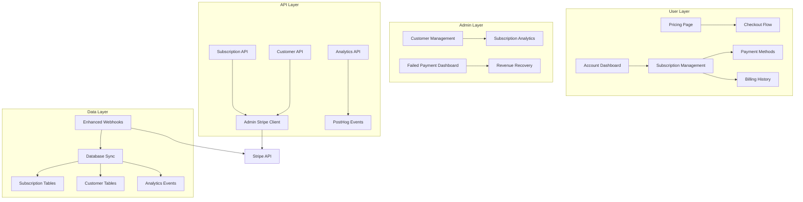

# Technical Architecture - Account-Stripe Integration

## System Overview

This document defines the technical architecture for integrating the QuoteKit account system with admin-configured Stripe for comprehensive subscription management.

### Current State Analysis

The existing system provides foundational Stripe integration through:
- **Admin Configuration**: `src/libs/stripe/stripe-admin.ts` - Configurable Stripe credentials
- **Basic Subscription Display**: `src/app/(account)/account/page.tsx` - View-only subscription info
- **Webhook Processing**: `src/app/api/webhooks/route.ts` - Basic event synchronization
- **External Management**: Redirect to Stripe Customer Portal

### Target Architecture



---

## Core Components Architecture

### 1. Enhanced Subscription API (`src/features/account/api/`)

**Purpose**: Centralized subscription management using admin-configured Stripe credentials

#### New Components:
```typescript
// src/features/account/api/subscription-service.ts
export class SubscriptionService {
  constructor(private stripeConfig: StripeConfig) {}
  
  async createCheckoutSession(params: CheckoutParams): Promise<Stripe.Checkout.Session>
  async getSubscriptionDetails(customerId: string): Promise<SubscriptionDetails>
  async updateSubscription(subscriptionId: string, params: UpdateParams): Promise<Subscription>
  async cancelSubscription(subscriptionId: string, atPeriodEnd: boolean): Promise<Subscription>
  async updatePaymentMethod(customerId: string, paymentMethodId: string): Promise<void>
}

// src/features/account/api/pricing-service.ts
export class PricingService {
  async getActivePrices(): Promise<PriceWithProduct[]>
  async getPricingPageData(): Promise<PricingPageData>
}
```

#### API Routes:
- `POST /api/subscriptions/checkout` - Create checkout session
- `GET /api/subscriptions/current` - Get current subscription details
- `PUT /api/subscriptions/:id` - Update subscription (plan changes)
- `DELETE /api/subscriptions/:id` - Cancel subscription
- `GET /api/pricing/plans` - Get available plans for pricing page

### 2. Admin Customer Management (`src/features/admin/customer-management/`)

**Purpose**: Admin interface for customer and subscription oversight

#### Components:
```typescript
// src/features/admin/customer-management/customer-service.ts
export class CustomerManagementService {
  async getCustomers(filters: CustomerFilters): Promise<Customer[]>
  async getCustomerDetails(customerId: string): Promise<CustomerDetails>
  async updateCustomerSubscription(customerId: string, changes: SubscriptionChanges): Promise<void>
  async processFailedPayments(): Promise<FailedPaymentResult[]>
  async generateCustomerReport(customerId: string): Promise<CustomerReport>
}
```

#### Admin Pages:
- `/admin/customers` - Customer list with search/filtering
- `/admin/customers/[id]` - Individual customer management
- `/admin/subscriptions/failed-payments` - Failed payment dashboard
- `/admin/analytics/subscriptions` - Subscription analytics

### 3. Enhanced Webhook System (`src/app/api/webhooks/`)

**Purpose**: Reliable, scalable webhook processing with retry mechanisms

#### Enhanced Architecture:
```typescript
// src/app/api/webhooks/webhook-processor.ts
export class WebhookProcessor {
  async processEvent(event: Stripe.Event): Promise<ProcessingResult>
  async retryFailedEvent(eventId: string): Promise<void>
  async handleDeadLetterEvent(event: Stripe.Event): Promise<void>
}

// src/app/api/webhooks/event-handlers/
export const handlers = {
  'customer.subscription.created': SubscriptionCreatedHandler,
  'customer.subscription.updated': SubscriptionUpdatedHandler,
  'customer.subscription.deleted': SubscriptionDeletedHandler,
  'invoice.payment_failed': PaymentFailedHandler,
  'invoice.payment_succeeded': PaymentSucceededHandler,
}
```

#### Enhanced Event Processing:
- **Idempotent Processing**: Prevent duplicate event handling
- **Retry Logic**: Exponential backoff for failed events
- **Dead Letter Queue**: Manual intervention for problematic events
- **Event Logging**: Comprehensive audit trail

---

## Database Schema Enhancements

### Enhanced Subscription Tables

```sql
-- Enhanced subscriptions table
ALTER TABLE subscriptions ADD COLUMN IF NOT EXISTS
  trial_end TIMESTAMPTZ,
  cancel_at_period_end BOOLEAN DEFAULT FALSE,
  cancelled_at TIMESTAMPTZ,
  ended_at TIMESTAMPTZ,
  latest_invoice_id TEXT,
  discount_id TEXT;

-- New customer management table
CREATE TABLE IF NOT EXISTS customer_management (
  id UUID PRIMARY KEY DEFAULT uuid_generate_v4(),
  user_id UUID REFERENCES auth.users(id) ON DELETE CASCADE,
  stripe_customer_id TEXT NOT NULL,
  customer_since TIMESTAMPTZ DEFAULT NOW(),
  lifetime_value DECIMAL(10,2) DEFAULT 0,
  total_payments INTEGER DEFAULT 0,
  failed_payments INTEGER DEFAULT 0,
  last_payment_date TIMESTAMPTZ,
  customer_status customer_status_enum DEFAULT 'active',
  notes TEXT,
  created_at TIMESTAMPTZ DEFAULT NOW(),
  updated_at TIMESTAMPTZ DEFAULT NOW()
);

-- Webhook processing audit table
CREATE TABLE IF NOT EXISTS webhook_events (
  id UUID PRIMARY KEY DEFAULT uuid_generate_v4(),
  stripe_event_id TEXT UNIQUE NOT NULL,
  event_type TEXT NOT NULL,
  processing_status processing_status_enum DEFAULT 'pending',
  retry_count INTEGER DEFAULT 0,
  error_message TEXT,
  processed_at TIMESTAMPTZ,
  created_at TIMESTAMPTZ DEFAULT NOW()
);

-- Subscription analytics events
CREATE TABLE IF NOT EXISTS subscription_events (
  id UUID PRIMARY KEY DEFAULT uuid_generate_v4(),
  user_id UUID REFERENCES auth.users(id),
  event_type subscription_event_enum NOT NULL,
  subscription_id TEXT,
  old_plan_id TEXT,
  new_plan_id TEXT,
  event_data JSONB,
  occurred_at TIMESTAMPTZ DEFAULT NOW()
);
```

### New Enums
```sql
CREATE TYPE customer_status_enum AS ENUM ('active', 'past_due', 'cancelled', 'incomplete');
CREATE TYPE processing_status_enum AS ENUM ('pending', 'processed', 'failed', 'dead_letter');
CREATE TYPE subscription_event_enum AS ENUM ('created', 'upgraded', 'downgraded', 'cancelled', 'renewed', 'payment_failed');
```

---

## Security Architecture

### 1. API Security
- **Authentication**: Session-based auth for user endpoints, admin role for management endpoints
- **Rate Limiting**: Implement rate limiting on subscription modification endpoints
- **Input Validation**: Strict validation using Zod schemas
- **Webhook Verification**: Mandatory Stripe signature verification

### 2. Data Security
- **PCI Compliance**: Never store payment card data, use Stripe's secure APIs
- **Customer Data**: Encrypt sensitive customer information at rest
- **Admin Access**: Role-based access control with audit logging
- **API Keys**: Secure storage of Stripe credentials with encryption

### 3. Error Handling
- **No Data Leakage**: Generic error messages to prevent information disclosure
- **Audit Logging**: All subscription changes and admin actions logged
- **Monitoring**: Integration with application monitoring for security events

---

## Integration Patterns

### 1. Service Layer Pattern
```typescript
// Dependency injection for testability
interface ISubscriptionService {
  createCheckout(params: CheckoutParams): Promise<CheckoutSession>
  updateSubscription(id: string, changes: SubscriptionChanges): Promise<Subscription>
}

// Implementation uses admin-configured Stripe client
export class StripeSubscriptionService implements ISubscriptionService {
  constructor(
    private stripeClient: Stripe,
    private database: SupabaseClient
  ) {}
}
```

### 2. Event-Driven Architecture
```typescript
// Domain events for subscription changes
export abstract class DomainEvent {
  abstract eventType: string
  abstract occurredAt: Date
}

export class SubscriptionUpgradedEvent extends DomainEvent {
  eventType = 'subscription.upgraded'
  constructor(
    public userId: string,
    public oldPlanId: string,
    public newPlanId: string,
    public occurredAt: Date = new Date()
  ) {}
}

// Event handlers for PostHog integration
export class SubscriptionEventHandler {
  async handle(event: DomainEvent): Promise<void> {
    await this.posthog.capture(event.eventType, event)
    await this.database.insertSubscriptionEvent(event)
  }
}
```

### 3. Repository Pattern
```typescript
// Abstract data access
export interface ISubscriptionRepository {
  findByUserId(userId: string): Promise<Subscription | null>
  update(subscription: Subscription): Promise<void>
  create(subscription: CreateSubscriptionData): Promise<Subscription>
}

// Supabase implementation
export class SupabaseSubscriptionRepository implements ISubscriptionRepository {
  constructor(private supabase: SupabaseClient) {}
  
  async findByUserId(userId: string): Promise<Subscription | null> {
    const { data } = await this.supabase
      .from('subscriptions')
      .select('*, prices(*, products(*))')
      .eq('user_id', userId)
      .maybeSingle()
    
    return data ? this.mapToSubscription(data) : null
  }
}
```

---

## Performance Considerations

### 1. Caching Strategy
- **Pricing Data**: Cache active products/prices for 15 minutes
- **Subscription Status**: Cache user subscription status for 5 minutes
- **Customer Data**: Cache customer details for admin interfaces (10 minutes)

### 2. Database Optimization
- **Indexes**: Add indexes on frequently queried fields (customer_id, user_id, status)
- **Query Optimization**: Use select joins to minimize database roundtrips
- **Connection Pooling**: Optimize Supabase connection usage

### 3. API Performance
- **Batch Operations**: Group multiple Stripe API calls where possible
- **Async Processing**: Use background jobs for non-critical webhook processing
- **Pagination**: Implement cursor-based pagination for large customer lists

---

## Testing Strategy

### 1. Unit Testing
```typescript
// Service layer testing with mocked dependencies
describe('SubscriptionService', () => {
  let service: SubscriptionService
  let mockStripe: jest.Mocked<Stripe>
  let mockDatabase: jest.Mocked<SupabaseClient>

  beforeEach(() => {
    mockStripe = createMockStripe()
    mockDatabase = createMockDatabase()
    service = new SubscriptionService(mockStripe, mockDatabase)
  })

  it('should create checkout session with correct parameters', async () => {
    // Test implementation
  })
})
```

### 2. Integration Testing
- **Webhook Testing**: Test webhook endpoints with Stripe test events
- **API Testing**: End-to-end API testing with test Stripe environment
- **Database Testing**: Test database operations with test data

### 3. E2E Testing
- **User Flows**: Complete subscription lifecycle testing
- **Admin Workflows**: Customer management and analytics testing
- **Error Scenarios**: Failed payment and edge case handling

---

## Monitoring and Observability

### 1. Application Metrics
```typescript
// Custom metrics for subscription operations
export class SubscriptionMetrics {
  static readonly checkoutCreated = new Counter('checkout_sessions_created_total')
  static readonly subscriptionUpdated = new Counter('subscriptions_updated_total')
  static readonly webhookProcessed = new Counter('webhooks_processed_total')
  static readonly paymentFailed = new Counter('payments_failed_total')
}
```

### 2. Business Metrics
- **MRR Tracking**: Monthly recurring revenue calculation
- **Churn Rate**: Customer cancellation rate monitoring
- **Conversion Rate**: Pricing page to subscription conversion
- **Revenue Recovery**: Failed payment recovery success rate

### 3. Error Monitoring
- **Webhook Failures**: Alert on webhook processing failures
- **API Errors**: Monitor subscription API error rates
- **Database Issues**: Track database connection and query issues
- **Stripe API Issues**: Monitor Stripe API response times and errors

---

## Deployment Strategy

### 1. Database Migrations
```sql
-- Migration scripts for new tables and columns
-- migrations/2025_01_25_001_enhance_subscriptions.sql
-- migrations/2025_01_25_002_add_customer_management.sql
-- migrations/2025_01_25_003_add_webhook_audit.sql
```

### 2. Environment Configuration
```bash
# Additional environment variables needed
STRIPE_WEBHOOK_TOLERANCE=300
SUBSCRIPTION_CACHE_TTL=300
WEBHOOK_RETRY_ATTEMPTS=3
WEBHOOK_DEAD_LETTER_QUEUE_URL=<queue-url>
```

### 3. Feature Flags
- **Enhanced Webhooks**: Gradual rollout of new webhook processing
- **Admin Customer Management**: Admin-only feature flag
- **In-App Subscription Management**: Progressive user rollout

---

**Document Version**: 1.0  
**Last Updated**: 2025-01-25  
**Next Review**: Sprint Planning  
**Approved By**: Technical Lead

---

## Related Documents
- [User Stories](./user-stories.md)
- [Epic Overview](./README.md)
- [Sprint Breakdown](./sprint-breakdown.md) *(Pending)*
- [API Specifications](./api-specs.md) *(Pending)*
- [Database Design](./database-design.md) *(Pending)*