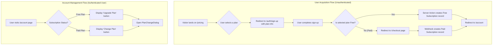

### Final User Flow (Version 4)

This diagram removes the "No Subscription" path from the account page, as it's an invalid state for a logged-in user. The primary user acquisition flow is now correctly rooted in the `/pricing` page.

### Explanation of the Final Flow:

1.  **User Acquisition (`/pricing`)**: The only way for a user to get a subscription is by starting on the `/pricing` page. After signing up, a subscription record (either free or paid) is **always** created for them.
2.  **Account Management (`/account`)**: This page is exclusively for users who already have a subscription.
    *   If they are on a **Free Plan**, they see an "Upgrade Plan" button which opens the `PlanChangeDialog`.
    *   If they are on a **Paid Plan**, they see a "Change Plan" button which also opens the `PlanChangeDialog`.

This model is clean, accurate, and reflects the logic you've described.