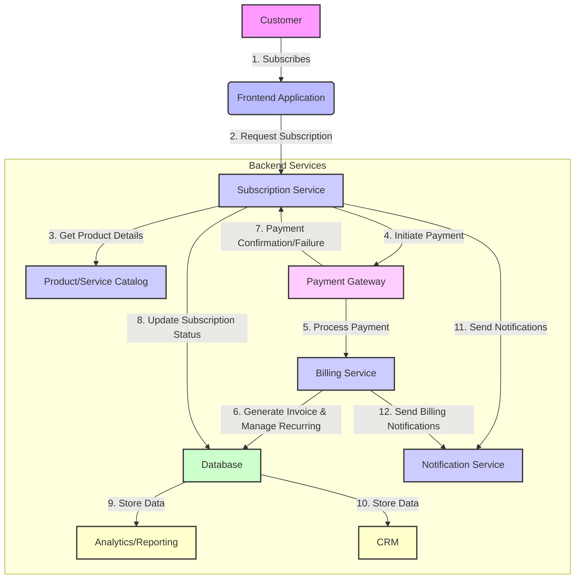

```mermaid
graph TD
    A[Customer] -->|1. Subscribes| B(Frontend Application)
    B -->|2. Request Subscription| C[Subscription Service]
    C -->|3. Get Product Details| D[Product/Service Catalog]
    C -->|4. Initiate Payment| E[Payment Gateway]
    E -->|5. Process Payment| F[Billing Service]
    F -->|6. Generate Invoice & Manage Recurring| G[Database]
    E -->|7. Payment Confirmation/Failure| C
    C -->|8. Update Subscription Status| G
    G -->|9. Store Data| H[Analytics/Reporting]
    G -->|10. Store Data| I[CRM]
    C -->|11. Send Notifications| J[Notification Service]
    F -->|12. Send Billing Notifications| J

    subgraph Backend Services
        C
        D
        E
        F
        G
        H
        I
        J
    end

    style A fill:#f9f,stroke:#333,stroke-width:2px
    style B fill:#bbf,stroke:#333,stroke-width:2px
    style C fill:#ccf,stroke:#333,stroke-width:2px
    style D fill:#ccf,stroke:#333,stroke-width:2px
    style E fill:#fcf,stroke:#333,stroke-width:2px
    style F fill:#ccf,stroke:#333,stroke-width:2px
    style G fill:#cfc,stroke:#333,stroke-width:2px
    style H fill:#ffc,stroke:#333,stroke-width:2px
    style I fill:#ffc,stroke:#333,stroke-width:2px
    style J fill:#ccf,stroke:#333,stroke-width:2px
```