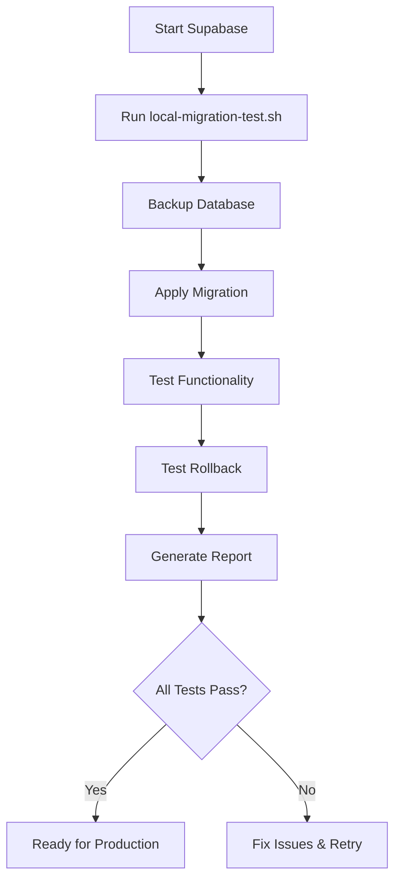

# Local Migration Testing Guide

This directory contains comprehensive tools for safely testing the security migration locally before production deployment.

## Quick Start

```bash
# 1. Start Supabase locally
supabase start

# 2. Run comprehensive migration test
./scripts/local-migration-test.sh

# 3. Review test results
cat migration-test-report-*.md
```

## Testing Files Overview

### Core Testing Scripts

| File | Purpose | Usage |
|------|---------|-------|
| `local-migration-test.sh` | Complete automated testing suite | `./scripts/local-migration-test.sh` |
| `migration-validation-tests.sql` | Database validation queries | `psql DB_URL -f scripts/migration-validation-tests.sql` |
| `security-function-tests.js` | Application-level security tests | `node scripts/security-function-tests.js` |
| `production-migration-plan.md` | Production deployment guide | Documentation |

### Testing Workflow



## Detailed Testing Steps

### 1. Pre-Testing Setup

```bash
# Ensure Supabase CLI is installed
supabase --version

# Start local instance
supabase start

# Verify instance is running
supabase status
```

### 2. Run Automated Test Suite

The main test script performs comprehensive validation:

```bash
./scripts/local-migration-test.sh
```

**What it does:**
- ✅ Checks Supabase status
- ✅ Validates migration file
- ✅ Creates database backup
- ✅ Applies migration
- ✅ Tests all new functionality
- ✅ Tests rollback procedures
- ✅ Generates detailed report

### 3. Manual Database Validation

For additional verification, run the SQL test suite:

```bash
# Get database URL
DB_URL=$(supabase status -o env | grep "DB_URL=" | cut -d'=' -f2-)

# Run validation tests
psql "$DB_URL" -f scripts/migration-validation-tests.sql
```

**Tests performed:**
- Table structure validation
- RLS policy verification  
- Function security checks
- Index performance validation
- Constraint verification

### 4. Application-Level Security Testing

Test security functions from application perspective:

```bash
# Install dependencies (if needed)
npm install @supabase/supabase-js

# Run security tests
node scripts/security-function-tests.js
```

**Security validations:**
- Anonymous access blocking
- Authentication requirements
- Admin privilege enforcement
- Audit logging functionality
- Account lockout protection

## Understanding Test Results

### Successful Test Output

```bash
[SUCCESS] All migration tests completed successfully!
✅ Migration is safe for production deployment

Next steps:
1. Review the test report: migration-test-report-20250824_143022.md
2. Schedule production deployment  
3. Apply migration using: supabase db push --linked
```

### Failed Test Output

```bash
[ERROR] Migration application failed
❌ SOME TESTS FAILED - REVIEW REQUIRED

Check the log file: migration-test-20250824_143022.log
```

## Test Reports

### Automated Report Generation

Each test run generates:

1. **Test Log**: `migration-test-YYYYMMDD_HHMMSS.log`
   - Detailed execution log
   - Error messages and warnings
   - Timing information

2. **Test Report**: `migration-test-report-YYYYMMDD_HHMMSS.md`
   - Executive summary
   - Pass/fail status for each test
   - Production readiness assessment
   - Rollback procedures

3. **Database Backup**: `pre-migration-backup-YYYYMMDD_HHMMSS.sql`
   - Full database backup before testing
   - Used for rollback if needed

### Sample Report Structure

```markdown
# Migration Test Report

**Status:** ✅ PASSED  
**Migration:** 99999999999999_secure_admin_functions.sql  
**Date:** 2025-08-24 14:30:22  

## Test Summary
- [x] Local Migration Applied Successfully
- [x] All Functionality Tests Passed
- [x] Rollback Procedures Validated
- [x] Security Enhancements Verified

## Recommendations
✅ **SAFE FOR PRODUCTION**
```

## Troubleshooting Common Issues

### Issue: Supabase Not Running

```bash
Error: Supabase is not running
```

**Solution:**
```bash
supabase start
# Wait for all services to be ready
supabase status
```

### Issue: Migration Already Applied

```bash
Warning: Security migration is already applied
```

**Solution:**
- Test will offer to run rollback test
- Or reset database: `supabase db reset`

### Issue: Function Permission Errors

```bash
Error: permission denied for function verify_admin_access
```

**Solution:**
- Check if migration applied correctly
- Verify RLS policies
- Review function security attributes

### Issue: Database Connection Failed

```bash
Error: Could not get database URL
```

**Solution:**
```bash
# Check Supabase status
supabase status

# Restart if needed
supabase stop
supabase start
```

## Production Readiness Checklist

Before proceeding to production, ensure:

- [ ] ✅ All automated tests pass
- [ ] ✅ Database validation tests pass  
- [ ] ✅ Security function tests pass
- [ ] ✅ Rollback procedures tested
- [ ] ✅ Performance impact assessed
- [ ] ✅ Test report reviewed
- [ ] ✅ Production plan prepared
- [ ] ✅ Team notified and ready

## Next Steps

After successful local testing:

1. **Review** the generated test report
2. **Schedule** production maintenance window
3. **Follow** the production migration plan
4. **Apply** migration: `supabase db push --linked`
5. **Monitor** system for 24 hours post-deployment

## Support

If you encounter issues during testing:

1. Check the detailed log files
2. Review the troubleshooting section above
3. Verify your local Supabase setup
4. Ensure migration file is correct and unmodified

For production deployment issues, follow the rollback procedures in the production migration plan.