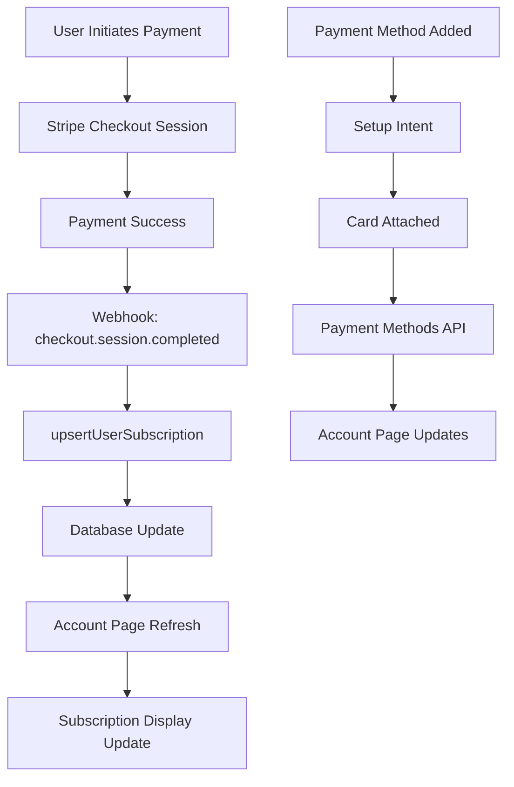

# Comprehensive Integration Test Plan: Payment-to-Account-Display Pipeline

## Overview
This document outlines comprehensive integration test scenarios for the complete subscription management flow from payment initiation to account page display in QuoteKit.

## User Journey Mapping

### Complete Flow: Payment → Account Page Display



## Critical Breaking Points Identified

### 1. Webhook Processing Failures
**Location**: `/api/webhooks/stripe/route.ts`
**Breaking Point**: Event processing retry mechanism
**Impact**: Subscription data inconsistency

```typescript
// Test Scenario: Webhook Processing Failure Recovery
describe('Webhook Processing Resilience', () => {
  it('should handle webhook processing failures gracefully', async () => {
    // Simulate webhook processing failure
    const mockEvent = createMockStripeEvent('customer.subscription.created');
    
    // Mock database failure on first attempt
    mockSupabaseError('subscriptions', 'insert', 1);
    
    // Process webhook
    const response = await POST(createMockRequest(mockEvent));
    
    // Verify retry mechanism kicked in
    expect(response.status).toBe(200);
    expect(mockProcessingAttempts).toBe(3);
    
    // Verify subscription was eventually created
    const subscription = await getSubscription();
    expect(subscription).toBeDefined();
  });
});
```

### 2. Customer Mapping Inconsistencies
**Location**: `ensureCustomerMapping` function
**Breaking Point**: Email/user lookup failures
**Impact**: Subscription orphaning

```typescript
describe('Customer Mapping Edge Cases', () => {
  it('should handle email mismatches gracefully', async () => {
    // Setup: User changes email after Stripe customer creation
    const originalEmail = 'old@example.com';
    const newEmail = 'new@example.com';
    
    // Create Stripe customer with old email
    const stripeCustomer = await mockStripe.customers.create({
      email: originalEmail
    });
    
    // Update user email in Supabase
    await updateUserEmail(userId, newEmail);
    
    // Process checkout session with old email
    const session = createMockCheckoutSession({
      customer: stripeCustomer.id,
      customer_details: { email: originalEmail }
    });
    
    // Verify mapping resolution
    const result = await ensureCustomerMapping(session);
    expect(result).toBeDefined();
  });
});
```

### 3. Subscription State Inconsistencies
**Location**: `getSubscription` function
**Breaking Point**: Multiple active subscriptions
**Impact**: Incorrect plan display

```typescript
describe('Subscription State Consistency', () => {
  it('should prioritize paid over free subscriptions', async () => {
    // Create both free and paid subscriptions
    await createSubscription({ type: 'free', status: 'active' });
    await createSubscription({ type: 'paid', status: 'active' });
    
    // Get subscription should return paid subscription
    const subscription = await getSubscription();
    expect(subscription.stripe_price_id).toBeDefined();
    expect(subscription.subscription_type).toBe('paid');
  });
});
```

## Test Scenarios by Component

### 1. Payment Method Storage/Retrieval Tests

#### Test Case 1.1: Payment Method Addition Flow
```typescript
describe('Payment Method Addition', () => {
  it('should complete full payment method addition flow', async () => {
    // Step 1: Create setup intent
    const response = await fetch('/api/payment-methods', {
      method: 'POST'
    });
    const { client_secret } = await response.json();
    
    // Step 2: Simulate Stripe confirmation
    const confirmResult = await mockStripeConfirmation(client_secret);
    expect(confirmResult.status).toBe('succeeded');
    
    // Step 3: Verify payment method appears in list
    const paymentMethods = await getPaymentMethods();
    expect(paymentMethods.length).toBe(1);
    
    // Step 4: Verify default payment method setting
    const customer = await stripe.customers.retrieve(customerId);
    expect(customer.invoice_settings.default_payment_method).toBeDefined();
  });
});
```

#### Test Case 1.2: Payment Method Default Setting
```typescript
describe('Payment Method Default Management', () => {
  it('should handle default payment method changes', async () => {
    // Add multiple payment methods
    const pm1 = await addPaymentMethod('4242424242424242');
    const pm2 = await addPaymentMethod('4000056655665556');
    
    // Set second as default
    await fetch(`/api/payment-methods/${pm2.id}`, {
      method: 'PATCH'
    });
    
    // Verify default changed
    const paymentMethods = await getPaymentMethods();
    const defaultPM = paymentMethods.find(pm => pm.is_default);
    expect(defaultPM.id).toBe(pm2.id);
  });
});
```

### 2. Webhook Event Processing Tests

#### Test Case 2.1: Subscription Lifecycle Webhooks
```typescript
describe('Subscription Webhook Processing', () => {
  it('should process complete subscription lifecycle', async () => {
    const subscriptionId = 'sub_test123';
    
    // 1. Subscription created
    await processWebhookEvent({
      type: 'customer.subscription.created',
      data: { object: mockSubscription({ id: subscriptionId }) }
    });
    
    let subscription = await getSubscriptionFromDB(subscriptionId);
    expect(subscription.status).toBe('active');
    
    // 2. Subscription updated
    await processWebhookEvent({
      type: 'customer.subscription.updated',
      data: { object: mockSubscription({ 
        id: subscriptionId, 
        status: 'past_due' 
      }) }
    });
    
    subscription = await getSubscriptionFromDB(subscriptionId);
    expect(subscription.status).toBe('past_due');
    
    // 3. Subscription deleted
    await processWebhookEvent({
      type: 'customer.subscription.deleted',
      data: { object: mockSubscription({ id: subscriptionId }) }
    });
    
    subscription = await getSubscriptionFromDB(subscriptionId);
    expect(subscription.status).toBe('canceled');
  });
});
```

#### Test Case 2.2: Webhook Idempotency
```typescript
describe('Webhook Idempotency', () => {
  it('should handle duplicate webhook events', async () => {
    const eventId = 'evt_test123';
    const mockEvent = createMockStripeEvent('customer.subscription.created', eventId);
    
    // Process event first time
    const response1 = await POST(createMockRequest(mockEvent));
    expect(response1.status).toBe(200);
    
    // Process same event again
    const response2 = await POST(createMockRequest(mockEvent));
    expect(response2.status).toBe(200);
    expect(response2.body.message).toBe('Event already processed');
    
    // Verify only one subscription created
    const subscriptions = await getAllSubscriptionsForUser(userId);
    expect(subscriptions.length).toBe(1);
  });
});
```

### 3. Account Page Display Tests

#### Test Case 3.1: Subscription Display Logic
```typescript
describe('Account Page Subscription Display', () => {
  it('should display correct subscription information', async () => {
    // Create paid subscription
    const subscription = await createPaidSubscription({
      price_id: 'price_test123',
      status: 'active'
    });
    
    // Render account page
    const { container } = render(<AccountPage />);
    
    // Verify subscription details displayed
    expect(screen.getByText('Pro Plan')).toBeInTheDocument();
    expect(screen.getByText('$29.00/month')).toBeInTheDocument();
    expect(screen.getByText('Active')).toBeInTheDocument();
    
    // Verify plan management buttons
    expect(screen.getByText('Change Plan')).toBeInTheDocument();
    expect(screen.getByText('Cancel Subscription')).toBeInTheDocument();
  });
  
  it('should display free plan for users without paid subscription', async () => {
    // User with no subscription
    mockGetSubscription(null);
    
    const { container } = render(<AccountPage />);
    
    // Verify free plan information displayed
    expect(screen.getByText('Free Plan')).toBeInTheDocument();
    expect(screen.getByText('$0.00')).toBeInTheDocument();
    expect(screen.getByText('Upgrade')).toBeInTheDocument();
  });
});
```

#### Test Case 3.2: Real-time Subscription Updates
```typescript
describe('Real-time Subscription Updates', () => {
  it('should update subscription display after plan change', async () => {
    // Initial state: Basic plan
    mockGetSubscription(createMockSubscription('basic'));
    const { rerender } = render(<AccountPage />);
    expect(screen.getByText('Basic Plan')).toBeInTheDocument();
    
    // Simulate plan change to Pro
    await changePlan('price_pro');
    
    // Mock updated subscription data
    mockGetSubscription(createMockSubscription('pro'));
    rerender(<AccountPage />);
    
    // Verify display updated
    expect(screen.getByText('Pro Plan')).toBeInTheDocument();
    expect(screen.queryByText('Basic Plan')).not.toBeInTheDocument();
  });
});
```

### 4. Manual Sync Functionality Tests

#### Test Case 4.1: Subscription Sync API
```typescript
describe('Manual Subscription Sync', () => {
  it('should sync subscription data from Stripe', async () => {
    // Create subscription in Stripe but not in local DB
    const stripeSubscription = await mockStripe.subscriptions.create({
      customer: customerId,
      items: [{ price: 'price_test123' }]
    });
    
    // Verify not in local DB
    let localSub = await getSubscriptionFromDB(stripeSubscription.id);
    expect(localSub).toBeNull();
    
    // Trigger manual sync
    const response = await fetch('/api/sync-my-subscription', {
      method: 'POST'
    });
    expect(response.status).toBe(200);
    
    // Verify subscription now in local DB
    localSub = await getSubscriptionFromDB(stripeSubscription.id);
    expect(localSub).toBeDefined();
    expect(localSub.status).toBe(stripeSubscription.status);
  });
});
```

## Performance and Concurrency Tests

### Test Case 5.1: Concurrent Subscription Operations
```typescript
describe('Concurrency Tests', () => {
  it('should handle concurrent subscription updates', async () => {
    const subscriptionId = 'sub_test123';
    
    // Simulate concurrent webhook events
    const promises = [
      processWebhookEvent(createSubscriptionUpdatedEvent(subscriptionId, { status: 'active' })),
      processWebhookEvent(createSubscriptionUpdatedEvent(subscriptionId, { status: 'past_due' })),
      processWebhookEvent(createSubscriptionUpdatedEvent(subscriptionId, { status: 'canceled' }))
    ];
    
    await Promise.all(promises);
    
    // Verify final state is consistent
    const subscription = await getSubscriptionFromDB(subscriptionId);
    expect(['active', 'past_due', 'canceled']).toContain(subscription.status);
  });
});
```

## Error Handling Test Scenarios

### Test Case 6.1: Stripe API Failures
```typescript
describe('Stripe API Error Handling', () => {
  it('should handle Stripe API timeouts gracefully', async () => {
    // Mock Stripe API timeout
    mockStripeTimeout('subscriptions.retrieve');
    
    // Attempt subscription retrieval
    const result = await getSubscription();
    
    // Verify graceful degradation
    expect(result).toBeNull();
    expect(mockErrorLog).toContainMatchingObject({
      message: expect.stringContaining('timeout')
    });
  });
  
  it('should handle invalid Stripe configuration', async () => {
    // Clear Stripe configuration
    mockStripeConfig(null);
    
    // Attempt payment method creation
    const response = await fetch('/api/payment-methods', {
      method: 'POST'
    });
    
    expect(response.status).toBe(400);
    expect(response.body.error).toBe('Stripe not configured');
  });
});
```

## Test Data Factories

### Subscription Factory
```typescript
export const createMockSubscription = (type = 'paid', overrides = {}) => ({
  id: `sub_${Math.random().toString(36).substr(2, 9)}`,
  user_id: 'user_test123',
  stripe_price_id: type === 'paid' ? 'price_test123' : null,
  status: 'active',
  current_period_start: new Date().toISOString(),
  current_period_end: new Date(Date.now() + 30 * 24 * 60 * 60 * 1000).toISOString(),
  created: new Date().toISOString(),
  ...overrides
});
```

### Stripe Event Factory
```typescript
export const createMockStripeEvent = (type, eventId = null) => ({
  id: eventId || `evt_${Math.random().toString(36).substr(2, 9)}`,
  type,
  data: {
    object: createMockSubscription()
  },
  created: Math.floor(Date.now() / 1000)
});
```

## Integration Test Environment Setup

### Database Setup
```typescript
beforeEach(async () => {
  // Clean database state
  await truncateTable('subscriptions');
  await truncateTable('stripe_customers');
  await truncateTable('stripe_webhook_events');
  
  // Seed test data
  await seedTestUser();
  await seedTestPlans();
});
```

### Mock Services
```typescript
// Mock Stripe API
jest.mock('@/libs/stripe/stripe-admin', () => ({
  stripeAdmin: mockStripeClient
}));

// Mock Supabase
jest.mock('@/libs/supabase/supabase-admin', () => ({
  supabaseAdminClient: mockSupabaseClient
}));
```

## Success Criteria

### Functional Requirements
- ✅ All subscription state transitions work correctly
- ✅ Payment method addition/removal flows complete successfully
- ✅ Webhook events process reliably with retry mechanisms
- ✅ Account page displays accurate subscription information
- ✅ Manual sync functionality works correctly

### Performance Requirements
- ✅ Subscription operations complete within 2 seconds
- ✅ Account page loads within 1 second
- ✅ Webhook processing completes within 5 seconds
- ✅ Concurrent operations don't cause data corruption

### Error Handling Requirements
- ✅ All error scenarios have appropriate fallbacks
- ✅ User-facing errors provide actionable information
- ✅ System errors are logged with sufficient detail
- ✅ Failed operations can be retried or recovered

## Monitoring and Observability

### Key Metrics to Track
- Webhook processing success rate
- Subscription sync accuracy
- Payment method operation success rate
- Account page load performance
- Error rates by component

### Alert Conditions
- Webhook processing failures > 5%
- Subscription data inconsistencies detected
- Payment method operations failing
- Account page errors > 1%

This comprehensive integration test plan ensures robust testing of the complete payment-to-account-display pipeline, covering all critical paths, error scenarios, and performance requirements.